# Как подбирать аугментации без гадания по метрикам

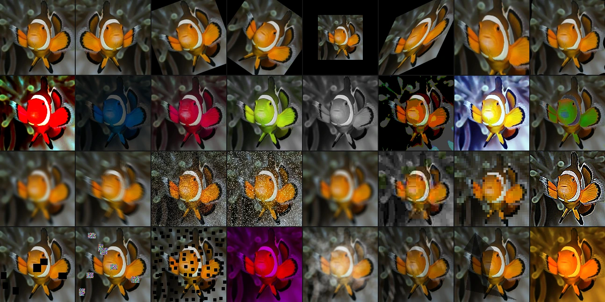

Модель для обнаружения дефектов показывает 99% на валидации. В production она пропускает половину дефектов: в цехе плавающее освещение и смаз от движения, которых не было в обучающих данных. Классификатор рентгеновских снимков грудной клетки, обученный с жёсткой аугментацией, разваливается полностью: сильные эластичные искажения, экстремальная яркость и мощный шум смывают диагностический сигнал, который там держится на тонких различиях плотности. Команда, занимающаяся мониторингом дикой природы, добавляет все трансформации подряд: обучение еле ползёт, метрики валидации скачут, и уже никто не понимает, какая из пятнадцати трансформаций помогает, а какие три активно вредят.

Слишком мало аугментации, слишком много и слишком наугад. Три разных сценария отказа, одна и та же причина: к аугментации относятся как к чек-листу в духе «перевернули, повернули, размыли, готово», а не как к осмысленному процессу проектирования. Библиотека даёт вам [сотню трансформаций](https://albumentations.ai/docs/reference/supported-targets-by-transform/); сложность не в этом. Сложность в том, чтобы выбрать правильное подмножество, в правильном порядке, с правильными параметрами и под вашу конкретную задачу и распределение данных.

Эта статья именно об этом процессе выбора: о ментальных моделях, логике и рабочем протоколе, который превращает аугментацию из источника загадочных регрессий в надёжный инструмент улучшения обобщающей способности.

> На практике. Здесь мы разбираем, **как выбирать** аугментации. Если сначала хотите понять, **что такое** аугментация и **почему** она работает, начните со статьи [What Is Image Augmentation?](https://albumentations.ai/docs/1-introduction/what-are-image-augmentations/).

Выбор аугментаций и настройка их параметров до сих пор не сводятся к готовой формуле. Не существует функции, которая берёт датасет и на выходе выдаёт оптимальный пайплайн. Где возможно, мы приводим математическую или интуитивную мотивацию рекомендаций. Но значительная часть этой статьи выросла из практики: обучения моделей для соревнований, production-систем и исследовательских проектов, а ещё из многолетних разговоров с инженерами, которые делились тем, что у них реально работало, а что ломалось. Относитесь к этим советам как к сильным априорным ориентирам, а не как к доказанным истинам.

И ещё одна важная оговорка перед стартом: если у вас есть возможность собрать больше размеченных данных, покрывающих ту вариативность, с которой модель столкнётся в production, делайте сначала это. Более репрезентативные обучающие данные остаются самым надёжным способом улучшить обобщение: никакая синтетическая трансформация не заменит реальный сигнал из целевого распределения. Аугментация нужна тогда, когда сбор слишком дорогой, слишком медленный или когда вы заранее не можете предусмотреть все условия эксплуатации. Это дополнение к сбору данных, а не его замена.

Как понять, какой рычаг тянуть? На необходимость «собрать больше данных» обычно указывают два сигнала:

1. Ошибки модели концентрируются на конкретном условии — ночные кадры, редкий класс объекта, определённый ракурс камеры, — которое аугментация правдоподобно не симулирует.
2. Вы уже добавили очевидные аугментации под этот сценарий отказа, а метрики перестали расти. Значит, синтетическая вариативность упёрлась в потолок, и дальше нужны только реальные примеры.

И наоборот, аугментация — правильный ход, когда вариативность хорошо понятна, но бюджет или сроки не позволяют её полностью покрыть. Например, вы знаете, что в цехе четыре схемы освещения, но данные собрали только под двумя, и трансформации яркости или гаммы выступают прямым приближением для оставшихся двух. На практике эти два инструмента чередуются: аугментируете, чтобы быстрее выкатиться; собираете данные там, куда аугментация не дотягивается; потом заново подбираете пайплайн уже на более богатом датасете.

## Почему к аугментации нужен инженерный подход

Аугментацию иногда подают как маленький трюк: добавили случайные отражения, может быть, насыпали шума, и надеемся, что поможет. Это слишком слабое описание того, чем она является на самом деле: принципиальным ответом на фундаментальное ограничение архитектуры нейросети.

Часть инвариантностей действительно можно зашить прямо в архитектуру. Сверточные слои дают эквивариантность к сдвигу: если вход сдвинуть, карты признаков сдвинутся соответствующим образом. Эквивариантные к группам сети кодируют группы вращений. Капсульные сети пытаются учитывать преобразования точки зрения. Когда это применимо, такие решения элегантны и экономны по данным.

Но большинство инвариантностей реального мира не являются чистыми математическими симметриями. Не существует «fog-equivariant convolution». Никакой архитектурный трюк сам по себе не решает JPEG-артефакты, гуляющий баланс белого между разными сенсорами, частичную окклюзию другими объектами или разницу между рассветным светом и люминесцентным освещением склада. У таких вариаций нет компактного представления в терминах теории групп: вы не можете построить слой, который будет к ним инвариантен по определению.

Именно здесь и нужна аугментация. Она позволяет напрямую зашить в обучающий сигнал предметное знание о том, какие вариации для задачи существенны, а какие нет. Когда вы добавляете [`AtmosphericFog`](https://explore.albumentations.ai/transform/AtmosphericFog) в пайплайн, вы делаете точное инженерное заявление: «туман не меняет того, что изображено на картинке, а в архитектуре у меня нет встроенного механизма это игнорировать, значит, я обучу модель на данных». Когда вы добавляете [`HorizontalFlip`](https://explore.albumentations.ai/transform/HorizontalFlip), вы компенсируете тот факт, что ваша архитектура, если только она специально не построена иначе, сама не знает, что ориентация влево-вправо для задачи не важна.

Такое понимание важно, потому что от него зависит сам процесс проектирования. Политика аугментаций заслуживает той же строгости, что выбор архитектуры, функции потерь или оптимизатора. Это не декоративная надстройка над обучением, а одна из базовых частей того, как модель учится обобщать.

И эта строгость начинается с одного вопроса, который стоит задать про каждую трансформацию, которую вы собираетесь добавить.

## Главная мысль: каждая трансформация — это утверждение об инвариантности

Главный вопрос не в том, «какие трансформации мне использовать?», а в том, «каким инвариантностям моя модель должна научиться и какие из них плохо представлены в обучающих данных?». Каждая добавленная трансформация неявно задаёт одно предположение: «модель должна выдавать тот же результат независимо от этой вариации». Если это предположение верно, трансформация помогает. Если нет — если вариация, которую вы объявляете несущественной, на самом деле несёт критичный для задачи сигнал, — трансформация портит обучающий сигнал.

Горизонтальное отражение означает: «ориентация влево-вправо для задачи не важна». Для детектора кошек это верно. Для OCR-модели, которая различает `b` и `d`, это катастрофически неверно. Перевод в оттенки серого означает: «цвет не несёт значимой для задачи информации». Для детектора дефектов, который опирается на форму, это часто верно. Для классификатора спелости фруктов, где весь сигнал сидит в изменении цвета, это делает метку неверной.

Такой взгляд превращает выбор аугментаций из гадания в инженерную задачу. Сначала вы спрашиваете: к чему именно модель должна быть инвариантна? Потом: какие из этих инвариантностей не покрыты моими обучающими данными? И только после этого кодируете через аугментацию именно их — и ничего сверх того.

Думайте о трансформациях как о специях: [`HorizontalFlip`](https://explore.albumentations.ai/transform/HorizontalFlip) — это соль, она улучшает почти всё. Но чёрный перец легко испортит крем-брюле. Правильная комбинация зависит от блюда. И решает не только выбор, но и доза: поворот на 5 градусов — это приправа; поворот на 175 градусов — это саботаж.

Модель «трансформация как утверждение об инвариантности» подсказывает, **что** спрашивать про каждую трансформацию. Следующий вопрос — **насколько сильно** её крутить, а это уже зависит от того, какой из двух принципиально разных задач она служит.

## Два уровня аугментации

Прежде чем выбирать конкретные трансформации, нужен каркас, через который о них вообще стоит думать. Любая аугментация, которую вы применяете, попадает в один из двух уровней. И именно уровень определяет, как вы оцениваете её пользу и риск.

### Уровень 1: правдоподобные вариации, которых не хватило в данных

Система контроля техники безопасности на стройке следит за рабочими через стационарные камеры. Датасет для обучения собрали за два летних месяца: яркий, ровный дневной свет, ясная погода. Но система работает круглый год: зимний рассвет, пасмурный дождь, ослепляющие блики на мокром бетоне, съёмка в помещении с люминесцентными лампами и глубокими тенями. В датасете слишком много одного узкого сценария освещения, а эксплуатация охватывает все остальные. Сдвиги яркости, контраста и гаммы синтезируют рассвет, сумерки и пасмурную погоду, которые вы **получили бы** и при реальном сборе, будь у вас больше времени. То есть вы закрываете дыры в распределении, которое уже понимаете.

Уровень 1 покрывает и разрыв между обучением и деплоем. Классификатор товаров, обученный на студийных фотографиях, в реальности получает снимки с телефона с другим балансом белого, другой экспозицией и другим кадрированием. Камера **могла бы** сделать такие фото — просто в обучении их не было. Цветовые трансформации и трансформации яркости сокращают этот разрыв.

Уровень 1 — самая безопасная территория для аугментации. Здесь чаще вредно быть слишком осторожным, чем слишком смелым.

### Уровень 2: намеренно усложняем задачу, чтобы модель учила более сильные признаки

Теперь возьмём трансформации, которые не создаст ни одна камера: переведём рыбу с заглавной картинки в оттенки серого, вырежем в изображении прямоугольные дыры, перекрасим оранжевую рыбу в неоново-синюю. Это заведомо нереалистично — но метка всё ещё очевидна. В оттенках серого это всё ещё та же рыба. И даже с вырезанным куском кадра она остаётся узнаваемой.

Задача здесь не в симуляции, а в **давлении**. Вы сознательно делаете обучение тяжелее, чем реальный инференс, чтобы модель была вынуждена строить более глубокие и более избыточные признаки. Пианист, который репетирует на 150% темпа, потом легко играет на концертной скорости. Модель, обученная на изображениях с вырезанными фрагментами, без цвета и с сильным шумом, воспринимает чистые, полные и цветные изображения на инференсе как лёгкий случай.

Почему это работает, а не просто путает модель? Потому что такие изображения, при всей их нереалистичности, всё ещё **узнаваемы**. Рыба в оттенках серого выглядит странно, но это всё равно однозначно рыба. Рыба с прямоугольной дырой в кадре необычна, но оставшиеся пиксели всё ещё складываются в цельное изображение рыбы. То есть аугментированные примеры остаются в пространстве «узнаваемых изображений этого класса», хотя уже выходят из пространства «изображений, которые реально создаёт камера». Модель учит границы класса, а не границы конкретной фотосистемы. Помогает ли конкретная трансформация второго уровня в вашей задаче — вопрос эмпирический; позже в статье мы разберём диагностический протокол, которым это проверяют.

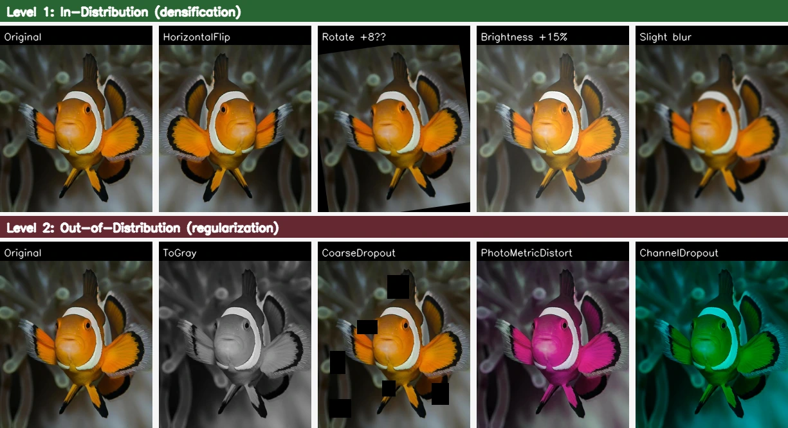

### Единственное жёсткое ограничение

У обоих уровней есть одно правило, которым нельзя жертвовать: **после трансформации метка должна оставаться однозначной.** Практическая проверка очень простая: покажите аугментированное изображение доменному эксперту и попросите его поставить метку. Покажите нашу аугментированную рыбу морскому биологу: если он без сомнений назовёт тот же вид, трансформация безопасна. Если начинает сомневаться, трансформация либо слишком сильная, либо вообще не подходит для вашей задачи.

Именно поэтому граница «реалистично vs нереалистично» слишком грубая. Рыба в оттенках серого нереалистична, но метка «рыба» у неё не ломается — значит, для уровня 2 это безопасно. Фото томата с сильным сдвигом `hue` может выглядеть вполне реалистично, но если красный стал зелёным, метка спелости испорчена — значит, трансформация опасна. Вопрос всегда в метке, а не в пикселях. Если хотите копнуть глубже — перспектива многообразий, инвариантность vs эквивариантность, архитектурное кодирование симметрий, — посмотрите [What Is Image Augmentation?](https://albumentations.ai/docs/1-introduction/what-are-image-augmentations/).

Теперь у нас есть инструменты мышления: каждая трансформация — это утверждение об инвариантности; эти утверждения бывают двух уровней — закрытие правдоподобных пробелов и намеренное давление; у обоих уровней одно общее ограничение — метка должна пережить трансформацию. Дальше — сам процесс сборки. Сначала короткая памятка, к которой удобно возвращаться по ходу проекта, а потом пройдём все шаги с объяснением, почему они устроены именно так.

## Краткая памятка: пайплайн в 7 шагов

**Собирайте пайплайн постепенно и в таком порядке:**

1. **Нормализация размера** — сначала кадрирование или изменение размера.
2. **Базовые геометрические инвариантности** — [`HorizontalFlip`](https://explore.albumentations.ai/transform/HorizontalFlip), [`SquareSymmetry`](https://explore.albumentations.ai/transform/SquareSymmetry) для аэросъёмки и медицины.
3. **Dropout и окклюзии** — [`CoarseDropout`](https://explore.albumentations.ai/transform/CoarseDropout), [`ConstrainedCoarseDropout`](https://explore.albumentations.ai/transform/ConstrainedCoarseDropout).
4. **Снижение зависимости от цвета** — [`ToGray`](https://explore.albumentations.ai/transform/ToGray), [`ChannelDropout`](https://explore.albumentations.ai/transform/ChannelDropout), если это уместно.
5. **Афинные преобразования** — [`Affine`](https://explore.albumentations.ai/transform/Affine) для масштаба и поворота.
6. **Трансформации под конкретный домен** — специализированные преобразования под вашу задачу.
7. **Нормализация** — стандартная или по конкретному примеру, всегда последней.

**Базовый стартовый пайплайн:**

```python
A.Compose([
    A.RandomCrop(height=224, width=224),      # Шаг 1: Размер
    A.HorizontalFlip(p=0.5),                  # Шаг 2: Базовая геометрия
    A.CoarseDropout(num_holes_range=(0.02, 0.1),  # Шаг 3: Dropout
                    hole_height_range=(0.05, 0.15),
                    hole_width_range=(0.05, 0.15), p=0.5),
    A.Normalize(),                            # Шаг 7: Нормализация
], seed=137)
```

Дальше разберём каждый шаг и логику за ним, а потом перейдём к настройке, диагностике и тому, как это всё доводить до production.

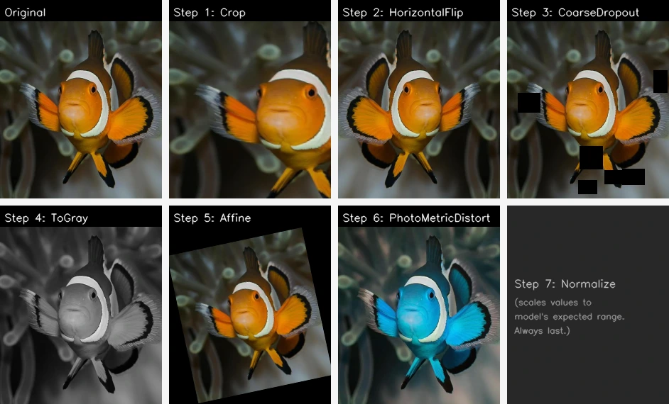

## Собираем пайплайн

### Почему порядок важен

Порядок из схемы выше — не вопрос вкуса. Он отражает то, как аугментация воздействует на обучающий сигнал. В отличие от `weight decay` или слоёв dropout, которые равномерно давят на все примеры, аугментация — это хирургический инструмент: разные трансформации можно применять к разным классам, разным изображениям и разным сценариям отказа. Такой степени свободы не даёт ни один другой регуляризатор. Но эту операцию нужно делать в правильном порядке.

Удобно думать об этом как о цепочке зависимостей: **разрешение → геометрия → окклюзия → цвет → вариативность домена → нормализация.** Каждый шаг опирается на предыдущий:

- **Сначала разрешение**, потому что эффект трансформаций зависит от разрешения. Ядро размытия 5 × 5 на изображении 1024 × 1024 почти незаметно; то же ядро на 64 × 64 уничтожает мелкие детали. Сначала фиксируйте пространственный размер, потом подбирайте всё остальное.
- **Геометрию — раньше**, потому что отражения и повороты на 90 градусов — это чистая перестановка пикселей: без интерполяции, без артефактов, без потери информации. Если добавить их рано, все следующие трансформации будут видеть обе ориентации, а значит, разнообразие дальше по пайплайну станет максимальным.
- **Dropout — после crop**, потому что если он сработает до crop, замаскированные области могут целиком вырезаться при кадрировании, и регуляризация просто пропадёт.
- **Нормализация — всегда последней.** Первый слой модели ожидает вход в определённом числовом диапазоне. Любая трансформация после нормализации уводит вход с этого ожидаемого многообразия.

### Как проходить эти шаги

Не добавляйте все семь шагов сразу. Начните с crop и одного отражения. Обучите модель. Зафиксируйте метрику на валидации. Потом добавьте одно семейство трансформаций. Обучите снова. Сравните. Звучит занудно — так и есть, — но это единственный надёжный способ понять, что реально помогает. Трансформации взаимодействуют нелинейно: умеренный сдвиг цвета, который сам по себе полезен, в комбинации с тяжёлым контрастом и размытием может начать вредить. Если вы навалили сразу пять трансформаций и метрика просела, вы отлаживаете систему из пяти переменных одним экспериментом.

**Возобновляйте обучение из чекпоинтов, а не с нуля.** Дообучили до сходимости, сохранили лучший чекпоинт, добавили одну новую трансформацию, продолжили из него. Если стало лучше — оставили аугментацию и сохранили новый чекпоинт. Если нет — выкинули и пробуете следующий кандидат. Именно так обычно и работают участники Kaggle: дошли до определённого уровня, придумали новую идею, дообучили от предыдущего лучшего чекпоинта с этой идеей. Каждый шаг здесь по сути становится отдельным запуском дообучения: у модели уже есть хорошие признаки, и вы проверяете, помогает ли новая аугментация сделать их ещё лучше.

Оговорка в том, что такой процесс создаёт зависимость от траектории, а значит, строгая воспроизводимость становится сложнее. Но на практике итоговая комбинация, найденная таким способом, обычно хорошо работает и при полном переобучении с нуля: поиск нащупал хорошую область пространства аугментаций, а повторное обучение уже доводит результат. Альтернатива — полный перебор по сетке по трансформациям, вероятностям и силам — слишком дорога вычислительно. Инкрементальный поиск с тёплого старта делает задачу выполнимой, потому что вы исследуете по одной оси за раз.

### Аугментация по классам

Стандартный подход — применять аугментации равномерно ко всему датасету, как и любой другой регуляризатор. Но поскольку аугментации применяются к каждому изображению отдельно, у вас появляется степень свободы, которой нет у других регуляризаторов: **можно использовать разные аугментационные пайплайны для разных классов, разных типов изображений и даже отдельных примеров.** Это подход со скальпелем — точечный выбор того, какие аугментации и к каким данным применять.

Этот принцип работает на всех этапах пайплайна — для геометрии, цвета, dropout и доменных трансформаций, — поэтому важно проговорить его до того, как вы начнёте собирать всё остальное.

Возьмём распознавание цифр: полный поворот на 360° допустим для большинства цифр, но **не для 6 и 9** — если повернуть 6 на 180°, получится 9. То же самое с буквами: горизонтальное отражение допустимо для многих символов, но не для `b` и `d` или `p` и `q`. Аналогично и с цветом: если одни классы определяются цветом, например спелый и неспелый фрукт, а другие — нет, например форма стебля или листа, то [`ToGray`](https://explore.albumentations.ai/transform/ToGray) можно применять только к классам, где важна форма, а не цвет.

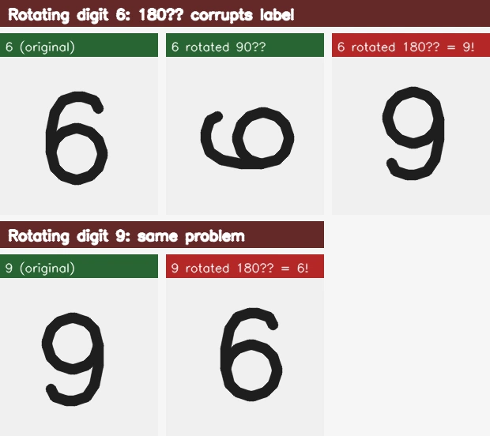

Логика по классам встраивается прямо в загрузчик данных:

```python
if label in [6, 9]:
    transform = pipeline_without_rotation
else:
    transform = pipeline_with_full_rotation
```

Концептуально это очень чистое и практически простое решение — нужен только роутинг в вашем классе датасета. Держите эту идею в голове, пока будете идти по следующим шагам: если трансформация подходит большинству, но не всем классам, ответом обычно становится именно маршрутизация по классам.

### Шаг 1. Нормализация размера: сначала crop или resize

Часто изображения в датасете, например 1024 × 1024, больше входного размера модели, например 256 × 256. Почти всегда приводить их к целевому размеру нужно **в самом начале** пайплайна.

**Почему сначала?** Любая следующая трансформация — отражение, поворот, dropout, цветовая аугментация — работает с пикселями. Если применять её к изображению 1024 × 1024, а потом обрезать до 256 × 256, вы зря потратите вычисления на 15/16 пикселей. Подробно про то, как не превратить аугментацию в CPU-узкое место, мы писали в статье [Optimizing Augmentation Pipelines for Speed](https://albumentations.ai/docs/3-basic-usage/performance-tuning/). Но ещё важнее другое: некоторые трансформации — dropout, шум, размытие — дают эффект, зависящий от разрешения. Дыра dropout размером 32 × 32 на изображении 1024 × 1024 закрывает 0.1% площади. Та же дыра на 256 × 256 закрывает уже 1.6% — в шестнадцать раз больше. Сначала crop, потом настройка параметров под то изображение, которое действительно увидит модель.

Здесь важно различать два сценария: **resize сохраняет статистики изображения** — распределение пикселей остаётся тем же, только в меньшем разрешении, — а **crop меняет их**, потому что вы выбираете пространственное подмножество изображения, а вместе с ним сдвигаются среднее, дисперсия и сам контент.

#### Прямой crop

- **Для обучения:** используйте [`A.RandomCrop`](https://explore.albumentations.ai/transform/RandomCrop) или [`A.RandomResizedCrop`](https://explore.albumentations.ai/transform/RandomResizedCrop). Если изображения могут быть меньше целевого размера, задайте `pad_if_needed=True` прямо в трансформации crop.
- **Для валидации:** обычно это [`A.CenterCrop`](https://explore.albumentations.ai/transform/CenterCrop) и при необходимости тоже `pad_if_needed=True`.

Для классификации часто предпочитают [`A.RandomResizedCrop`](https://explore.albumentations.ai/transform/RandomResizedCrop): он объединяет кадрирование с вариацией масштаба и соотношения сторон, и из-за этого отдельный [`A.Affine`](https://explore.albumentations.ai/transform/Affine) позже может уже не понадобиться.

#### Resize до короткой стороны, потом crop

[`A.SmallestMaxSize`](https://explore.albumentations.ai/transform/SmallestMaxSize) меняет размер так, чтобы короткая сторона совпала с целевой, сохраняя соотношение сторон, а затем [`A.RandomCrop`](https://explore.albumentations.ai/transform/RandomCrop) для обучения или [`A.CenterCrop`](https://explore.albumentations.ai/transform/CenterCrop) для валидации вырезает нужный фрагмент. Это стандартный препроцессинг в стиле ImageNet.

#### Letterboxing: resize до длинной стороны и padding

[`A.LetterBox`](https://explore.albumentations.ai/transform/LetterBox) меняет размер так, чтобы длинная сторона вписалась в цель, а оставшееся пространство заполняет константой. Так вы сохраняете всё содержимое изображения, но получаете паддинг-пиксели, которые модель должна научиться игнорировать.

**Компромисс здесь такой:** стратегия «короткая сторона + crop» может терять содержимое по краям, а для детекции crop вообще может вырезать маленькие объекты целиком. Letterboxing сохраняет всё, но добавляет паддинг. Для классификации crop обычно нормален. Для детекции маленьких объектов letterboxing безопаснее.

```python
import albumentations as A

TARGET_HEIGHT = 256
TARGET_WIDTH = 256

# RandomResizedCrop (вариация масштаба и соотношения сторон в одном шаге)
train_pipeline_rrc = A.Compose([
    A.RandomResizedCrop(size=(TARGET_HEIGHT, TARGET_WIDTH), scale=(0.8, 1.0), p=1.0),
], seed=137)

# SmallestMaxSize + RandomCrop (стиль ImageNet)
train_pipeline_shortest_side = A.Compose([
    A.SmallestMaxSize(max_size_hw=(TARGET_HEIGHT, TARGET_WIDTH), p=1.0),
    A.RandomCrop(height=TARGET_HEIGHT, width=TARGET_WIDTH, p=1.0),
], seed=137)

val_pipeline_shortest_side = A.Compose([
    A.SmallestMaxSize(max_size_hw=(TARGET_HEIGHT, TARGET_WIDTH), p=1.0),
    A.CenterCrop(height=TARGET_HEIGHT, width=TARGET_WIDTH, p=1.0),
], seed=137)

# Letterboxing (сохраняет всё содержимое)
pipeline_letterbox = A.Compose([
    A.LetterBox(size=(TARGET_HEIGHT, TARGET_WIDTH), fill=0, p=1.0),
], seed=137)
```

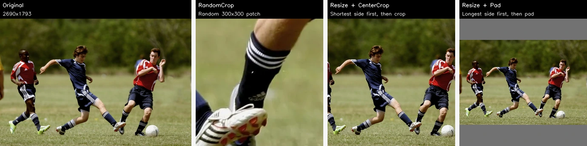

### Шаг 2. Добавляем базовые геометрические инвариантности

Если в обучающих данных объекты в основном показаны в одной ориентации, модель начнёт считать ориентацию полезным признаком вместо того, чтобы её игнорировать. Геометрические инвариантности исправляют этот перекос — и у них есть важное преимущество: это чистая перестановка пикселей, а значит, они быстрые, не требуют интерполяции, не создают артефактов и почти всегда безопасны, если только не нарушают симметрию, значимую для конкретного примера.

Интуиция проста: [`HorizontalFlip`](https://explore.albumentations.ai/transform/HorizontalFlip) — естественный выбор для большинства реальных изображений: кот, смотрящий влево, остаётся тем же котом. [`SquareSymmetry`](https://explore.albumentations.ai/transform/SquareSymmetry) подходит там, где ориентация вообще не несёт смысла: аэросъёмка, микроскопия, часть медицинских изображений. Модель должна выучить такие инвариантности, но если в обучении все кошки смотрят только вправо, она может выучить правило «кошка = животное, смотрящее вправо». Геометрическая аугментация ломает эту ложную зависимость, потому что явно показывает модели: ориентация не определяет класс.

#### Какие трансформации использовать

- **Горизонтальное отражение:** [`A.HorizontalFlip`](https://explore.albumentations.ai/transform/HorizontalFlip) подходит почти всегда для естественных изображений: уличные сцены, животные, обычные объекты вроде тех, что встречаются в ImageNet, COCO или Open Images. Рыба, плывущая влево, — тот же вид, что и рыба, плывущая вправо; идентичность объекта почти никогда не зависит от горизонтальной ориентации. Это самая безопасная аугментация, которую можно добавить почти в любой vision-пайплайн. Главное исключение — случаи, где направление жёстко значимо: распознавание конкретных символов, дорожных знаков и других объектов, где отражение меняет смысл.

- **Вертикальное отражение и повороты на 90/180/270 градусов (`SquareSymmetry`):** если ваши данные инвариантны к отражениям по осям и к поворотам на 90, 180 и 270 градусов, [`A.SquareSymmetry`](https://explore.albumentations.ai/transform/SquareSymmetry) — отличный выбор. Она случайно применяет одну из 8 симметрий квадрата: тождественное преобразование, горизонтальное отражение, вертикальное отражение, отражение по диагонали, поворот на 90°, поворот на 180°, поворот на 270° и отражение по побочной диагонали.

  Ключевое преимущество [`SquareSymmetry`](https://explore.albumentations.ai/transform/SquareSymmetry) перед поворотами на произвольный угол в том, что все 8 операций **точные**: они просто переставляют пиксели без интерполяции. Поворот на 90° переносит каждый пиксель в строго определённую новую позицию. Поворот на 37° уже требует интерполяции, то есть новые значения пикселей вычисляются как взвешенное среднее соседей, а это добавляет лёгкое размытие и может создавать артефакты.

  **Где это уместно:** аэросъёмка и спутниковая съёмка, где нет канонического «верха»; микроскопия, где стекло можно положить под любым углом; некоторые медицинские изображения, например аксиальные срезы, где тоже нет предпочтительного поворота; и даже неочевидные домены. В [соревновании Kaggle по digital forensics](https://ieeexplore.ieee.org/abstract/document/8622031), где нужно было определить модель камеры по снимку, [`SquareSymmetry`](https://explore.albumentations.ai/transform/SquareSymmetry) тоже оказалась полезной — вероятно, потому что характерные для сенсора шумовые паттерны обладают симметриями относительно поворотов и отражений.

  Если для ваших данных осмысленно только вертикальное отражение, используйте [`A.VerticalFlip`](https://explore.albumentations.ai/transform/VerticalFlip).

**Где это ломается:** вертикальное отражение недопустимо для дорожных сцен — небо не бывает под дорогой. Большие повороты портят распознавание цифр и текста. Всегда проверяйте, сохраняет ли добавляемая геометрия метку именно в вашей задаче. Простой тест: поставил бы человек-разметчик ту же самую метку на трансформированное изображение?

### Шаг 3. Добавьте аугментации с dropout и окклюзиями

На этом месте многие останавливаются слишком рано. Аугментации семейства dropout дают один из самых сильных приростов качества среди всех трансформаций и нередко оказываются полезнее, чем цветовые трансформации и размытия, которым обычно достаётся больше внимания.

Механизм здесь вполне конкретный: **dropout заставляет модель учиться по слабым признакам, а не только по доминирующим.** Представьте классификатор моделей автомобилей. Без dropout сеть может легко выйти на низкий `loss`, если найдёт эмблему на решётке радиатора, самый характерный фрагмент изображения, и начнёт игнорировать всё остальное. Это работает ровно до тех пор, пока не появляется машина с грязью на решётке, без шильдика после тюнинга или в таком ракурсе, где передняя часть вообще не попала в кадр. С dropout эмблема иногда оказывается замаскирована, и сети *приходится* дополнительно выучивать форму фар, пропорции кузова, рисунок колёс, линию крыши. В итоге у неё появляется несколько независимых «способов понять» класс вместо одного хрупкого shortcut.

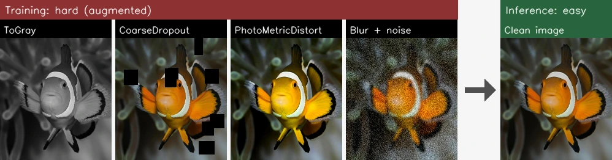

То, что модель выучивает сильный доминирующий признак, само по себе не проблема: полосы у зебры и правда надёжный индикатор. Проблема в другом: при деплое нельзя гарантировать, что этот признак всегда будет виден. Зебра может стоять в высокой траве, и в кадре останется только голова; логотип автомобиля может быть заляпан грязью; лицо может частично закрывать шарф. Модель, которая умеет узнавать объект не только по доминирующему признаку, но и по более слабым, например по форме головы, пропорциям тела или походке, куда устойчивее к таким реальным окклюзиям. Dropout систематически заставляет модель строить именно такую избыточность признаков.

#### Какие dropout-трансформации доступны

В Albumentations есть несколько трансформаций, которые реализуют эту идею:

- **[`A.CoarseDropout`](https://explore.albumentations.ai/transform/CoarseDropout):** случайным образом зануляет прямоугольные области изображения. Базовая рабочая трансформация из семейства dropout.
- **[`A.GridDropout`](https://explore.albumentations.ai/transform/GridDropout):** зануляет пиксели по регулярной сетке. Даёт более равномерное покрытие, чем случайные прямоугольники.
- **[`A.XYMasking`](https://explore.albumentations.ai/transform/XYMasking):** маскирует вертикальные и горизонтальные полосы на изображении. По духу похожа на [`GridDropout`](https://explore.albumentations.ai/transform/GridDropout), но использует полосы, выровненные по осям, а не ячейки сетки. Изначально её придумали как визуальный аналог SpecAugment для спектрограмм, но на обычных изображениях она тоже работает хорошо.
- **[`A.ConstrainedCoarseDropout`](https://explore.albumentations.ai/transform/ConstrainedCoarseDropout):** применяет dropout *только* внутри областей, заданных масками или ограничивающими рамками. Вместо случайного зануления квадратов где угодно, в том числе по фону, эта трансформация направляет dropout *на сами объекты*.

#### Почему dropout-аугментация настолько эффективна

**Окклюзия в реальном мире — это норма, а не исключение.** При деплое объекты постоянно оказываются за столбами, перекрывают друг друга на полках, частично выходят за границы кадра или заслоняются другими объектами. Обучающие данные почти никогда не отражают это адекватно: большинство датасетов предпочитает чистые, полностью видимые экземпляры. Dropout систематически имитирует частичную окклюзию, поэтому модель приходит в production уже умея распознавать объекты по неполным наблюдениям.

**Пространственная защита от ложных корреляций.** Модели пугающе хорошо находят shortcut'ы, и последствия бывают вполне серьёзными. В известном разборе классификации на ImageNet ([Stock & Cissé, ECCV 2018](https://arxiv.org/abs/1711.11443)) исследователи показали, что модели начали связывать метку `basketball` с присутствием темнокожего человека: 78% изображений, предсказанных как `basketball`, содержали темнокожих людей, а 90% ошибочно классифицированных изображений `basketball` содержали белых людей. Сеть не выучила правило «basketball = мяч + кольцо + площадка + поза», а зацепилась за демографический признак, который просто коррелировал с классом в обучающем распределении. [`CoarseDropout`](https://explore.albumentations.ai/transform/CoarseDropout) умеет ломать такие пространственные shortcut'ы, если время от времени маскировать коррелирующую область фона и тем самым вынуждать модель искать сам объект. Если же shortcut основан на *цвете* вроде «зелёный фон = птица», то сильнее работают [`ToGray`](https://explore.albumentations.ai/transform/ToGray) и цветовые аугментации: они бьют прямо по цветовому каналу, на котором держится shortcut. Dropout борется с пространственными shortcut'ами, а цветовые аугментации — с хроматическими. Используйте и то и другое, но понимайте, какой инструмент против чего направлен.

**У dropout две роли: работа с фоном и работа с передним планом.** [`CoarseDropout`](https://explore.albumentations.ai/transform/CoarseDropout) и [`ConstrainedCoarseDropout`](https://explore.albumentations.ai/transform/ConstrainedCoarseDropout) решают разные, но взаимодополняющие задачи:

- **[`CoarseDropout`](https://explore.albumentations.ai/transform/CoarseDropout) маскирует случайные области где угодно на изображении**, в том числе на фоне. Это разрушает ложные пространственные корреляции между фоновыми признаками и целевым классом, как в примере выше с `basketball` и демографическим признаком. Даже в классификации, где нет явной ограничивающей рамки, маскирование фона полезно именно потому, что напрямую нацелиться на объект вы не можете.
- **[`ConstrainedCoarseDropout`](https://explore.albumentations.ai/transform/ConstrainedCoarseDropout) маскирует области *внутри* размеченных объектов** — по маскам или ограничивающим рамкам, заставляя модель узнавать объект по частичному изображению. Это напрямую имитирует реальную окклюзию самого объекта: автомобиль за столбом, товар, наполовину скрытый на полке.

[`ConstrainedCoarseDropout`](https://explore.albumentations.ai/transform/ConstrainedCoarseDropout) подходит для **любой задачи, где у вас есть пространственная разметка**: классификации с ограничивающими рамками, детекции объектов, instance segmentation. Это не трансформация только для детекции; она полезна в любой задаче, где есть рамки или маски.

Рассмотрим конкретный пример: вы обучаете детектор мяча для футбольных или баскетбольных видео. Мяч маленький, часто всего 10–30 пикселей в диаметре, и его регулярно частично перекрывают игроки. Если применять [`CoarseDropout`](https://explore.albumentations.ai/transform/CoarseDropout) случайно по всему изображению, область мяча почти никогда не попадёт под маску: dropout ляжет на фон, разметку поля или тела игроков. А вот [`ConstrainedCoarseDropout`](https://explore.albumentations.ai/transform/ConstrainedCoarseDropout), ограниченный рамкой мяча, гарантирует, что каждый акт dropout действительно имитирует частичную окклюзию таргета. В этом и разница между бессмысленной регуляризацией по фоновым пикселям и прямым обучением модели находить маленькие частично видимые объекты.

Это обобщается очень широко: если интересующие вас объекты малы относительно размера изображения, обычный dropout без ограничений малоэффективен, а dropout, ограниченный областью объекта, даёт заметно лучший результат.

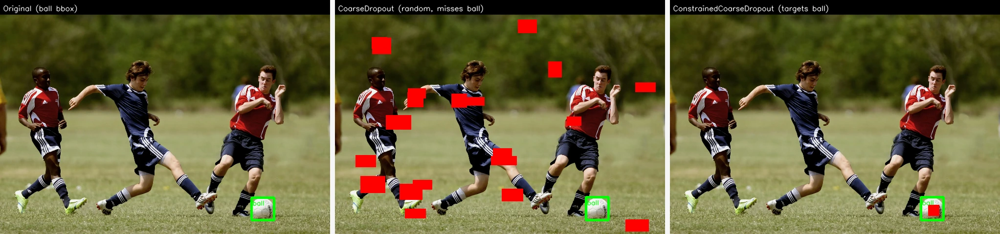

**Типичная ошибка:** дыры слишком большие или слишком частые, и вы уничтожаете основной сигнал, который нужен модели. Если одна дырка dropout закрывает 60% изображения, оставшиеся 40% могут просто не содержать достаточно информации для правильной метки. Возвращаясь к метафоре со специями: dropout — это перец чили. В правильной дозе он меняет блюдо к лучшему, но одна столовая ложка в тарелке всё портит. Начинайте с умеренных настроек, обязательно визуализируйте результат и повышайте интенсивность постепенно.

**Следите за взаимодействием с подавлением цвета.** Попугай в оттенках серого, если он виден целиком, всё ещё однозначно остаётся попугаем: видны форма, перья, клюв и поза. Но попугай в оттенках серого, у которого dropout закрыл голову, уже совсем другой случай. Перед вами просто серое туловище, которое может принадлежать нескольким видам птиц: цвет, который помог бы отличить его, исчез, а форма, по которой можно было бы узнать вид, тоже оказалась замаскирована. Каждая трансформация по отдельности метку сохраняет. Вместе же, при высокой вероятности, они могут вытолкнуть пример за границу распознавания. Именно поэтому взаимодействия трансформаций так важны: если вы используете и [`ToGray`](https://explore.albumentations.ai/transform/ToGray), и [`CoarseDropout`](https://explore.albumentations.ai/transform/CoarseDropout), держите вероятность каждой из них умеренной: 5–15% для подавления цвета и 30–50% для dropout. Тогда совместная вероятность того, что обе трансформации сработают на одном и том же примере, останется низкой.

### Шаг 4. Снизьте зависимость от цветовых признаков

Цвет — один из самых соблазнительных признаков, за который может уцепиться нейросеть. Его легко вычислить, он часто хорошо разделяет классы в обучающих выборках и при этом катастрофически ненадёжен при деплое. Модель, выучившая правило «красное = яблоко», провалится на зелёных яблоках, на яблоках под синеватым LED-освещением и на снимках с камеры с другим балансом белого. Но заметьте: если перевести нашу рыбу в оттенки серого, она всё равно останется однозначно тем же видом, потому что её идентичность сидит в форме тела, строении плавников и рисунке чешуи, а не в конкретном оттенке оранжевого. Зависимость от цвета — один из самых частых источников разрыва между качеством на train и на test.

На эту уязвимость нацелены две трансформации:

- **[`A.ToGray`](https://explore.albumentations.ai/transform/ToGray):** переводит изображение в оттенки серого и полностью убирает всю цветовую информацию. Модель вынуждена узнавать объект только по форме, текстуре, границам и контексту.
- **[`A.ChannelDropout`](https://explore.albumentations.ai/transform/ChannelDropout):** случайным образом убирает один или несколько цветовых каналов, например превращает RGB-изображение в RG, RB, GB или вовсе в одноканальное. Это не полностью уничтожает цветовой сигнал, а лишь частично его ослабляет.

Механизм здесь тот же, что и у [`CoarseDropout`](https://explore.albumentations.ai/transform/CoarseDropout), только действует он не в пространственном, а в цветовом измерении. Если dropout удаляет *пространственные области* и тем самым заставляет модель учиться по разным частям объекта, то [`ToGray`](https://explore.albumentations.ai/transform/ToGray) и [`ChannelDropout`](https://explore.albumentations.ai/transform/ChannelDropout) убирают *цветовую информацию* и заставляют модель опираться на форму и текстуру. Обе относятся к Level 2 аугментациям: на инференсе модель увидит полноцветные изображения, а это строго более простая задача, чем та, на которой её обучали.

Опытный орнитолог узнаёт виды в тумане, в сумерках и через залитый дождём бинокль, то есть в условиях, где цвет либо ненадёжен, либо вообще не виден. Он опирается на силуэт, манеру полёта, размер и среду обитания. Новичок, который учился по ярким фотографиям из полевого определителя, в такой ситуации скажет: «Я не понимаю, тут не видно цвета». [`ToGray`](https://explore.albumentations.ai/transform/ToGray) даёт вашей модели именно такую школу опытного наблюдателя: она строит признаки, основанные на форме, которые работают и с цветом, и без него, так что цвет становится полезным дополнительным сигналом, а не единственной точкой отказа.

**Когда это лучше пропустить:** если цвет и есть главный сигнал задачи, такие трансформации портят метку. Классификация спелых и неспелых фруктов опирается на изменение цвета. Определение сигнала светофора целиком завязано на цвете. Идентификация бренда часто держится на фирменных цветах. В таких случаях подавление цвета — не полезная регуляризация, а просто шум в метках.

**Рекомендация:** если цвет не является стабильно надёжным признаком для вашей задачи или вам нужна устойчивость к вариациям между камерами, условиями освещения и окружением, добавьте [`A.ToGray`](https://explore.albumentations.ai/transform/ToGray) или [`A.ChannelDropout`](https://explore.albumentations.ai/transform/ChannelDropout) с низкой вероятностью, порядка 5–15%.

### Шаг 5. Добавьте affine-трансформации: масштаб, поворот и не только

Человек в 2 метрах от камеры занимает весь кадр, а тот же человек в 50 метрах превращается в точку. Камеру видеонаблюдения после сильного ветра может перекосить на 5 градусов. На конвейере товар может сместиться на сантиметр. Все эти непрерывные геометрические вариации — масштаб, поворот, сдвиг, сдвиг с наклоном — постоянно ломают модель при деплое, и одних дискретных отражений для этого недостаточно. [`A.Affine`](https://explore.albumentations.ai/transform/Affine) покрывает всё это одной эффективной операцией.

Разница со Шагом 2 принципиальна. Отражения и повороты на 90° — это *дискретные* симметрии: результат получается точным и не требует интерполяции. Affine-трансформации — *непрерывные*: чтобы вычислить новые значения пикселей, им нужна интерполяция, а значит, появляется лёгкое размытие. Кроме того, они вычислительно дороже. Поэтому они идут после отражений: сначала вы почти бесплатно забираете базовые симметрии, а уже потом добавляете непрерывную геометрическую вариативность.

#### Масштаб: недооценённая инвариантность

Вариация масштаба — одна из самых частых причин, по которым модели ломаются, и при этом о ней говорят меньше, чем о повороте или цвете. В вашем обучающем наборе почти наверняка какие-то масштабы перепредставлены, а какие-то недопредставлены. И в отличие от цвета или яркости, где сдвиг обычно плавный, вариация масштаба в реальном мире может отличаться на порядки.

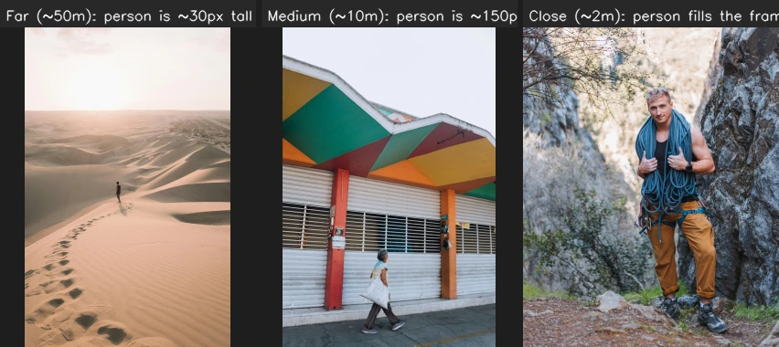

**Почему deep-сетям всё равно нужна аугментация масштаба, несмотря на архитектурные ухищрения.** Глубокие CNN уже отчасти умеют работать с масштабом благодаря иерархической структуре: ранние слои ловят мелкие локальные признаки, а глубокие собирают их в большие receptive field. Маленький человек, далеко от камеры, активирует признаки на одной глубине; крупный человек, близко к камере, на другой. Feature Pyramid Networks (FPN), которые явно объединяют признаки с нескольких уровней разрешения в общее предсказание, идут ещё дальше: они совмещают детальные и грубые признаки. Но даже с FPN способность сети работать на разных масштабах ограничена тем, что она увидела на обучении. Аугментация масштаба закрывает дыры в покрытии по масштабу, которые сама архитектура компенсировать не может. Поэтому для задач детекции и сегментации это по-прежнему одна из самых полезных аугментаций.

Хороший и относительно безопасный стартовый диапазон для параметра `scale` — `(0.8, 1.2)`. В задачах, где большая вариативность масштаба ожидаема заранее, например в уличных сценах, аэросъёмке или мониторинге дикой природы, часто используют и гораздо более широкие диапазоны вроде `(0.5, 2.0)`.

> На практике. Если вы задаёте широкий несимметричный диапазон вроде `scale=(0.5, 2.0)` и выбираете значения равномерно из всего интервала, то увеличение масштаба, то есть значения `1.0–2.0`, будет встречаться **вдвое чаще**, чем уменьшение `0.5–1.0`, просто потому, что этот подинтервал вдвое длиннее. Чтобы приблизительно с вероятностью 50/50 получать увеличение и уменьшение масштаба, используйте `balanced_scale=True` в `A.Affine`. Сначала трансформация случайно выбирает направление, а затем уже равномерно сэмплирует значение из соответствующего подинтервала.

#### Поворот: зависит от контекста и очень часто используется чрезмерно

Небольшие повороты, например `rotate=(-15, 15)`, имитируют лёгкий наклон камеры или вариацию ориентации объекта. Они полезны, если такие отклонения реально встречаются при деплое, но слабо представлены в обучении. При этом поворот — одна из самых часто переиспользуемых аугментаций. Во многих задачах у объектов есть сильная каноническая ориентация: машины стоят горизонтально, лица расположены вертикально, текст идёт по горизонтали. Большие углы поворота нарушают это априорное знание.

Ключевой вопрос здесь простой: насколько сильная вариативность поворота реально есть в вашей среде деплоя? Камера наблюдения может отклоняться на ±5°. Смартфон в руке — на ±15°. Дрон — на все 360°. Подстраивайте диапазон аугментации под реальные условия, если хотите покрыть in-distribution-вариации, или намеренно выходите за них ради регуляризации Level 2. Но важно чётко понимать, какой из этих двух сценариев вы сейчас реализуете.

У оптимального угла поворота, диапазона яркости или вероятности dropout нет универсальной формулы. Всё это зависит от распределения данных, архитектуры модели и самой задачи. Но хорошие априорные ориентиры у вас есть: отталкивайтесь от реальности деплоя, расширяйте out-of-distribution-трансформации до тех пор, пока метка не начнёт становиться неоднозначной, затем немного откатывайтесь назад, а для быстрой проверки используйте интерактивный инструмент [Explore Transforms](https://explore.albumentations.ai/), который позволяет в реальном времени применять любую трансформацию к вашим собственным изображениям.

#### Сдвиг и shear: обычно второстепенны

Сдвиг имитирует появление объекта в разных местах кадра. Для CNN **аугментация сдвигом в значительной степени избыточна**, потому что сверточные слои по построению эквивариантны к сдвигу: если вы сдвинули вход, признаки сдвинутся соответствующим образом. Это как раз тот случай, когда архитектура уже сама содержит нужную симметрию, и аугментации остаётся немного. Сдвиг всё ещё может быть полезен на границах изображения, где паддинг ломает идеальную эквивариантность, или в архитектурах, где полной эквивариантности к сдвигу нет, например в некоторых вариантах Vision Transformer, но обычно это не самая сильная добавка к пайплайну.

Shear имитирует косые ракурсы, например документ, снятый сбоку, или курсивный текст с разным наклоном. И сдвиг, и shear для общей устойчивости нужны реже, чем масштаб и поворот, но у shear есть важные прикладные ниши: OCR, где текст может быть наклонён, видеонаблюдение с разным креплением камер, промышленная инспекция, где изделие может лежать под углом на ленте.

#### [`Perspective`](https://explore.albumentations.ai/transform/Perspective): когда affine уже недостаточно

[`Affine`](https://explore.albumentations.ai/transform/Affine) сохраняет параллельность прямых, то есть прямоугольник превращается в параллелограмм. [`A.Perspective`](https://explore.albumentations.ai/transform/Perspective), напротив, вводит непараллельные искажения и тем самым имитирует вид плоской поверхности под углом. Это полезно в задачах, связанных с плоскими объектами, например документами, вывесками или фасадами зданий, а также в случаях, где точка съёмки камеры сильно меняется.

### Шаг 6. Предметно-специфичные и продвинутые аугментации

Когда у вас уже есть внятный базовый пайплайн с кропами, базовыми инвариантностями, dropout, а при необходимости ещё и подавлением цвета и affine-трансформациями, можно переходить к более специализированным аугментациям. Всё в этом разделе нацелено на конкретные режимы отказа, которые вы уже нашли либо через диагностический протокол, либо по опыту из production.

Именно здесь начинает окупаться подход, основанный на диагностике. Вы больше не гадаете, какая предметно-специфичная трансформация может помочь, а опираетесь на данные. Если «модель теряет 15% точности при тёмном освещении», это напрямую указывает на [`RandomBrightnessContrast`](https://explore.albumentations.ai/transform/RandomBrightnessContrast) и [`RandomGamma`](https://explore.albumentations.ai/transform/RandomGamma). Если «модель проваливается на размытых изображениях из-за движения», это прямой аргумент в пользу [`MotionBlur`](https://explore.albumentations.ai/transform/MotionBlur).

Полезная эвристика такая: **если вы не можете назвать конкретный режим отказа, который адресует трансформация, скорее всего, она вам не нужна.** У каждой трансформации в пайплайне должно быть однострочное обоснование, связанное либо с известной дырой в обучающих данных (Level 1), либо с осознанной стратегией регуляризации (Level 2). Формулировка «я добавил это, потому что кто-то в Twitter сказал, что помогает» обоснованием не является.

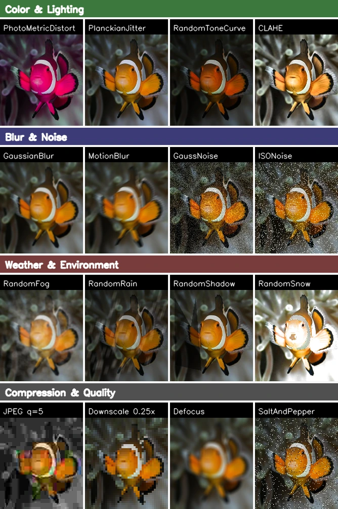

#### Быстрые стартовые наборы по доменам

Вместо того чтобы читать про каждую трансформацию подряд, найдите свой домен ниже и начните с 3–4 перечисленных вариантов. Всё остальное добавляйте только после проверки, что эти трансформации действительно помогают. Логика выбора везде одна и та же: каков главный источник различий между обучающими данными и условиями деплоя и какие трансформации это имитируют.

**Автономное вождение / уличная робототехника:**
Машине всё равно, какая погода на улице, а вот модели нет. Дождь, туман и солнечные блики убивают уличные системы восприятия чаще, чем необычный внешний вид объектов. Датасет для беспилотного автомобиля, собранный летом в Калифорнии, не покрывает большую часть условий, с которыми система столкнётся первой же зимой. [`RandomBrightnessContrast`](https://explore.albumentations.ai/transform/RandomBrightnessContrast) закрывает вариации экспозиции от рассвета до сумерек, [`MotionBlur`](https://explore.albumentations.ai/transform/MotionBlur) имитирует восприятие на скорости, а [`AtmosphericFog`](https://explore.albumentations.ai/transform/AtmosphericFog) и [`RandomShadow`](https://explore.albumentations.ai/transform/RandomShadow) покрывают погодные условия и тени под эстакадами, которых солнечный датасет просто не видел.

**Медицинские изображения: радиология / патология:**
Разрыв между разными больницами часто больше, чем разрыв между здоровой и патологической тканью. Модель, обученная в больнице A на одном бренде сканера, в больнице B увидит совсем другое распределение интенсивностей пикселей, если там стоит оборудование другого производителя. Та же патология в сыром пиксельном пространстве выглядит иначе. [`ElasticTransform`](https://explore.albumentations.ai/transform/ElasticTransform) покрывает небольшие деформации ткани при подготовке препарата; [`HEStain`](https://explore.albumentations.ai/transform/HEStain) имитирует вариации окрашивания между патологоанатомическими лабораториями и часто оказывается самой полезной аугментацией в гистопатологии; [`RandomGamma`](https://explore.albumentations.ai/transform/RandomGamma) и [`GaussNoise`](https://explore.albumentations.ai/transform/GaussNoise) закрывают различия в калибровке сканеров и шуме сенсоров. Ключевое ограничение здесь — величина воздействия: диагностический сигнал живёт в тонких различиях плотности, и сдвиг интенсивности на 5% уже может отделять здоровую ткань от патологической. Агрессивная аугментация, которая была бы безобидной на обычных изображениях, здесь уничтожит тот самый сигнал, который читает радиолог.

**Спутниковая и аэросъёмка:**
Ваши обучающие снимки, скорее всего, получены с одного семейства сенсоров, в один сезон и в схожих атмосферных условиях. А деплой охватывает всё это многообразие. Главные режимы отказа здесь — дымка, потому что атмосферное рассеяние меняется по сезону и времени суток, разные углы солнца, которые меняют тени и цветовую температуру, и различия в разрешении между спутниковыми платформами. [`ColorJitter`](https://explore.albumentations.ai/transform/ColorJitter) и [`PlanckianJitter`](https://explore.albumentations.ai/transform/PlanckianJitter) помогают со сдвигами освещения и цвета; [`AtmosphericFog`](https://explore.albumentations.ai/transform/AtmosphericFog) имитирует атмосферную дымку; [`Downscale`](https://explore.albumentations.ai/transform/Downscale) закрывает разрыв по разрешению между платформами.

**Ритейл / распознавание товаров:**
Главный шок для любой ритейл-команды в ML — разница между студийными карточками товара и тем, что присылают пользователи. Пользовательская фотография проходит через жестокую цепочку: камера телефона с автобалансом белого → JPEG-сжатие в мессенджере → повторное кодирование при загрузке на сервер. На выходе получается изображение, мало похожее на чистую студийную картинку, на которой обучалась модель. [`PhotoMetricDistort`](https://explore.albumentations.ai/transform/PhotoMetricDistort) покрывает хаос экспозиции, [`ImageCompression`](https://explore.albumentations.ai/transform/ImageCompression) имитирует цепочку повторного кодирования, [`GaussianBlur`](https://explore.albumentations.ai/transform/GaussianBlur) учитывает проблемы с фокусом на камерах телефонов, а [`Perspective`](https://explore.albumentations.ai/transform/Perspective) моделирует косые ракурсы, под которыми пользователи снимают товары.

**OCR / document vision:**
Документы, снятые на телефон, живут совсем в другом мире по сравнению со сканами с планшетного сканера: рука пользователя даёт тени, бумага изгибается, камера дрожит, а JPEG на выходе ещё дважды пережимается, прежде чем дойти до сервера. Самая важная трансформация здесь — [`Perspective`](https://explore.albumentations.ai/transform/Perspective): она имитирует неперпендикулярные углы съёмки, которые для фотографий с телефона скорее норма, чем исключение. [`MotionBlur`](https://explore.albumentations.ai/transform/MotionBlur) покрывает дрожание рук, [`ImageCompression`](https://explore.albumentations.ai/transform/ImageCompression) отвечает за деградацию качества, а [`RandomShadow`](https://explore.albumentations.ai/transform/RandomShadow) имитирует тени от руки и изгиба страницы, которых нет в сканерных обучающих данных.

**Промышленная инспекция:**
Сигналом задачи здесь часто служит волосная трещина, микроскопическая царапина или пятно меньше ногтя, и именно это определяет, какие трансформации вообще безопасно использовать. Размытие здесь ваш враг: оно стирает тот самый дефект, который нужно обнаружить. Реальные источники вариации между линиями и сменами — это различия в световой установке и шум сенсоров, а не качество фокусировки. [`RandomBrightnessContrast`](https://explore.albumentations.ai/transform/RandomBrightnessContrast) покрывает вариативность освещения, [`GaussNoise`](https://explore.albumentations.ai/transform/GaussNoise) отвечает за шум сенсора, а [`Illumination`](https://explore.albumentations.ai/transform/Illumination) имитирует неравномерное освещение из-за разного положения светильников. То, что мы сознательно не добавляем сюда размытие, не недосмотр, а решение, продиктованное предметной областью.

#### Быстрая памятка по трансформациям

В таблице ниже трансформации сгруппированы по тем режимам отказа, с которыми они борются. Перед тем как добавлять любую из них в код, проверьте её на собственных изображениях через интерактивный инструмент [Explore Transforms](https://explore.albumentations.ai).

| Режим отказа | Ключевые трансформации | Когда использовать |
|---|---|---|
| **Освещение / экспозиция** | [`ColorJitter`](https://explore.albumentations.ai/transform/ColorJitter), [`RandomBrightnessContrast`](https://explore.albumentations.ai/transform/RandomBrightnessContrast), [`RandomGamma`](https://explore.albumentations.ai/transform/RandomGamma), [`CLAHE`](https://explore.albumentations.ai/transform/CLAHE) | Освещение при обучении и при деплое заметно различается. [`ColorJitter`](https://explore.albumentations.ai/transform/ColorJitter) сразу меняет яркость, контраст, насыщенность и оттенок. [`RandomBrightnessContrast`](https://explore.albumentations.ai/transform/RandomBrightnessContrast) удобен, если вам нужны только вариации экспозиции. |
| **Цветовая температура** | [`PlanckianJitter`](https://explore.albumentations.ai/transform/PlanckianJitter), [`RandomToneCurve`](https://explore.albumentations.ai/transform/RandomToneCurve) | Разные камеры, баланс белого, калибровка сканеров. [`PlanckianJitter`](https://explore.albumentations.ai/transform/PlanckianJitter) сдвигает цвет вдоль кривой чёрного тела, то есть опирается на физически правдоподобную модель. |
| **Шум** | [`GaussNoise`](https://explore.albumentations.ai/transform/GaussNoise), [`ISONoise`](https://explore.albumentations.ai/transform/ISONoise), [`MultiplicativeNoise`](https://explore.albumentations.ai/transform/MultiplicativeNoise) | Плохое освещение, дешёвые сенсоры, спекл-шум в радаре или ультразвуке. |
| **Размытие** | [`GaussianBlur`](https://explore.albumentations.ai/transform/GaussianBlur), [`MotionBlur`](https://explore.albumentations.ai/transform/MotionBlur), [`Defocus`](https://explore.albumentations.ai/transform/Defocus), [`ZoomBlur`](https://explore.albumentations.ai/transform/ZoomBlur) | Артефакты движения, вариации фокуса, низкокачественная оптика. |
| **Сжатие** | [`ImageCompression`](https://explore.albumentations.ai/transform/ImageCompression), [`Downscale`](https://explore.albumentations.ai/transform/Downscale) | Пользовательские фото, повторно закодированные кадры из видео. |
| **Погода** | [`RandomFog`](https://explore.albumentations.ai/transform/RandomFog), [`AtmosphericFog`](https://explore.albumentations.ai/transform/AtmosphericFog), [`RandomRain`](https://explore.albumentations.ai/transform/RandomRain), [`RandomSnow`](https://explore.albumentations.ai/transform/RandomSnow) | Уличные системы, где погода реально влияет на качество в production. |
| **Блики / тени** | [`RandomSunFlare`](https://explore.albumentations.ai/transform/RandomSunFlare), [`LensFlare`](https://explore.albumentations.ai/transform/LensFlare), [`RandomShadow`](https://explore.albumentations.ai/transform/RandomShadow) | Уличные сцены, OCR с тенями от руки пользователя. |
| **Деформация ткани** | [`ElasticTransform`](https://explore.albumentations.ai/transform/ElasticTransform), [`ThinPlateSpline`](https://explore.albumentations.ai/transform/ThinPlateSpline), [`GridDistortion`](https://explore.albumentations.ai/transform/GridDistortion) | Гистопатология, рукописный текст и любые нежёсткие объекты. |
| **Вариативность окрашивания** | [`HEStain`](https://explore.albumentations.ai/transform/HEStain) | Гистопатология: физически наиболее осмысленная аугментация окраски. |
| **Сдвиг домена** | [`FDA`](https://explore.albumentations.ai/transform/FDA), [`HistogramMatching`](https://explore.albumentations.ai/transform/HistogramMatching) | Разные сканеры, разные камеры, sim-to-real. |

> Осторожно. Если мелкие детали *и есть* сигнал вашей задачи, например узкие трещины толщиной с волос в промышленной инспекции, микрокальцинаты в маммографии или крошечный текст в OCR, то шум и размытие могут стереть ровно ту информацию, которая нужна модели. Держите интенсивность низкой или вовсе откажитесь от таких трансформаций.

#### За пределами одного изображения: batch-level аугментации

Некоторые из самых сильных техник аугментации работают не внутри одного изображения, а сразу между несколькими. В Albumentations для этого есть [`A.Mosaic`](https://explore.albumentations.ai/transform/Mosaic), который объединяет несколько изображений в мозаику и поддерживает все типы таргетов: маски, `bboxes`, keypoints. Mosaic сильно помогал семейству YOLO в задачах детекции: он создаёт обучающие примеры, где на одном изображении больше объектов и больше вариации масштаба, чем может дать одна исходная фотография.

Есть ещё три batch-level техники, о которых стоит знать, хотя обычно они реализуются не в библиотеке аугментаций на одно изображение, а на стороне training framework, например в `timm`, `ultralytics` или в кастомной логике `dataloader`:

- **MixUp:** линейно интерполирует пары изображений и их метки. Это сильный регуляризатор, который улучшает и точность, и калибровку в задачах классификации.
- **CutMix:** вырезает прямоугольный фрагмент из одного изображения и вставляет его в другое, а метки смешивает пропорционально площади вставки. По сути это сочетание преимуществ dropout, то есть частичной окклюзии, и MixUp, то есть смешивания меток.
- **CopyPaste:** копирует экземпляры объектов по маскам из одного изображения и вставляет в другое. Особенно полезно для редких классов: можно искусственно выровнять частоты классов, вставляя больше экземпляров недопредставленных объектов.

Эти техники не заменяют обычные per-image аугментации, а дополняют их. Если есть возможность, используйте оба уровня.

### Шаг 7. Финальная нормализация: стандартная или по конкретному примеру

Нормализация — это шлюз между вашим аугментационным пайплайном и первым слоем модели. Она переводит значения пикселей из режима «что записала камера» в режим «что ожидает нейросеть». Думайте о ней как о переводе единиц измерения: модель спроектирована или предобучена так, чтобы получать входы в определённом числовом диапазоне, и если подать ей сырые значения пикселей 0–255, это всё равно что дать термометру Цельсия показание по Фаренгейту. Числа сами по себе корректны, но интерпретация уже неверна.

[`A.Normalize`](https://explore.albumentations.ai/transform/Normalize) вычитает `mean` и делит на `std` для каждого канала, либо выполняет другой вариант масштабирования. Эта трансформация должна стоять последней, потому что любая операция после нормализации сдвинет вход за пределы ожидаемого диапазона, и первый слой модели окажется в численном пространстве, с которым её никогда не обучали работать.

- **Стандартный вариант (фиксированные `mean`/`std`):** самый распространённый подход — взять заранее посчитанные `mean` и `std` по большому датасету, например ImageNet. Затем эти константы одинаково применяются ко всем изображениям и на обучении, и на инференсе через настройку по умолчанию `normalization="standard"`.

```python
normalize_fixed = A.Normalize(mean=[0.485, 0.456, 0.406],
                              std=[0.229, 0.224, 0.225],
                              max_pixel_value=255.0,
                              normalization="standard",
                              p=1.0)
```

- **Нормализация по конкретному примеру (встроенная):** [`A.Normalize`](https://explore.albumentations.ai/transform/Normalize) умеет не только брать фиксированные статистики, но и вычислять `mean` и `std` *для каждого отдельного аугментированного изображения*, а затем нормализовать именно по ним. Это может работать как дополнительная регуляризация.

Этот приём напрямую предложил [Christof Henkel](https://www.kaggle.com/christofhenkel) — грандмастер Kaggle Competitions, который по состоянию на март 2026 года занимает 3-е место в мире и имеет 50 золотых медалей. Механика такая: когда `normalization` установлена в `"image"` или `"image_per_channel"`, трансформация вычисляет статистики по текущему изображению *после* того, как к нему уже применены все предыдущие аугментации. Каждый обучающий пример нормализуется по своим собственным статистикам, и из-за этого в нормализованных значениях появляется вариативность, зависящая от данных.

- `normalization="image"`: один `mean` и один `std` по всем каналам и всем пикселям.
- `normalization="image_per_channel"`: `mean` и `std` считаются независимо для каждого канала.

**Почему это помогает:** связь с [`RandomBrightnessContrast`](https://explore.albumentations.ai/transform/RandomBrightnessContrast) здесь удивительно прямая. `RandomBrightnessContrast` умножает значения пикселей на случайный коэффициент и добавляет случайное смещение — `pixel * α + β`, где `α` и `β` сэмплируются из заданного вами распределения. Нормализация по изображению делает *структурно то же самое*, только в обратную сторону: вычитает собственный `mean` изображения и делит на его собственный `std` — `(pixel - μ) / σ`. В обоих случаях это аффинное преобразование значений пикселей. Разница в том, что `RandomBrightnessContrast` параметрический: диапазон задаёте вы. А нормализация по изображению непараметрическая: сдвиг и масштаб определяются статистиками самого изображения.

Дальше начинается важная тонкость. Нормализация по изображению выполняется *после* всех предыдущих аугментаций. У каждой аугментированной версии одного и того же исходного изображения статистики пикселей чуть разные: версия с `jitter` по цвету имеет один `mean`, версия со сдвигом яркости — другой. Поэтому константы нормализации `μ` и `σ` меняются на каждом проходе даже для одного и того же исходного кадра. Модель никогда не видит одни и те же нормализованные значения дважды. Эффект такой: светлое и тёмное изображение одной и той же сцены после нормализации становятся более похожими, потому что статистики конкретного изображения поглощают глобальную разницу по интенсивности. По сути, вы бесплатно получаете зависящую от данных аугментацию яркости и контраста, встроенную прямо в шаг нормализации, не добавляя ни одной новой трансформации в пайплайн.

```python
normalize_sample_per_channel = A.Normalize(normalization="image_per_channel", p=1.0)
normalize_sample_global = A.Normalize(normalization="image", p=1.0)
normalize_min_max = A.Normalize(normalization="min_max", p=1.0)
```

Выбор между фиксированной нормализацией и нормализацией по конкретному примеру зависит от задачи и от того, что показывают метрики. Фиксированная нормализация — стандартная стартовая точка. Нормализация по конкретному примеру — более продвинутая стратегия, с которой стоит поэкспериментировать, особенно если условия при деплое дают заметную вариативность по яркости и контрасту.

Полные, готовые к копированию пайплайны для классификации, детекции объектов и семантической сегментации — вместе с объяснением каждого выбора — смотрите в разделе «Готовые примеры пайплайнов» в конце статьи.

Теперь у вас есть пайплайн с правильными трансформациями в правильном порядке. Следующий вопрос: насколько сильно должна работать каждая из них?

## Настройка: сила аугментации, ёмкость модели и регуляризационный бюджет

Правильная сила аугментации зависит от ёмкости модели. У маленькой модели, например MobileNet или EfficientNet-B0, ограниченная способность представлять сложные зависимости: слишком агрессивная аугментация её перегружает, `training loss` остаётся высоким, и модель недообучается. У большой модели, например Vision Transformer ViT-L или ConvNeXt-XL, проблема обратная: она слишком легко запоминает train-выборку, и слабая аугментация почти не мешает переобучению. Практическая стратегия такая: берите самую большую модель, которую можете себе позволить, ожидайте, что на сырых данных она будет переобучаться, и наращивайте силу аугментации до тех пор, пока разрыв между train и val не станет управляемым.

Аугментация — это часть регуляризационного бюджета, а не отдельный тумблер. `weight decay`, архитектурный dropout, `label smoothing` и аугментация данных расходуют один и тот же бюджет: если выкрутить всё сразу на максимум, модель недообучится. Более сильная аугментация может потребовать более долгого обучения или пересмотра `learning rate schedule`. Сильная аугментация вместе с сильным `label smoothing` может чрезмерно размягчить обучающий сигнал. Шум меток в сочетании с тяжёлой аугментацией делает оптимизацию хаотичной. Сила аугментации и ёмкость модели — это связанные ручки, их надо настраивать вместе. Если хотите углубиться, посмотрите раздел [Match Augmentation Strength to Model Capacity](https://albumentations.ai/docs/1-introduction/what-are-image-augmentations/#match-augmentation-strength-to-model-capacity).

Эта закономерность проявляется очень стабильно. Возьмём классификатор животных, обученный на 50 000 изображений. Четыре конфигурации, один и тот же датасет:

| Конфигурация | Train acc | Val acc | Результат |
|---|---|---|---|
| MobileNet-V3, без аугментации | 99.8% | 82% | Сильное переобучение |
| MobileNet-V3, лёгкая аугментация | 97% | 85% | Практический потолок для этой модели |
| ViT-Large (Vision Transformer), без аугментации | 99.9% | 87% | Запоминает датасет, но сама ёмкость уже помогает |
| ViT-Large, сильная аугментация | 96% | 94% | Лучший результат с большим отрывом |

Картина здесь очень показательная. MobileNet выходит на плато в 85% даже с лёгкой аугментацией — более тяжёлые политики просто перегружают её 5 миллионов параметров. ViT-Large ту же тяжёлую политику спокойно переваривает и превращает в дополнительные девять пунктов по валидации, доходя до 94%. Тот же агрессивный пайплайн, который ломает MobileNet, для ViT-Large, наоборот, необходим, чтобы модель перестала запоминать train-данные. Большой модели хватает ёмкости, чтобы *пройти сквозь* регуляризационное давление аугментации и превратить его в более устойчивые признаки, а не быть им подавленной.

Думайте о силе аугментации как о диммере, а не как о выключателе. Вопрос никогда не в том, «нужна ли аугментация вообще», а в том, «сколько аугментации нужно *этой* модели на *этих* данных». Поднимайте ручку до тех пор, пока модели не станет заметно тяжело учиться: `training loss` остаётся высоким, сходимость резко замедляется. После этого открутите на один шаг назад. Это и есть ваша рабочая точка. То, что для маленькой модели «слишком агрессивно», для большой модели часто оказывается ровно тем, что нужно для обобщения.

**Размер батча взаимодействует с силой аугментации.** В каждом обучающем батче уже есть дисперсия градиента из-за случайного набора изображений. Аугментация добавляет второй источник дисперсии: каждое изображение становится случайным возмущением исходного. При маленьком размере батча, например 8–16, эти два источника дисперсии складываются: оценка градиента шумная и из-за маленькой выборки, и из-за тяжёлой аугментации, из-за чего оптимизация становится нестабильной. Большие батчи лучше сглаживают эту вариативность, потому что градиент усредняется по большему числу примеров. Если вы обучаете с маленьким батчем и тяжёлой аугментацией, а сходимость ведёт себя рвано, увеличение размера батча может стабилизировать обучение ещё до того, как придётся ослаблять аугментацию. Часто это более дешёвое исправление, чем ослабление пайплайна: вы сохраняете регуляризационный эффект, но даёте оптимизатору более чистый сигнал.

Когда вы нашли эту рабочую точку, из того же самого пайплайна можно выжать ещё больше и без новых трансформаций — если менять *когда* и *как* аугментация применяется по ходу обучения.

## Продвинутые приёмы

Это практические инструменты, которыми регулярно пользуются победители соревнований и ML-инженеры в production, но в гайдах по аугментации о них пишут редко.

### Расписание аугментаций: сначала усиливать, потом ослаблять

Необязательно держать одну и ту же аугментацию от первой эпохи до последней. Интенсивность можно менять по ходу обучения. Здесь есть две взаимодополняющие идеи, которые часто применяют вместе.

**Начинайте мягко, заканчивайте сильнее.** В начале обучения модель осваивает базовые признаки: границы, текстуры, простые формы. Если на этом этапе сразу навалить тяжёлую аугментацию, вы просто усложните и без того хрупкий процесс обучения. Для первых 30% эпох достаточно `flip` и лёгкого `crop`, в середине можно добавить dropout и цветовые аугментации, а полный пайплайн, включая affine и доменно-специфичные трансформации, включать уже в финальной фазе. Самая простая реализация — держать две или три конфигурации пайплайна и переключать их по номеру эпохи. Более продвинутый вариант — линейно интерполировать значения `p` по расписанию, например увеличивать вероятность dropout с 0.1 на первой эпохе до 0.5 к 60-й. Это особенно полезно для больших моделей на маленьких датасетах, где ранняя фаза обучения критична.

**К концу ослабляйте.** В последние 5–15% эпох уменьшайте силу тяжёлой аугментации или вообще её отключайте. Механизм здесь такой: в начале обучения модель строит устойчивые общие признаки — границы, текстуры, части объектов, — и они спокойно переживают сильные возмущения. В конце обучения модель уже не строит базовые признаки, а уточняет тонкие границы решений между визуально похожими классами, а эти границы куда более хрупкие. Сильный цветовой `jitter`, который на 10-й эпохе полезно вынуждал модель опираться на форму, а не на цвет, на 90-й эпохе уже может мешать различать тонкую текстурную границу между двумя похожими видами. Ослабление аугментации снимает регуляризационное давление именно в тот момент, когда модель переключается с построения признаков на тонкую доводку решений. «Лёгкий» пайплайн сохраняет базовые трансформации, такие как `crop`, `flip` и `normalize`, но убирает агрессивный dropout, тяжёлые цветовые искажения и сильные геометрические трансформации.

Оба приёма давно прижились и в соревновательном ML, и в production-пайплайнах. В сумме они часто дают 0.1–0.5% к валидационным метрикам. Прирост небольшой, но стабильный, и по сути бесплатный: без смены архитектуры, без дополнительных данных, только за счёт более умного расписания обучения.

### Прогрессивное увеличение разрешения: сначала низкое, потом высокое

Сначала обучайте на более низком разрешении с полным аугментационным пайплайном, а затем дообучайте на более высоком разрешении с более лёгкой аугментацией. Частый паттерн: 80% расписания на 224 × 224, затем дообучение на 384 × 384 или 512 × 512 в оставшиеся 20%.

Экономика здесь очень привлекательная. На 224 × 224 в батч помещается в 4 раза больше изображений, чем на 448 × 448, потому что память растёт квадратично относительно разрешения. Это означает более быстрые эпохи, больше экспериментов на один GPU-час и более широкий поиск по пространству аугментаций. На низком разрешении модель быстро выучивает грубые признаки: форму объекта, пространственные отношения, цветовые паттерны. Высокое разрешение затем добавляет тонкие детали: текстуру, способность находить маленькие объекты, точность по границам.

Здесь есть тонкая, но важная деталь: фаза высокого разрешения по сути является дообучением поверх фазы низкого разрешения. У модели уже есть хорошие признаки, и вы не строите их заново, а уточняете на более детальном входе. Поэтому более лёгкая аугментация здесь уместна ровно по той же причине, по которой она уместна почти в любом дообучении: модели не нужно заново учить базовые инвариантности, а тяжёлые возмущения только мешают тонкой доводке. Когда повышаете разрешение, уменьшайте силу аугментации и относитесь к этому этапу как к дообучению, а не как к запуску обучения с нуля.

Этот приём популяризовал `fast.ai`, и сегодня он стал стандартным инструментом в соревновательной классификации изображений. В production он тоже очень удобен: низкое разрешение даёт дешёвую фазу исследования, высокое — прицельную доводку.

Всё, что было выше, — 7-шаговый пайплайн, подбор силы аугментации, продвинутые расписания — это проектирование. Но любое проектирование требует проверки. Следующий раздел о том, как *понять*, действительно ли ваш пайплайн работает.

## Диагностика и оценка

Пайплайн у вас уже есть, сила аугментации тоже. Прежде чем окончательно на него опираться, проверьте, что он действительно работает, и поймите, *где* именно он помогает, а где нет.

### Шаг 1. Baseline без аугментации

Сначала обучите модель вообще без аугментации, чтобы получить настоящую точку отсчёта. Это ваша контрольная группа. Без неё любое следующее изменение сравнивается с движущейся мишенью, и чистый эффект конкретной трансформации измерить уже нельзя.

Записывайте всё: верхнеуровневые метрики, метрики по классам, метрики по подгруппам, если у вас есть метаданные вроде условий освещения, типа камеры или размера объекта, а при необходимости ещё и метрики калибровки. Этот baseline показывает не только текущее качество, но и то, где модель уже сильна, а значит аугментация там может не понадобиться, и где она слаба, а значит аугментацию стоит нацеливать именно туда. Важно помнить, что **для разных классов или типов изображений можно использовать разные аугментационные пайплайны**. Если baseline показывает, что класс A и так устойчив, а класс B плохо переносит повороты, можно добавить аугментацию поворота только для изображений класса B, а не размазывать её по всему датасету.

### Шаг 2. Осторожный стартовый пайплайн

Примените стартовый пайплайн из Quick Reference выше. Проведите полное обучение. Запишите те же метрики, что и для baseline. Разница между этим запуском и baseline покажет, сколько даёт даже минимальная аугментация. Для многих задач уже этот шаг приносит заметный выигрыш.

### Шаг 3. Абляции по одной оси

Меняйте только один фактор за раз:

- увеличьте или уменьшите вероятность одной трансформации;
- расширьте или сузьте диапазон её силы;
- добавьте или уберите одно семейство трансформаций.

Каждое такое изменение — отдельный эксперимент. Сравнивайте его с предыдущим лучшим результатом. То, что помогает, оставляйте. То, что вредит, откатывайте. Именно здесь окупается инкрементальный подход: вы сначала убеждаетесь в пользе каждого компонента по отдельности и только потом добавляете следующий.

### Шаг 4. Проверка устойчивости на аугментированной валидации

У аугментаций есть и вторая, не менее важная роль помимо обучения: это **диагностический инструмент**, который позволяет понять, что именно ваша модель выучила, а что нет.

Соберите дополнительные валидационные пайплайны, которые применяют целевые трансформации поверх стандартного `resize + normalize`, а затем сравните метрики с чистым baseline. Если качество заметно падает даже от простого горизонтального отражения, значит модель не выучила ту инвариантность, на которую вы рассчитывали. Если метрики разваливаются при умеренном затемнении изображения, вы сразу понимаете, какую аугментацию нужно добавлять в обучение.

Думайте об этом как о стресс-тесте. Инженер не проверяет мост только под обычной нагрузкой — он проверяет его на ветру, под тяжёлым трафиком, при экстремальной температуре. Каждый такой тест прощупывает конкретную уязвимость. Аугментированные валидационные пайплайны делают для модели то же самое.

**Есть два типа устойчивости, которые здесь можно измерить:**

1. **In-distribution устойчивость** — применяйте трансформации, которые *лежат внутри* обучающего распределения, например горизонтальные отражения или небольшие повороты, и смотрите, остаются ли предсказания стабильными.
2. **Out-of-distribution устойчивость** — применяйте трансформации, которые имитируют условия *вне* обучающего распределения, чтобы устроить модели стресс-тест. Например, у вас есть модель обнаружения трещин, обученная на хорошо освещённых фотографиях с завода. Как она поведёт себя, когда освещение ухудшится? Если собрать валидационный набор с [`RandomBrightnessContrast`](https://explore.albumentations.ai/transform/RandomBrightnessContrast) и [`RandomGamma`](https://explore.albumentations.ai/transform/RandomGamma), сдвинутыми в сторону более тёмных значений, это можно измерить *ещё до того*, как проблема проявится в production.

```python
import albumentations as A

TARGET_HEIGHT = 256
TARGET_WIDTH = 256

# Стандартный чистый валидационный пайплайн (ваш baseline)
val_pipeline_clean = A.Compose([
    A.SmallestMaxSize(max_size_hw=(TARGET_HEIGHT, TARGET_WIDTH)),
    A.CenterCrop(height=TARGET_HEIGHT, width=TARGET_WIDTH),
    A.Normalize(mean=[0.485, 0.456, 0.406], std=[0.229, 0.224, 0.225]),
], seed=137)

# Тест на устойчивость: как модель переносит изменения освещения?
val_pipeline_lighting = A.Compose([
    A.SmallestMaxSize(max_size_hw=(TARGET_HEIGHT, TARGET_WIDTH)),
    A.CenterCrop(height=TARGET_HEIGHT, width=TARGET_WIDTH),
    A.OneOf([
        A.RandomBrightnessContrast(brightness_limit=(-0.3, -0.1), contrast_limit=(-0.2, 0.2), p=1.0),
        A.RandomGamma(gamma_limit=(40, 80), p=1.0),
    ], p=1.0),
    A.Normalize(mean=[0.485, 0.456, 0.406], std=[0.229, 0.224, 0.225]),
], seed=137)

# Тест на устойчивость: инвариантна ли модель к горизонтальному отражению?
val_pipeline_flip = A.Compose([
    A.SmallestMaxSize(max_size_hw=(TARGET_HEIGHT, TARGET_WIDTH)),
    A.CenterCrop(height=TARGET_HEIGHT, width=TARGET_WIDTH),
    A.HorizontalFlip(p=1.0),
    A.Normalize(mean=[0.485, 0.456, 0.406], std=[0.229, 0.224, 0.225]),
], seed=137)
```

Прогоните валидационный набор через каждый из этих пайплайнов и сравните метрики. Если переход от `val_pipeline_clean` к `val_pipeline_lighting` даёт сильную просадку, значит модель хрупка к изменениям освещения, и это прямой сигнал добавить аугментации яркости или гаммы в *обучающий* пайплайн. Если просадка возникает на `val_pipeline_flip`, значит модель не выучила горизонтальную симметрию, и [`HorizontalFlip`](https://explore.albumentations.ai/transform/HorizontalFlip) стоит добавить в обучение.

Так возникает диагностический цикл с обратной связью: вы тестируете уязвимость, находите её, добавляете соответствующую аугментацию в обучение, переобучаете модель и снова проверяете. Лучшие аугментационные пайплайны редко выводят из первых принципов. Обычно их постепенно выстраивают через диагностику.

#### Разбор на реальном примере: классификатор видов животных для камер-ловушек

Протокол выше универсален. Теперь применим его к реальному сценарию: с конкретными трансформациями, конкретными числами и конкретными решениями на каждой итерации.

Команда обучает классификатор видов животных на фотографиях с камер-ловушек. Базовая модель (`ResNet-50`, без аугментации) даёт 94.2% точности на чистой валидационной выборке. Затем команда запускает тесты на устойчивость:

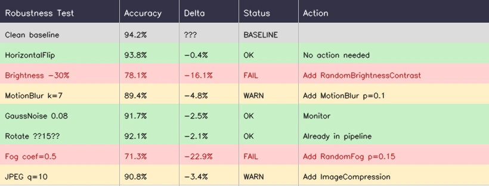

Результаты показывают две критичные уязвимости: **освещение** (-16.1%) и **туман** (-22.9%). Модель обучали на дневных фотографиях, а работать она будет в заповеднике, где много кадров на рассвете и в сумерках, а по утрам часто стоит туман.

Почему небольшие просадки на `HorizontalFlip` (-0.4%), `GaussNoise` (-2.5%) и `Rotate` (-2.1%) помечены как OK и не требуют действий? Потому что падение меньше примерно 3% в тесте на устойчивость означает, что модель уже неплохо справляется с этой вариацией: либо нужная инвариантность уже выучена по обучающим данным, либо расхождение настолько мало, что не приведёт к сбоям при деплое. Диагностический протокол нужен, чтобы находить *большие* провалы (10%+) и закрывать именно их, а не гоняться за каждой просадкой на доли процента. Поворот в диапазоне ±15° уже есть в пайплайне; просадка на -2.1% лишь подтверждает, что он работает, хотя и не идеально, и это ожидаемо.

**Итерация 1:** добавить [`RandomBrightnessContrast`](https://explore.albumentations.ai/transform/RandomBrightnessContrast) с `brightness_limit=(-0.3, 0.1)` — распределение смещаем в сторону более тёмных значений, чтобы имитировать рассвет и сумерки — и [`AtmosphericFog`](https://explore.albumentations.ai/transform/AtmosphericFog) с `fog_coef_range=(0.2, 0.5)` при `p=0.15`. Затем дообучить модель ещё 20 эпох, начиная с лучшего чекпоинта.

**Результат:** точность на чистых данных немного падает до 93.8% — это ожидаемо, часть своей ёмкости модель теперь тратит на инвариантность к туману и плохому освещению. Зато устойчивость к изменениям освещения вырастает с 78.1% до 91.3%, а устойчивость к туману — с 71.3% до 87.5%. Итоговый выигрыш: модель теперь можно использовать в заповеднике. Разбивка по классам подтверждает, что специфичных для отдельных видов регрессий нет.

**Итерация 2:** команда замечает, что `MotionBlur` остаётся умеренной слабостью (-4.8%). Ночью камеры-ловушки часто снимают с длинной выдержкой. Добавляем [`MotionBlur`](https://explore.albumentations.ai/transform/MotionBlur) с `blur_limit=5` при `p=0.1` и дообучаем модель от последнего чекпоинта.

**Результат:** устойчивость к смазу от движения растёт с 89.4% до 93.1%. `Accuracy` на чистых данных остаётся стабильной: 93.7%. После этого команда фиксирует политику.

Полное время диагностического цикла по часам: 2 дня обучения и 1 час анализа. Без этого протокола команда неделями подбирала бы трансформации вслепую.

> Примечание. Эти аугментированные валидационные пайплайны нужны **только для анализа и диагностики**. Выбор модели, `early stopping` и подбор гиперпараметров всегда должны опираться только на один чистый валидационный пайплайн (`val_pipeline_clean`), чтобы критерии отбора оставались стабильными и сопоставимыми между экспериментами.

Сводная таблица трансформаций в Step 6 сопоставляет каждый режим отказа с конкретными трансформациями. Используйте её как шпаргалку после диагностики: нашли режим отказа, выбрали соответствующие трансформации, добавили их в обучение и снова протестировали модель. Если трансформация в вашей политике обучения не привязана к реальному паттерну отказа, скорее всего, она только увеличивает вычислительную стоимость, но не приносит пользы.

### Шаг 5: зафиксируйте политику перед перебором архитектур

Не перенастраивайте аугментацию одновременно с крупными изменениями архитектуры. Эксперименты со смешанными факторами тратят время и дают ненадёжные выводы. Сначала фиксируете политику аугментаций и перебираете архитектуры. Потом фиксируете архитектуру и перебираете аугментации. Если чередовать и то и другое одновременно, вы получаете двумерный поиск, которому нужно экспоненциально больше экспериментов, чем двум отдельным одномерным.

### Как смотреть на метрики без самообмана

Агрегированные метрики нужны, но их недостаточно. Они скрывают вред от политики сразу несколькими способами:

- **Регрессии по отдельным классам маскируются доминирующими классами.** Если в датасете 80% кошек и 20% собак, то улучшение на 5% по кошкам и регрессия на 20% по собакам дадут общий рост точности. Но для собак модель стала хуже.
- **Раскалибровка уверенности.** Аугментация может улучшить точность, но ухудшить калибровку: модель в среднем чаще права, но когда ошибается, делает это с большей уверенностью. Если в вашем сценарии важны надёжные оценки уверенности — медицина, safety-critical системы, — калибровку нужно проверять отдельно.
- **Улучшения на лёгких срезах и регрессии на критичных хвостовых случаях.** Аугментация может помогать на хорошо освещённых изображениях с крупными объектами в фас, но вредить на тёмных кадрах, косых ракурсах и мелких объектах. Агрегированные метрики вырастут, хотя именно важные production-сценарии станут хуже.
- **Дисперсия по сидам при тяжёлых политиках.** Сильная аугментация увеличивает разброс результатов между случайными сидами. Один запуск обучения может показать улучшение просто по удаче. Для финальных кандидатов на политику запускайте минимум два сида.

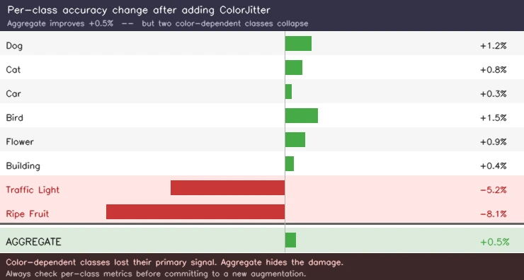

Числа в этом примере сходятся только если учитывать частоты классов: `Dog`, `Cat`, `Car`, `Bird`, `Flower` и `Building` вместе составляют примерно 95% датасета, поэтому именно их небольшие улучшения (+0.3%...+1.5%) определяют агрегированный результат. `Traffic Light` и `Ripe Fruit` — редкие классы, вместе около 5%, поэтому их тяжёлые регрессии (-5.2%, -8.1%) почти не видны в среднем с весами. В этом и проблема. Агрегат говорит: «+0.5%, можно выкатывать», а вы незаметно сломали два класса, где цвет является основным сигналом.

Для простоты в этом примере используется точность, но аргумент справедлив для любой метрики: `F1`, `ROC AUC`, `mAP`, `IoU`. Метрики, рассчитанные на дисбаланс классов, например `macro-averaged F1` или `ROC AUC` по классам, лучше ловят такой вред, но и они могут его скрывать, когда усреднение идёт по большому числу классов. Решение не в том, чтобы найти ещё одну «лучшую» агрегированную метрику. Решение — смотреть разбивку по классам, а в идеале ещё и по условиям съёмки: освещение, тип камеры, размер объекта. Это напрямую связано с главным преимуществом аугментации как регуляризатора: аугментация применяется к каждому изображению отдельно, поэтому можно точечно усиливать именно те классы или условия, где модель проседает, — например, более сильный dropout для классов, которые ломаются под окклюзией, или более широкий диапазон яркости для классов, которые плохо переживают сдвиг освещения, — не затрагивая классы, которые уже работают хорошо. Ни один другой регуляризатор — `weight decay`, архитектурный dropout, `label smoothing`, `learning rate schedule` — не даёт такого контроля на уровне классов.

Диагностика подсказывает, что нужно добавить. Не менее важно понимать, когда пора *убирать* трансформации, то есть вовремя распознать, что пайплайн зашёл слишком далеко.

## Как понять, что аугментация начала вредить

Проблемы с чтением метрик из раздела выше позволяют увидеть ущерб *после* обучения. Но есть и три сигнала, которые позволяют поймать его *во время* обучения: `loss` остаётся высоким и не сходится, особенно у маленьких моделей под агрессивным пайплайном; валидационные метрики скачут без явного тренда; или сходимость занимает в 3 × больше времени, чем у baseline. Подробнее о симптомах переаугментации и их причинах — в разделе [Failure Modes](https://albumentations.ai/docs/1-introduction/what-are-image-augmentations/#know-the-failure-modes-before-they-hit-production).

Протокол исправления последовательный: останавливайтесь на первом шаге, который снимает проблему.

1. **Сначала уменьшайте интенсивность, а не убирайте трансформацию целиком.** Если поворот на ±30° вредит, сначала попробуйте ±10°, а не удаляйте `Rotate` полностью.
2. **Снижайте вероятность.** Уменьшите `p` с 0.5 до 0.2 или 0.1.
3. **Уберите самое последнее добавление.** Откатитесь к предыдущему лучшему чекпоинту.
4. **Проверьте разрушительные взаимодействия.** Умеренный сдвиг цвета может стать разрушительным после сильного контраста и размытия. Комбинация способна перейти границу сохранения метки, даже если каждая трансформация по отдельности её не нарушает.
5. **Учитывайте ёмкость модели.** Иногда лечить нужно не удалением аугментации, а *усилением модели*. Более крупная модель может переварить более сильную аугментацию и превратить её в лучшие признаки. То, что перегружало MobileNet, может оказаться ровно тем, что нужно ViT.

## Автоматический поиск аугментаций

У ручного проектирования есть альтернатива: дать алгоритму выбрать политику самому. **AutoAugment** (Google, 2018) использует reinforcement learning для поиска по пространству политик аугментации. **RandAugment** (2020) упростил эту идею до двух гиперпараметров: числа трансформаций и общей интенсивности.

По состоянию на 2026 год ни один автоматический метод не вытеснил ручное проектирование, опирающееся на знание предметной области, в реальных production-сценариях. Причина проста: такие методы оптимизируют агрегированные метрики на стандартных бенчмарках, но не умеют закодировать то знание о задаче, которое и делает аугментацию полезной на практике: какие режимы отказа важны именно для *вашего* деплоя, какие инвариантности допустимы именно для *ваших* классов, каким подмножествам нужен отдельный режим. Политика RandAugment не знает, что классификатор цифр не должен вращать шестёрки, что модель оценки спелости фруктов критически зависит от цвета, или что модели детекции с мелкими объектами нужен constrained dropout. На практике часы, потраченные на автоматический поиск, обычно дают результат слабее, чем те же часы, потраченные на диагностический процесс из этой статьи, или даже просто на разметку более репрезентативных данных.

**TrivialAugment** (2021) идёт другим путём: одна случайная трансформация на изображение, интенсивность выбирается равномерно, стоимость поиска нулевая. Его полезнее понимать не как автоматический поиск политики, а как форму разнообразия аугментаций на уровне отдельных изображений: каждый пример получает свою случайную трансформацию, а значит, естественным образом возникает часть той вариативности по объектам, которую в `per-class augmentation pipelines` вы задаёте осознанно. Это может быть разумной стартовой точкой, если у вас совсем нет знаний о предметной области, но заменить точечную аугментацию под известные режимы отказа такой подход не может.

Если вам известны сильные свежие работы, которые меняют эту картину, пришлите ссылки на статьи — я обновлю этот раздел.

> Примечание. AutoAugment, RandAugment и TrivialAugment реализованы в тренировочных фреймворках вроде `timm` и `torchvision.transforms.v2`, а не в Albumentations.

## Как выкатывать и поддерживать пайплайн

### Сначала визуализируйте, потом обучайте

Вы только что потратили время на аккуратный выбор трансформаций, настройку вероятностей и рассуждения об инвариантностях. Прежде чем запускать обучение на несколько дней, потратьте 10 минут и проверьте, что пайплайн действительно делает то, что вы от него ждёте.

Ошибки в аугментации редко приводят к исключениям. Слишком широкий диапазон поворота для вашей задачи, вероятность dropout настолько высокая, что объект становится неузнаваемым, неправильная строка `coord_format` в `BboxParams` — всё это даёт валидные выходы, но незаметно портит обучение. Ошибка формата особенно коварна: если аннотации у вас в формате COCO `[x_min, y_min, width, height]`, а вы передаёте `coord_format='pascal_voc'`, где ожидается `[x_min, y_min, x_max, y_max]`, Albumentations интерпретирует ширину и высоту как абсолютные координаты. Боксы будут синтаксически корректными, но пространственно неверными: смещёнными, сжатыми или обрезанными по границам изображения. Никакого исключения не возникнет, потому что числа лежат в допустимом диапазоне. Вы несколько дней обучаете модель на неправильно совмещённых таргетах и замечаете проблему только тогда, когда метрики упорно не растут.

Отрисуйте 20–50 аугментированных примеров со всеми наложенными таргетами: масками, боксами, keypoints. Проверяйте, не съехали ли маски, продолжают ли боксы действительно охватывать объекты, не уехали ли keypoints в неверные позиции и не настолько ли искажены изображения, что метка уже становится неоднозначной.

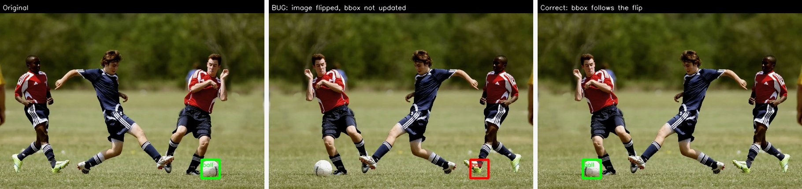

Именно здесь вы заодно валидируете и *те решения*, которые приняли на предыдущих шагах. Разумно ли выглядит dropout при выбранной вероятности? Не слишком ли агрессивно искажается цвет для вашей предметной области? Остаются ли повёрнутые изображения однозначно распознаваемыми? Визуальная проверка — это не просто поиск багов. Это финальная валидация самой конструкции пайплайна. Десять минут на просмотр аугментированных примеров экономят десять дней обучения на испорченных данных.

### Воспроизводимость и трекинг

**Фиксируйте random seed** через `seed=137` в вызове `A.Compose`. Подробности о том, как сиды ведут себя с воркерами `DataLoader`, есть в [гайде по воспроизводимости](https://albumentations.ai/docs/4-advanced-guides/reproducibility/).

**Сохраняйте информацию о том, какие аугментации были применены к каждому изображению**, через `save_applied_params=True`. Это открывает очень полезную диагностику: если модель даёт большой `loss` на конкретном изображении, можно посмотреть, какие именно аугментации к нему применились.

```python
transform = A.Compose([
    A.RandomBrightnessContrast(brightness_limit=(-0.3, 0.3), p=1),
    A.GaussNoise(std_range=(0.1, 0.4), p=0.9),
    A.HorizontalFlip(p=0.5),
], save_applied_params=True)

result = transform(image=image)

# Какие трансформации сработали и с какими точными значениями?
print(result["applied_transforms"])
# [
#   ("RandomBrightnessContrast",
#    {"brightness_limit": 0.21, "contrast_limit": -0.08, ...}),
#   ("GaussNoise",
#    {"std_range": 0.27, "mean_range": 0.0, ...}),
# ]

# Собираем детерминированный пайплайн с p=1.0, который воспроизводит тот же эффект:
replay = A.Compose.from_applied_transforms(result["applied_transforms"])
result2 = replay(image=image)
```

**Версионируйте политику аугментаций** в конфиг-файлах, а не только в коде. Храните её рядом с артефактами модели, чтобы откат оставался возможным. Если модели обучают несколько человек, относитесь к аугментации как к управляемой конфигурации: версионируйте её, ведите changelog, требуйте абляции перед крупными изменениями.

### Расхождение между training и inference пайплайнами

Тонкий, но очень частый production-сбой: пайплайн аугментации и препроцессинг на инференсе со временем расходятся. В обучении у вас `SmallestMaxSize → RandomCrop → HorizontalFlip → ... → Normalize`, а команда сервинга написала отдельный скрипт препроцессинга, где стоит `Resize → Normalize` с чуть другой логикой ресайза, другой интерполяцией или другими константами нормализации. Модель обучалась на одном численном распределении, а в production видит другое. Качество падает на 1–3%, и никто не связывает это с несовпадающим препроцессингом, потому что изображения «выглядят нормально».

Лечится это так: один раз определяете валидационный пайплайн — точную последовательность детерминированных трансформаций, `resize`, `crop`, `normalize`, — которую ожидает модель, и используете это же определение и для оценки во время обучения, и для сервинга. Пайплайны Albumentations можно сериализовать: сохраните определение валидационного пайплайна рядом с чекпоинтом модели и пусть код сервинга загружает его, а не реализует препроцессинг вручную заново. Если среда сервинга не может напрямую запускать Albumentations, то как минимум численно проверьте, что препроцессинг на сервисе даёт идентичный результат на наборе тестовых изображений.

### Пропускная способность

Если утилизация GPU далека от 100%, узкое место у вас в data pipeline. Дорогие трансформации вроде elastic distortion или perspective warp держите на более низкой вероятности. Кэшируйте детерминированный препроцессинг, а стохастическую аугментацию накладывайте поверх него. Подробнее — в статье [Optimizing Pipelines for Speed](https://albumentations.ai/docs/3-basic-usage/performance-tuning/).

### Когда пересматривать политику

Политика, которая раньше была удачной, перестаёт быть правильной, когда меняется стек камер, правила разметки, источник датасета или продуктовые ограничения.

Конкретный пример: ритейл-команда обучает модель распознавания товаров и использует тяжёлые [`PhotoMetricDistort`](https://explore.albumentations.ai/transform/PhotoMetricDistort) и [`Perspective`](https://explore.albumentations.ai/transform/Perspective), потому что исходные обучающие данные целиком состояли из студийных снимков, а модель работала на фото с телефонов. Через полгода команда данных собирает 200 000 реальных изображений с телефонных камер, покрывающих фактическое распределение деплоя. Тяжёлая цветовая и перспективная аугментация, которая была критически важна на узком студийном датасете, теперь начинает вредить: она лишь добавляет лишнюю сложность в датасет, где эта вариативность уже присутствует естественным образом. Политика, которая давала +4 пункта точности на студийных данных, теперь отнимает 1.5 пункта на сбалансированном датасете. Никто этого не замечает до квартального ревью.

Пересмотр политики должен быть стандартным шагом при крупных изменениях данных или продукта, а не реакцией на уже упавшие метрики. Когда метрики упали, вы уже выкатили ухудшенную модель. Подробнее об эксплуатационной стороне вопроса — в разделе [Production Reality](https://albumentations.ai/docs/1-introduction/what-are-image-augmentations/#production-reality-operational-concerns).

## Заключение

Нет формулы, которая берёт датасет и сразу выдаёт оптимальный пайплайн аугментаций. Но есть процесс, который надёжно приводит к сильному решению.

Ключевая идея проста: каждая добавленная трансформация — это утверждение об инвариантности. Вы заявляете, что такая вариация не меняет смысл изображения и что у архитектуры нет встроенного механизма, чтобы игнорировать её самостоятельно. Если утверждение верно, аугментация учит модель тому, чего архитектура сама не выучит. Если утверждение ложно, вы вносите шум в метки. Всё искусство здесь сводится к тому, чтобы задавать точные вопросы о своих данных и кодировать ответы в виде трансформаций.

Три главные мысли:

1. **Начинайте с вопроса, а не с трансформации.** Сначала спрашиваем: «К чему моя модель должна быть инвариантна, но чего нет в обучающих данных?» И только потом: «Стоит ли добавлять `ColorJitter`?» Выбор определяется разрывом в инвариантностях, а не чек-листом, не чужим датасетом и не привычкой.
2. **Измеряйте точечно.** Агрегированные метрики врут. Пример с камерами-ловушками из этой статьи показал, как за два дня модель подняла точность в тумане с 71% до 87% — не за счёт того, что мы просто накидали больше трансформаций, а потому что сначала диагностировали конкретный провал, а потом прицельно его закрыли. Разбивки по классам, тесты на устойчивость в специально выбранных условиях и срезы по условиям съёмки отличают пайплайн, который просто «красиво выглядит по метрикам», от пайплайна, который реально работает при деплое.
3. **Относитесь к пайплайну как к живому артефакту.** Политика, идеальная для студийных данных, становится вредной после того, как вы собрали 200 000 реальных изображений. Политику, которая работала для MobileNet, приходится собирать заново для ViT. Меняются данные, меняются модели, меняются условия деплоя — пайплайн должен меняться вместе с ними, иначе он тихо превращается из актива в источник проблем.

## Готовые примеры пайплайнов

Ниже — готовые пайплайны для трёх самых частых задач, которые можно копировать и запускать сразу. Это хорошие стартовые точки: не оптимум для любого датасета, но сильные дефолтные варианты, перекрывающие самые распространённые режимы отказа.

### Классификация

Классификация — самая «терпимая» задача к аугментации: метка здесь одна на всё изображение, поэтому пространственные трансформации не могут рассинхронизировать таргет. Это позволяет гораздо смелее работать и с геометрией, и с цветом. Пайплайн ниже использует ресайз по короткой стороне и случайный кроп, стандартный подход ImageNet, dropout через `OneOf` для разнообразия паттернов окклюзии и 10%-ную вероятность убрать цвет, чтобы модель училась запасным признакам формы.

```python
import albumentations as A

train_transform = A.Compose([
    A.SmallestMaxSize(max_size_hw=(256, 256), p=1.0),
    A.RandomCrop(height=224, width=224, p=1.0),
    A.HorizontalFlip(p=0.5),
    A.Affine(scale=(0.8, 1.2), rotate=(-15, 15), balanced_scale=True, p=0.5),
    A.OneOf([
        A.CoarseDropout(num_holes_range=(0.02, 0.1),
                        hole_height_range=(0.05, 0.15),
                        hole_width_range=(0.05, 0.15), p=1.0),
        A.GridDropout(ratio=0.4, unit_size_range=(0.05, 0.15), p=1.0),
    ], p=0.4),
    A.OneOf([
        A.ToGray(p=1.0),
        A.ChannelDropout(p=1.0),
    ], p=0.1),
    A.PhotoMetricDistort(brightness_range=(0.8, 1.2), contrast_range=(0.8, 1.2),
                         saturation_range=(0.7, 1.3), hue_range=(-0.05, 0.05), p=0.5),
    A.GaussianBlur(blur_limit=(3, 5), p=0.1),
    A.Normalize(),
], seed=137)

val_transform = A.Compose([
    A.SmallestMaxSize(max_size_hw=(256, 256), p=1.0),
    A.CenterCrop(height=224, width=224, p=1.0),
    A.Normalize(),
], seed=137)
```

### Детекция объектов

У детекции другие ограничения: тут нельзя бездумно кропать изображения, потому что кроп может целиком вырезать мелкие объекты, а bounding boxes должны сдвигаться абсолютно точно вместе с каждой пространственной трансформацией. Поэтому в этом пайплайне используется letterbox, то есть ресайз по длинной стороне плюс паддинг, а не кроп, чтобы сохранить все объекты. Если же вам всё-таки нужна вариативность, которую дают кропы, у Albumentations есть bbox-aware варианты: [`AtLeastOneBBoxRandomCrop`](https://explore.albumentations.ai/transform/AtLeastOneBBoxRandomCrop) гарантирует, что после кропа останется хотя бы один bounding box, а [`BBoxSafeRandomCrop`](https://explore.albumentations.ai/transform/BBoxSafeRandomCrop) сохраняет все боксы. Оба варианта дают аугментацию кропом без незаметной потери обучающего сигнала.

Здесь диапазон масштаба шире — `(0.5, 1.5)` — потому что детекция должна уметь работать и с крошечными объектами, и с объектами во весь кадр. Параметр `min_visibility=0.3` нужен, чтобы выбрасывать боксы, которые после трансформаций оказались слишком сильно обрезаны и уже не дают полезного сигнала.

Есть и менее очевидная деталь, специфичная именно для детекции: пространственные трансформации незаметно меняют не только изображения, но и распределение меток. Когда вы включаете аугментацию масштаба с `scale=(0.5, 1.5)`, вы не просто растягиваете пиксели — вы меняете распределение размеров объектов, количество объектов на изображение и долю foreground к background, которую голова детектора видит в каждом батче. Если сделать zoom-out на плотной сцене, часть объектов может уменьшиться ниже порога детекции, и вы фактически теряете обучающий сигнал по мелким объектам. Если сделать zoom-in, в кадре может остаться один крупный объект, и эффективное соотношение положительных и отрицательных примеров изменится. Это не баги, а естественные последствия пространственных трансформаций в задаче с несколькими объектами. Важно понимать, что ваша политика аугментаций формирует не только распределение пикселей, но и распределение меток, на котором обучается модель.

```python
import albumentations as A

train_transform = A.Compose([
    A.LetterBox(size=(640, 640), fill=0, p=1.0),
    A.HorizontalFlip(p=0.5),
    A.Affine(scale=(0.5, 1.5), balanced_scale=True, p=0.5),
    A.CoarseDropout(num_holes_range=(3, 8),
                    hole_height_range=(0.05, 0.15),
                    hole_width_range=(0.05, 0.15), p=0.3),
    A.ColorJitter(brightness=(0.7, 1.3), contrast=(0.7, 1.3),
                  saturation=(0.6, 1.4), hue=(-0.05, 0.05), p=0.5),
    A.MotionBlur(blur_limit=5, p=0.1),
    A.Normalize(),
], bbox_params=A.BboxParams(coord_format='pascal_voc', min_visibility=0.3),
   seed=137)

val_transform = A.Compose([
    A.LetterBox(size=(640, 640), fill=0, p=1.0),
    A.Normalize(),
], bbox_params=A.BboxParams(coord_format='pascal_voc', min_visibility=0.3),
   seed=137)
```

### Семантическая сегментация

Для сегментации главное ограничение — целостность маски. Каждый пиксель здесь имеет метку класса, и интерполяция во время пространственных трансформаций может породить неверные индексы классов на границах. По умолчанию Albumentations использует для масок nearest-neighbor интерполяцию, и это как раз предотвращает такую проблему. Размеры кропов здесь обычно больше, `512` вместо `224`, потому что архитектурам сегментации нужен пространственный контекст, а `pad_if_needed=True` позволяет корректно работать с изображениями, которые меньше целевого размера кропа. Цветовые и фотометрические аугментации остаются умеренными: сегментация часто опирается на тонкие детали границ, которые сильные искажения легко размывают.

```python
import albumentations as A
import cv2

train_transform = A.Compose([
    A.RandomCrop(height=512, width=512, pad_if_needed=True, p=1.0),
    A.HorizontalFlip(p=0.5),
    A.Affine(scale=(0.8, 1.5), rotate=(-10, 10), balanced_scale=True, p=0.5),
    A.CoarseDropout(num_holes_range=(3, 8),
                    hole_height_range=(0.05, 0.2),
                    hole_width_range=(0.05, 0.2), p=0.3),
    A.PhotoMetricDistort(brightness_range=(0.8, 1.2), contrast_range=(0.8, 1.2),
                         saturation_range=(0.75, 1.25), hue_range=(-0.03, 0.03), p=0.5),
    A.GaussNoise(noise_scale_factor=0.5, p=0.1),
    A.Normalize(),
], seed=137)

val_transform = A.Compose([
    A.PadIfNeeded(min_height=512, min_width=512,
                  border_mode=cv2.BORDER_CONSTANT, value=0, p=1.0),
    A.CenterCrop(height=512, width=512, p=1.0),
    A.Normalize(),
], seed=137)
```

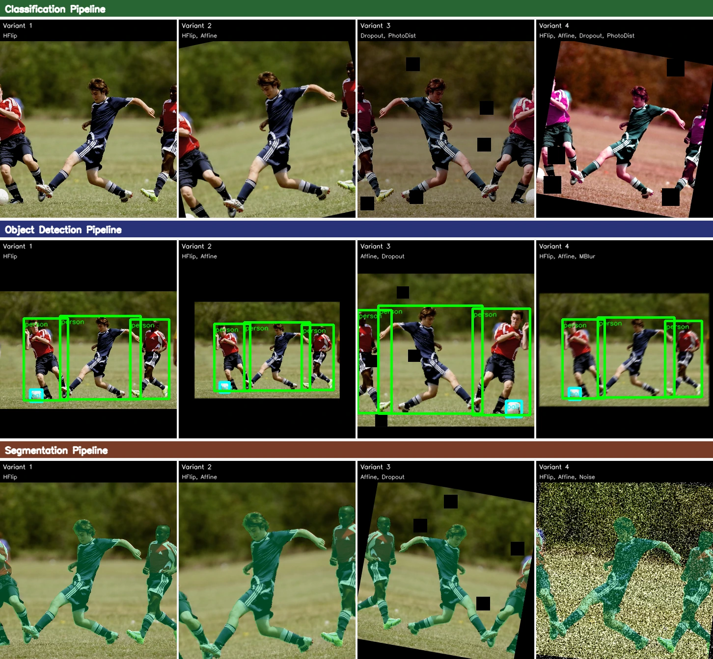

Это только стартовые точки. Когда получите baseline с этими пайплайнами, используйте диагностический протокол, чтобы найти конкретные слабые места, и добавляйте точечные трансформации из Step 6.

---

Albumentations — open-source библиотека для аугментации изображений.

Если хотите поэкспериментировать с аугментациями на практике, можно посмотреть [Explore Transforms](https://explore.albumentations.ai), а если нужен первоисточник по базовым идеям — начать со статьи [What Is Image Augmentation?](https://albumentations.ai/docs/1-introduction/what-are-image-augmentations/).
