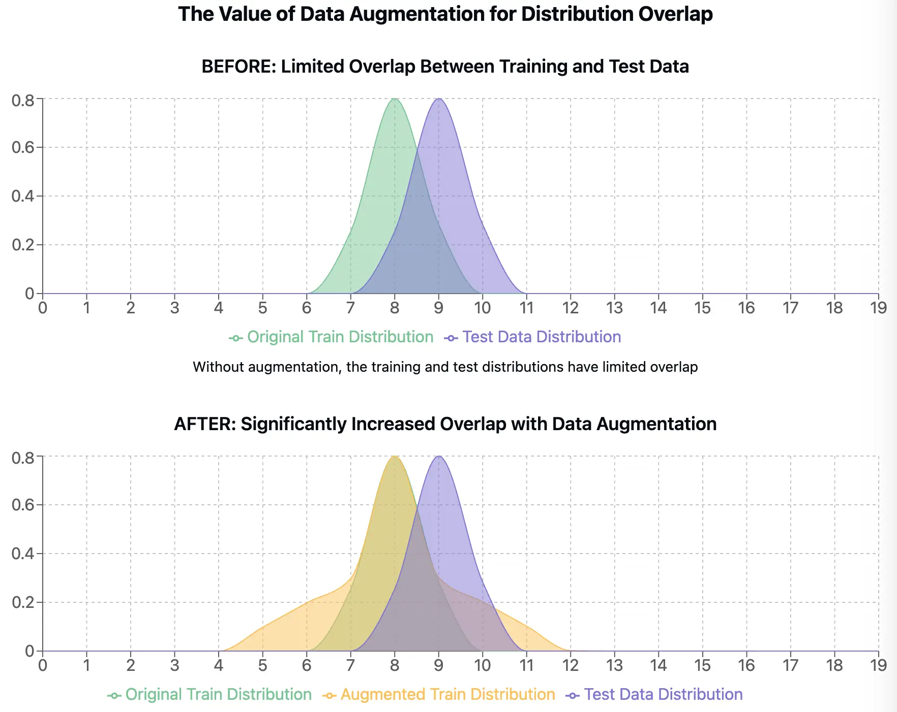

# What is Data Augmentation (and Why Your Computer Vision Model Needs It)

Training modern machine learning models, especially deep learning models for computer vision, often requires vast amounts of data. These models learn intricate patterns from the examples they're shown, and the more diverse and numerous those examples, the better they tend to perform on new, unseen data.

However, collecting and labeling huge datasets can be a major bottleneck. It's often expensive, time-consuming, and in some cases (like modeling rare events), sufficient data might simply not exist.

This is where **Data Augmentation** comes in. It's a collection of techniques used to artificially increase the amount and diversity of training data by generating new data points from existing ones. Think of it as teaching a model more robustly by showing it the same things in slightly different ways.

## Why Augment Data? The Motivation

Modern deep learning models thrive on data. It's an empirical observation that models trained on larger, more diverse datasets tend to generalize better – meaning they perform more accurately and reliably on new, unseen data that wasn't part of their training set.

Therefore, the ideal first step to improve a model is often to acquire more high-quality labeled data. This data should ideally increase both the size and the *diversity* of the existing dataset, paying special attention to scenarios where the current model struggles, such as rare classes or hard-to-classify examples. Furthermore, the data acquisition process must respect legal and ethical considerations – simply scraping data from the internet, while common practice, exists in a legally gray area depending on the source and intended use. If you *can* obtain more varied, high-quality, legally sound labeled data, especially targeting your model's weaknesses, that's generally the most direct path to improvement.

However, acquiring such ideal data is often impractical for several reasons:

1.  **Cost and Time:** Data collection and labeling, particularly at scale, can be prohibitively expensive and time-consuming.
2.  **Inherent Data Scarcity:** Some phenomena are naturally rare. For example, certain rare diseases will, by definition, have limited available medical images, making it impossible to gather a large dataset regardless of resources.
3.  **Expert Labeling Requirement:** Many tasks require domain expertise for accurate labeling. Radiological scans, for instance, need annotation by trained radiologists, adding significant cost and potential delays.

Beyond these limitations, another common challenge is **distribution shift**. A model might be trained on data collected under one specific set of conditions (e.g., images from one country, scans from a specific hospital using a particular vendor's machine) but needs to perform well in a different context (a new geography, a different hospital with different equipment). Evaluating model performance across datasets from different distributions is a standard practice in research to assess real-world robustness.

This is where **Data Augmentation** becomes an invaluable technique. It allows us to artificially expand the *diversity* of our existing training data by applying transformations that create plausible variations of our samples. For the distribution shift problem, augmentations can help by effectively *widening* the distribution of the training data, increasing the chance that it overlaps with the distribution the model will encounter during deployment.

Crucially, unlike the slow and costly process of data collection and labeling, data augmentation is typically applied **on-the-fly** during model training. The transformations are often computed on the CPU in parallel while the GPU is busy with the forward and backward passes of the neural network. This means augmentations can help enhance data diversity and model robustness with minimal impact on overall training time and without the direct costs associated with acquiring new data. It's a powerful tool for making the most of the data you already have.

At its core, data augmentation involves applying various transformations to your existing training samples to create modified copies. Crucially, these transformations must be **label-preserving**. This means the core meaning or category represented by the data shouldn't change. If you apply an augmentation to an image labeled "cat," the resulting image should still be clearly recognizable as a "cat."

**Pros and Cons**

While the core idea is simple, the practical application of data augmentation involves trade-offs and strategic thinking. A smartly chosen augmentation pipeline almost always leads to better performing, more robust models. However, achieving the "optimal" pipeline is complex because it heavily depends on the specific context: the nature of the **task**, the chosen **model** architecture, the characteristics of the **dataset**, and even the **training hyperparameters** (like learning rate and optimizer).

Generally, data augmentation tends to provide more relative value when working with smaller datasets, where the risk of overfitting on limited examples is higher. For very large datasets, the inherent diversity might already be sufficient, although augmentation often still provides benefits in robustness.

There are currently no universally agreed-upon methods to automatically determine the best augmentation strategy for any given problem. Selecting an effective pipeline heavily relies on the practitioner's experience and intuition, often involving iterative experimentation. While the research community is actively exploring automated approaches (like AutoAugment, RandAugment), these methods are not yet mature enough to be a guaranteed replacement for careful manual selection in most practical scenarios. They can also be computationally expensive to run.

Furthermore, it's difficult to predict beforehand exactly how much performance gain, if any, a specific augmentation strategy will yield. This uncertainty can make it challenging to allocate dedicated time and resources for extensive augmentation tuning. Unlike collecting new data, where each labeled sample directly increases the company's intellectual property (IP) in the form of a valuable data asset, developing an augmentation pipeline is primarily code and configuration, which doesn't translate to the same kind of asset value.

Remember that augmentation also acts as a form of regularization. Like any regularization technique, overuse can be detrimental. Overly aggressive augmentations might slow down the training convergence significantly or, more critically, make the augmented training distribution too different from the actual test distribution the model will face in production, potentially harming real-world performance.

Despite these challenges, data augmentation is a cornerstone of modern computer vision. It's widely used across almost all image-related tasks, and the collective expertise in applying it effectively grows daily. While finding the absolute *best* pipeline is hard, finding a *good* one that improves your model is often achievable. We provide practical recommendations in our guide on **[How to Pick Augmentations](../3-basic-usage/choosing-augmentations.md)**. Remember these are guidelines, and verifying their effectiveness on your specific dataset through experimentation is always recommended.

## Focusing on Image Augmentation

Data augmentation is applicable across various domains (text, audio, etc.), but it's arguably most crucial and widely used in **computer vision**. Images possess high dimensionality and exhibit immense variability in the real world due to factors like:

*   **Viewpoint:** Objects look different from various angles.
*   **Illumination:** Lighting conditions change dramatically (day/night, indoor/outdoor, shadows).
*   **Scale:** Objects can appear at different sizes depending on distance.
*   **Deformation:** Non-rigid objects can bend and change shape.
*   **Occlusion:** Objects can be partially hidden by others.
*   **Background:** Objects appear against diverse backgrounds.
*   **Intra-class Variation:** Even within a single category (like "dog"), there's huge visual diversity.

Image augmentation techniques aim to simulate these variations.

**Common Image Augmentation Techniques**

Here are some common categories of image augmentations:

1.  **Geometric Transformations:** These alter the spatial properties of the image.
    *   *Flips:* Horizontal (`HorizontalFlip`) and Vertical (`VerticalFlip`) flips are simple yet often very effective, especially if there's no inherent top/bottom or left/right orientation preference in the data (e.g., general object classification).
    *   *Rotations:* [`Rotate`](https://explore.albumentations.ai/transform/Rotate) or [`RandomRotate90`](https://explore.albumentations.ai/transform/RandomRotate90) help the model become invariant to object orientation.
    *   *Scaling:* [`RandomScale`](https://explore.albumentations.ai/transform/RandomScale), [`Resize`](https://explore.albumentations.ai/transform/Resize). Makes the model robust to objects appearing at different sizes.
    *   *Translation:* Shifting the image content horizontally or vertically ([`Affine`](https://explore.albumentations.ai/transform/Affine)). Helps the model find objects regardless of their exact position.
    *   *Shear:* Tilting the image along an axis ([`Affine`](https://explore.albumentations.ai/transform/Affine)). Simulates viewing objects from different angles slightly.
    *   *Perspective:* Applying perspective distortion ([`Perspective`](https://explore.albumentations.ai/transform/Perspective)). Can simulate viewing planar surfaces from different viewpoints.
    *   *Elastic Deformations & Distortions:* [`ElasticTransform`](https://explore.albumentations.ai/transform/ElasticTransform) warps the image locally, often useful for medical images. Other spatial distortions like [`GridDistortion`](https://explore.albumentations.ai/transform/GridDistortion) exist as well.

2.  **Color Space Transformations:** These modify the color characteristics of the image.
    *   *Brightness/Contrast:* [`RandomBrightnessContrast`](https://explore.albumentations.ai/transform/RandomBrightnessContrast). Simulates varying lighting conditions.
    *   *Gamma Correction:* [`RandomGamma`](https://explore.albumentations.ai/transform/RandomGamma). Adjusts image intensity non-linearly, also good for lighting variations.
    *   *Hue/Saturation/Value:* [`HueSaturationValue`](https://explore.albumentations.ai/transform/HueSaturationValue). Adjusts the color shades, intensity, and brightness, making the model less sensitive to specific color palettes.
    *   *Grayscale Conversion:* [`ToGray`](https://explore.albumentations.ai/transform/ToGray). Forces the model to rely on shapes and textures rather than color.
    *   *Channel Shuffling:* [`ChannelShuffle`](https://explore.albumentations.ai/transform/ChannelShuffle). Randomly reorders the R, G, B channels. A more disruptive augmentation.

3.  **Noise and Blurring:** These simulate imperfections in image capture or transmission.
    *   *Gaussian Noise:* [`GaussNoise`](https://explore.albumentations.ai/transform/GaussNoise). Adds random noise drawn from a Gaussian distribution.
    *   *Blurring:* [`GaussianBlur`](https://explore.albumentations.ai/transform/GaussianBlur), [`MedianBlur`](https://explore.albumentations.ai/transform/MedianBlur), [`MotionBlur`](https://explore.albumentations.ai/transform/MotionBlur). Simulates out-of-focus images or movement during capture.

4.  **Random Erasing / Occlusion:** These techniques randomly remove or obscure parts of the image. This forces the model to learn from the remaining context and prevents it from relying too heavily on any single feature.
    *   The concept is often called "Cutout". Albumentations implementations include [`CoarseDropout`](https://explore.albumentations.ai/transform/CoarseDropout) (removes rectangular regions), [`GridDropout`](https://explore.albumentations.ai/transform/GridDropout) (removes grid points), and `MaskDropout` (removes regions based on masks).

5.  **Weather & Environmental Effects:** Simulates different real-world conditions.
    *   Examples: [`RandomRain`](https://explore.albumentations.ai/transform/RandomRain), [`RandomFog`](https://explore.albumentations.ai/transform/RandomFog), [`RandomSunFlare`](https://explore.albumentations.ai/transform/RandomSunFlare), [`RandomShadow`](https://explore.albumentations.ai/transform/RandomShadow).

6.  **Mixing Images:** Some advanced techniques combine information from multiple images.
    *   *MixUp:* Creates new samples by taking a weighted linear interpolation of pairs of images and their labels.
    *   *CutMix:* Cuts a patch from one image and pastes it onto another, with labels mixed proportionally to the area of the patches.
    *   *Mosaic:* Combines four training images into one larger image, resizing them and placing them in a 2x2 grid. This exposes the model to objects at different scales and contexts, and smaller objects become relatively larger.
    *   *Copy-Paste:* Copies object instances (usually with their segmentation masks) from one image and pastes them onto another, often used for instance segmentation or detection to increase the number of object instances per image.
    *(Note: Techniques like MixUp, CutMix, Mosaic, and Copy-Paste often require specific handling of labels and batching logic. While some components might be implementable with Albumentations, they are frequently integrated directly into the data loading or training loop rather than being standalone transforms applied to single images).*

**The Crucial Role of Synchronization: Augmenting Targets**

In many computer vision tasks, you're not just working with an image; you also have associated **targets** or **labels** that describe the image content. This could be:

*   A single class label (Classification)
*   Pixel-level class masks (Semantic Segmentation)
*   Bounding boxes around objects (Object Detection)
*   Coordinates of specific points (Keypoint Detection)
*   Both masks and boxes (Instance Segmentation)

When you apply a geometric augmentation to an image (like a rotation or flip), you **must** apply the *exact same* transformation to its corresponding targets to maintain correctness. Color augmentations generally only affect the image itself.

*   **Classification:** Usually, only the image is transformed. The class label (e.g., "dog") remains the same after flipping or rotating a dog image.
*   **Object Detection:** If you rotate the image, the bounding boxes must also be rotated around the correct center point. If you scale the image, the bounding box coordinates must be scaled. If you flip the image, the box coordinates must be flipped accordingly.
*   **Semantic Segmentation:** The segmentation mask is essentially a pixel-level label map. Any geometric warp, rotation, flip, or crop applied to the image must be applied identically to the mask.
*   **Keypoint Detection:** Keypoint coordinates (e.g., locations of facial features) must be transformed geometrically just like the image pixels.

Handling this synchronization manually can be complex and error-prone. A major advantage of libraries like Albumentations is that they are designed to handle this automatically. When you define a pipeline and pass your image along with its corresponding masks, bounding boxes, or keypoints using the correct arguments (e.g., `transform(image=img, mask=mask, bboxes=bboxes, keypoints=keypoints)`), the library ensures that all specified targets are transformed consistently with the image according to the rules of each augmentation.

## Conclusion

Data augmentation, particularly image augmentation, is an indispensable tool in the modern computer vision toolkit. It helps bridge the gap caused by limited data, pushes models to learn more robust and generalizable features, and ultimately leads to better performance on real-world tasks.

While the concept is simple, effective implementation requires understanding your task and data, choosing appropriate transformations, and carefully managing the synchronization between images and their associated targets. Libraries like Albumentations help simplify this process, allowing developers to easily define and apply complex augmentation pipelines while ensuring target consistency.
