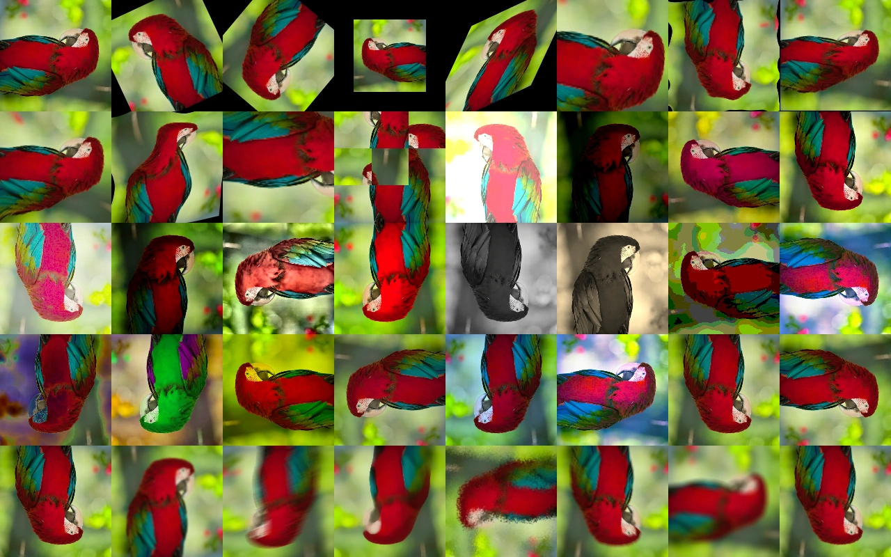
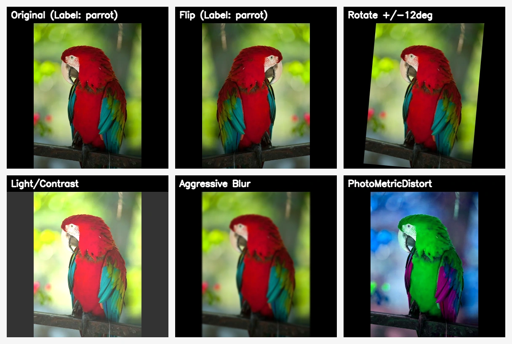
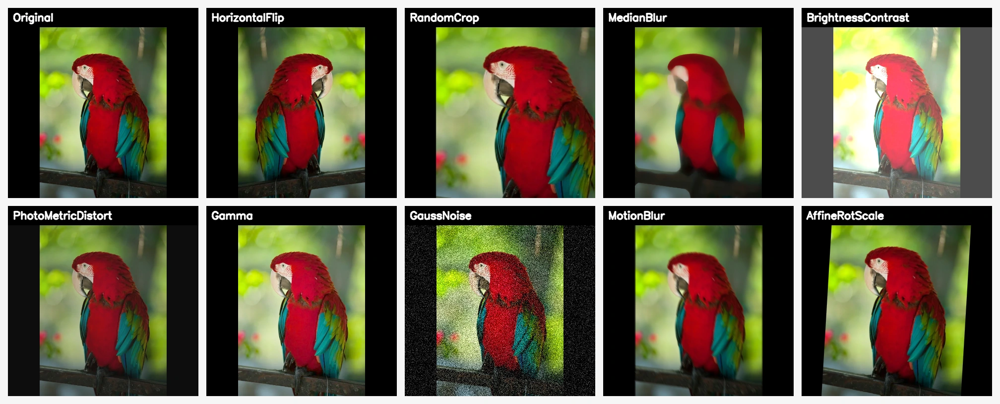
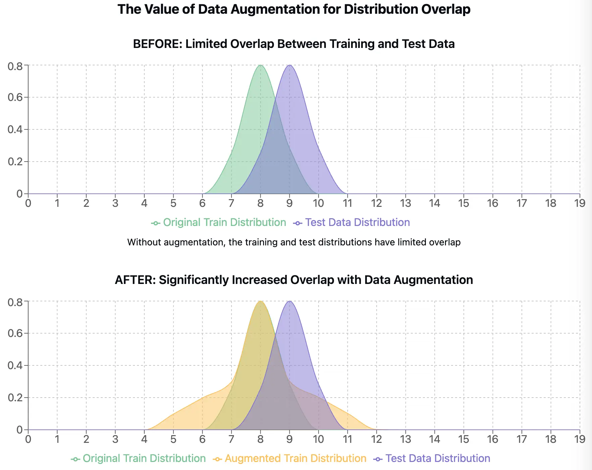
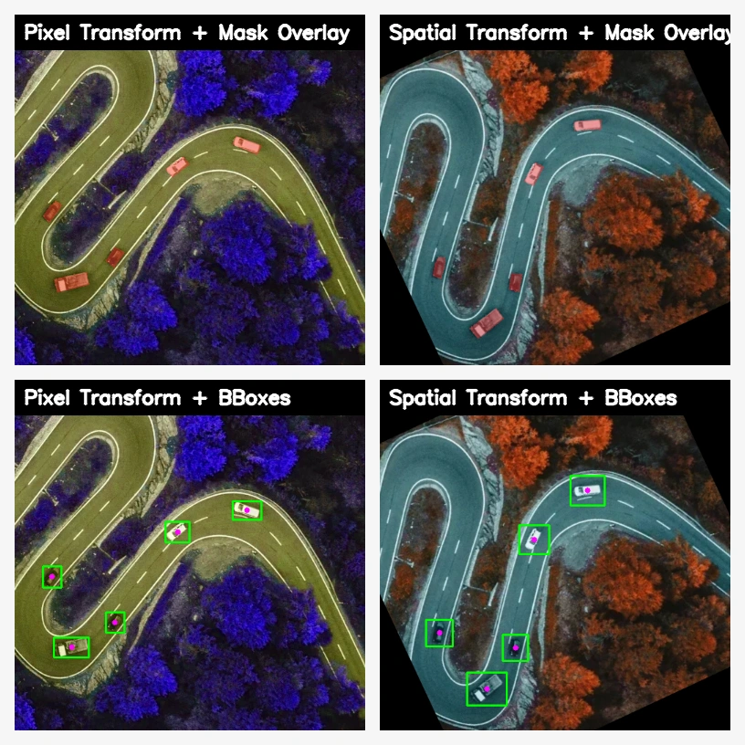
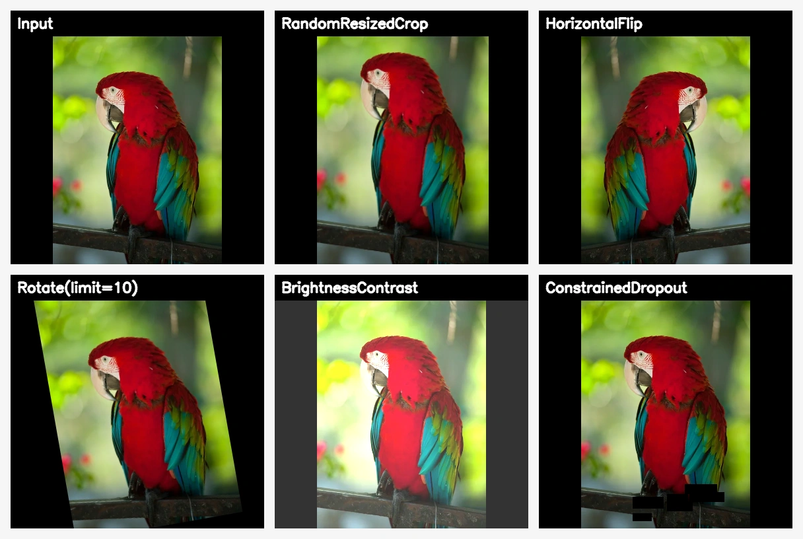
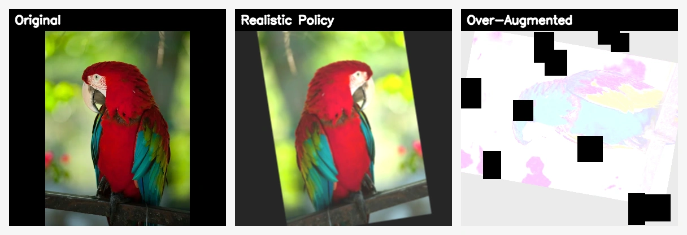

# What Is Image Augmentation?



Training a computer vision model starts with a labeled dataset: images paired with their labels. The label might be a class name ("parrot"), a set of bounding boxes, a segmentation mask, or keypoint coordinates — but the principle is the same. The model learns from these image-label pairs.

Image augmentation is a technique that expands this labeled dataset by applying transformations to existing images while keeping their labels valid. It works especially well for visual data, because humans can look at a transformed image and immediately judge whether the label still applies — and in most cases it does.

## The Intuition: Transforms That Preserve Meaning

Take a color photograph of a parrot and convert it to grayscale. Is it still a parrot? Obviously yes. The semantic content — shape, texture, pose — is fully intact. The color was not what made it a parrot.

Now flip the image horizontally. Still a parrot. Rotate it a few degrees. Still a parrot. Crop a little tighter. Adjust the brightness. Add a touch of blur. In every case, a human annotator would assign the exact same label without hesitation.



This observation is the foundation of image augmentation: many transformations change the pixels of an image without changing what the image *means*. The technical term is that the label is **invariant** to these transformations.

These transformations fall into two broad families:

- **Pixel-level transforms** change intensity values without moving anything: brightness, contrast, color shifts, blur, noise, grayscale conversion.
- **Spatial transforms** change geometry: flips, rotations, crops, scaling, perspective warps.

Both families preserve labels (when chosen correctly), and because they operate along independent axes, they can be freely combined.

## The Combinatorial Explosion

This is where augmentation becomes powerful. Each independent transformation direction multiplies the effective dataset size:

- Apply horizontal flip to all images → **×2**
- Rotate by 1-degree increments from −15° to +15° → **×31**
- Use 5 different methods for grayscale conversion → **×5**

That is already a **2 × 31 × 5 = 310×** expansion, and we haven't touched brightness, contrast, scale, crop position, blur strength, noise level, or occlusion. Each of these adds its own range of variation. Albumentations provides dozens of pixel-level transforms and dozens of spatial transforms, each with its own continuous or discrete parameter range.

In practice, the space of all possible augmented versions of a single image is so vast that the network effectively never sees the exact same variant twice during training, even across hundreds of epochs.



## How It Works in Practice: Pipelines and Probabilities

You don't enumerate all possible variants. Instead, you build a pipeline — an ordered sequence of transforms, each applied with a certain probability — and apply it on the fly during training. Every time the data loader serves an image, the pipeline generates a fresh random variant.

```python
import albumentations as A

train_transform = A.Compose([
    A.RandomResizedCrop(size=(512, 512), scale=(0.8, 1.0), p=1.0),
    A.HorizontalFlip(p=0.5),
    A.Rotate(limit=10, p=0.3),
    A.RandomBrightnessContrast(brightness_limit=0.2, contrast_limit=0.2, p=0.4),
    A.GaussianBlur(blur_limit=(3, 5), p=0.1),
    A.CoarseDropout(
        num_holes_range=(1, 6),
        hole_height_range=(0.05, 0.15),
        hole_width_range=(0.05, 0.15),
        p=0.2,
    ),
])
```

This runs on CPU while the GPU performs forward and backward passes. Augmentation libraries are [heavily optimized for speed](../benchmarks), so the pipeline keeps up with GPU training without becoming a bottleneck.

## Augmentation Is Not the Same as New Data

It would be incorrect to say that augmentation is equivalent to collecting new labeled data. New data adds genuinely new information — new scenes, new objects, new conditions. Augmentation creates variations of existing information. It increases diversity, but not information content in the same way.

That said, the two approaches are complementary, not competing. Virtually all modern computer vision models are trained with image augmentation, regardless of dataset size. Small datasets benefit the most (augmentation can be the difference between a working model and a useless one), but even models trained on millions of images use augmentation for regularization and robustness.

> [!TIP]
> **TL;DR**
> - Augmentation expands the effective training set by generating label-preserving variants of existing images.
> - Pixel-level and spatial transforms are independent axes of variation that combine multiplicatively.
> - The network effectively never sees the same image variant twice during training.
> - Augmentation is not a substitute for new data, but it is complementary — all modern CV models use it.
> - Spatial transforms must be applied to all spatial targets in sync (`mask`, `bboxes`, `keypoints`).
> - Over-augmentation is real: unrealistic transforms can silently hurt performance.

## Why It Helps: Two Levels of Augmentation

Augmentation operates at two distinct levels. Understanding the difference is key to building effective policies — and to understanding why "only use realistic augmentation" is incomplete advice.

### Level 1: In-distribution — fill gaps in what you could have collected

Think of in-distribution augmentation this way: if you kept collecting data under the same conditions for an infinite amount of time, what variations would eventually appear?

You photograph cats for a classifier. Most cats in your dataset face right. But cats also face left, look up, sit at different angles. You just didn't capture enough of those poses yet. A horizontal flip or small rotation produces samples that your data collection process *would* have produced — you just got unlucky with the specific samples you collected.

A dermatologist captures skin lesion images with a dermatoscope. The device sits flat against the skin, but in practice there is always slight tilt, minor rotation, small shifts in how centered the lesion is. These variations are inherent to the collection process — they just didn't all show up in your finite dataset. Small affine transforms and crops fill in these gaps.

Every camera lens introduces some barrel or pincushion distortion — straight lines in the real world curve slightly in the image. Different lenses distort differently. If your training data comes from one camera but production uses another, the geometric distortion profile will differ. [`OpticalDistortion`](https://explore.albumentations.ai/transform/OpticalDistortion) simulates exactly this: it warps the image the way a different lens would, producing variations that are physically grounded and characteristic of real optics.

A self-driving dataset contains mostly clear weather because data collection happened in summer. But the same cameras on the same roads in winter would capture rain, fog, different lighting. Brightness, contrast, and weather simulation transforms generate plausible samples from the same data-generating process.

In-distribution augmentation is safe territory. You are densifying the training distribution — filling in the spaces between your actual samples with plausible variations that the data collection process supports. At this level, the risk is being too cautious, not too aggressive.

### The production distribution problem

There is a subtlety that makes augmentation especially valuable in practice: you often know what your training data looks like, but you cannot guarantee what production data will look like.

A medical model trained on scans from one hospital gets deployed at another hospital with different scanner hardware, different calibration, different technician habits. A retail classifier trained on studio product photos gets hit with phone camera uploads under arbitrary lighting. A satellite model trained on imagery from one sensor constellation needs to work on a different one.



In these cases, in-distribution augmentation bridges the gap: it simulates the variation that the production environment introduces but your training data did not capture. Brightness and color transforms cover different exposure and white balance. Blur and noise transforms cover different optics and sensor quality. Geometric transforms cover different framing and viewpoint conventions.

This is one of the most common reasons augmentation helps in practice — not because the training data is bad, but because production conditions are inherently less controlled than data collection.

### Level 2: Out-of-distribution — regularize through unrealistic transforms

Now consider transforms that produce images your data collection process would *never* produce, no matter how long you waited. Converting a color photograph to grayscale — no color camera will ever capture a grayscale image. Applying heavy shear distortion — no lens produces this effect. Dropping random rectangular patches from the image — no physical process does this. Extreme color jitter that turns a red parrot purple — no lighting condition produces this.

These are out-of-distribution by definition. But the semantic content is still perfectly recognizable. A grayscale parrot is obviously still a parrot. A parrot with a rectangular patch missing is still a parrot. A purple parrot is weird, but the shape, pose, and texture still say "parrot" unambiguously.

The purpose of these transforms is not to simulate any deployment condition. It is to force the network to learn features that are robust and redundant:

- **Grayscale conversion** forces the model to recognize objects from shape and texture alone, not color. If you train a bird classifier and the model learns "red means parrot," it will fail on juvenile parrots that are green. Occasional grayscale training forces it to use structural features instead. A pathologist looking at H&E-stained tissue slides works the same way — the staining intensity varies between labs, so the model should not rely on exact color.

- **[`CoarseDropout`](https://explore.albumentations.ai/transform/CoarseDropout)** forces the model to learn from multiple parts of the object. Without it, an elephant detector might rely almost entirely on the trunk — the single most distinctive feature. Mask out the trunk during training, and the network *must* learn ears, legs, body shape, and skin texture too. At inference time, the model sees the complete image — a strictly easier task than what it trained on. This "train hard, test easy" dynamic works precisely because the augmented images are unrealistic.

- **Elastic transforms** simulate deformations that no camera produces but that matter for specific domains. In medical imaging, tissue samples under a microscope can shift and deform slightly depending on how the slide is prepared and how the scope is focused. The deformation is not extreme, but it is real enough that elastic transforms capture the kind of geometric instability the model needs to handle. Similarly, handwritten character recognition benefits because no two handwritten strokes produce the same geometry.

- **Strong color jitter** forces invariance to color statistics that differ across lighting, sensors, and post-processing pipelines. A wildlife camera trap model needs to work at dawn, dusk, and under canopy. A retail model needs to work under fluorescent warehouse lighting and natural daylight. Color jitter far beyond realistic limits teaches the model that object identity does not depend on precise color — which is usually true.

This is an advanced technique. The key constraint is unchanged — the label must still be unambiguous after transformation. When out-of-distribution augmentation works, it significantly improves generalization beyond what in-distribution augmentation alone achieves. When it goes too far (the label becomes ambiguous, or the model spends capacity learning irrelevant invariances), it hurts.

### Both levels work together

In practice, you build a policy that combines both levels. In-distribution transforms cover realistic variation and bridge the gap to production conditions. Out-of-distribution transforms — typically at lower probability — add regularization pressure on top, forcing redundant feature learning. Most competitive training pipelines use both.

## The One Rule: Label Preservation

Regardless of which mechanism dominates, every augmentation must satisfy the same constraint:

**Would a human annotator keep the same label after this transformation?**

If yes, the transform is a candidate. If no, either remove it or constrain its magnitude until the answer is yes.

- For classification, this means the class identity must survive the transform.
- For detection, segmentation, and keypoints, it means the spatial targets must transform consistently with the image.

The parrot examples below show this principle. Every variant looks different, but the label "parrot" is unambiguous in each one.


When label preservation fails, augmentation becomes label noise. The model receives contradictory supervision and performance degrades — often silently, because aggregate metrics can mask per-class damage.

## Target Synchronization: The Most Common Implementation Bug

For tasks beyond classification, augmentation involves more than just images. Detection needs bounding boxes to move with the image. Segmentation needs masks to warp identically. Pose estimation needs keypoints to follow geometry.

| Task | Input components | Albumentations targets |
|---|---|---|
| **Classification** | image | `image` |
| **Object detection** | image + boxes | `image`, `bboxes` |
| **Semantic segmentation** | image + mask | `image`, `mask` |
| **Keypoint detection / pose** | image + keypoints | `image`, `keypoints` |
| **Instance segmentation** | image + masks + boxes | `image`, `mask`, `bboxes` |

There are two categories of transforms, and they interact with targets differently:

- **Pixel-level transforms** (brightness, contrast, blur, noise) change pixel values but not geometry. Masks, boxes, and keypoints stay unchanged.
- **Spatial transforms** (flip, rotate, crop, affine, perspective) change geometry. All spatial targets must transform in lockstep with the image.

This is exactly where hand-rolled augmentation pipelines fail most often: the image gets rotated but the bounding boxes don't, and the training signal becomes corrupted. The model learns from wrong labels, and the bug never raises an exception.



A multi-target call in Albumentations handles synchronization automatically:

```python
result = transform(image=img, mask=mask, bboxes=bboxes, keypoints=keypoints)
```

> [!NOTE]
> Not every transform supports every target type. Always check [Supported Targets by Transform](../reference/supported-targets-by-transform.md) before finalizing your pipeline.

## What Transforms Exist

Transforms fall into several families, each with characteristic strengths and failure modes. This section provides an overview; for a detailed step-by-step guide to selecting and ordering transforms for your pipeline, see [Choosing Augmentations](../3-basic-usage/choosing-augmentations.md).

### Geometric transforms

Examples: [`HorizontalFlip`](https://explore.albumentations.ai/transform/HorizontalFlip), [`Rotate`](https://explore.albumentations.ai/transform/Rotate), [`Affine`](https://explore.albumentations.ai/transform/Affine), [`Perspective`](https://explore.albumentations.ai/transform/Perspective), [`OpticalDistortion`](https://explore.albumentations.ai/transform/OpticalDistortion), [`SquareSymmetry`](https://explore.albumentations.ai/transform/SquareSymmetry).

Useful for viewpoint tolerance, framing variation, and scale/position invariance. [`HorizontalFlip`](https://explore.albumentations.ai/transform/HorizontalFlip) is safe in most natural-image tasks. For domains where orientation has no semantic meaning (aerial/satellite imagery, microscopy, some medical scans), [`SquareSymmetry`](https://explore.albumentations.ai/transform/SquareSymmetry) applies one of the 8 symmetries of the square (identity, flips, 90/180/270° rotations) — all exact operations that avoid interpolation artifacts from arbitrary-angle rotations.

Failure mode: transform breaks scene semantics. Vertical flip is nonsense for driving scenes. Large rotations corrupt digit or text recognition. Always check whether the geometry you are adding is label-preserving for your specific task.

### Photometric transforms

Examples: [`RandomBrightnessContrast`](https://explore.albumentations.ai/transform/RandomBrightnessContrast), [`ColorJitter`](https://explore.albumentations.ai/transform/ColorJitter), [`PlanckianJitter`](https://explore.albumentations.ai/transform/PlanckianJitter), [`PhotoMetricDistort`](https://explore.albumentations.ai/transform/PhotoMetricDistort).

Useful for camera and illumination variation, color balance differences across devices, and exposure shifts.

Failure mode: unrealistic color distributions that never appear in deployment. Heavy hue shifts on medical grayscale images make no physical sense. Aggressive color jitter on brand-color-sensitive retail classes can confuse the model.

### Blur and noise

Examples: [`GaussianBlur`](https://explore.albumentations.ai/transform/GaussianBlur), [`MedianBlur`](https://explore.albumentations.ai/transform/MedianBlur), [`MotionBlur`](https://explore.albumentations.ai/transform/MotionBlur), [`GaussNoise`](https://explore.albumentations.ai/transform/GaussNoise).

Useful for tolerance to low-quality optics, motion artifacts, compression, and sensor noise.

Failure mode: excessive blur or noise removes the very details that define the class. If small defects are the task signal (industrial inspection, medical lesions), strong blur can erase the target.

### Occlusion and dropout

Examples: [`CoarseDropout`](https://explore.albumentations.ai/transform/CoarseDropout), [`RandomErasing`](https://explore.albumentations.ai/transform/RandomErasing), [`GridDropout`](https://explore.albumentations.ai/transform/GridDropout), [`ConstrainedCoarseDropout`](https://explore.albumentations.ai/transform/ConstrainedCoarseDropout).

Dropout-style augmentations are among the highest-impact transforms you can add. They force the network to learn from multiple parts of the object instead of relying on a single dominant patch. They also simulate real-world partial occlusion, which is common in deployment but often underrepresented in training data. [`ConstrainedCoarseDropout`](https://explore.albumentations.ai/transform/ConstrainedCoarseDropout) goes further by applying dropout specifically within annotated object regions (masks or bounding boxes), making occlusion simulation more targeted.

Failure mode: holes too large or too frequent, destroying the primary signal the model needs. For a deeper treatment of dropout strategies, see [Choosing Augmentations](../3-basic-usage/choosing-augmentations.md#step-3-add-dropout--occlusion-augmentations).

### Color reduction

Examples: [`ToGray`](https://explore.albumentations.ai/transform/ToGray), [`ChannelDropout`](https://explore.albumentations.ai/transform/ChannelDropout).

If color is not a reliably discriminative feature for your task, these transforms force the network to learn from shape, texture, and context instead. [`ToGray`](https://explore.albumentations.ai/transform/ToGray) removes all color information, while [`ChannelDropout`](https://explore.albumentations.ai/transform/ChannelDropout) drops individual channels, partially degrading color signal. Both are useful as low-probability additions (5-15%) to reduce the model's dependence on color cues that may not transfer across lighting conditions or camera hardware.

Failure mode: if color *is* task-critical (ripe vs unripe fruit, traffic light state), these transforms corrupt the label signal. See [Choosing Augmentations: Reduce Reliance on Color](../3-basic-usage/choosing-augmentations.md#step-4-reduce-reliance-on-color-features) for details.

### Environment simulation

Examples: [`RandomRain`](https://explore.albumentations.ai/transform/RandomRain), [`RandomFog`](https://explore.albumentations.ai/transform/RandomFog), [`RandomSunFlare`](https://explore.albumentations.ai/transform/RandomSunFlare), [`RandomShadow`](https://explore.albumentations.ai/transform/RandomShadow).

Useful for outdoor systems where weather is a real production factor.

Failure mode: synthetic effects that look nothing like real camera captures. A crude rain overlay that no camera actually produces can hurt more than help.

### Advanced composition methods

MixUp, CutMix, Mosaic, and Copy-Paste can be powerful, but they usually require training-loop integration and label mixing logic beyond single-image transforms. Use them when your baseline policy is already stable and you need additional robustness or minority-case support.

## A Starter Policy

The pipeline shown above is a practical starting point. Here is why each transform is there:

- **[`RandomResizedCrop`](https://explore.albumentations.ai/transform/RandomResizedCrop)** introduces scale and framing variation while preserving enough semantic content.
- **[`HorizontalFlip`](https://explore.albumentations.ai/transform/HorizontalFlip)** is safe in most natural-image tasks and exploits left-right symmetry.
- **Small [`Rotate`](https://explore.albumentations.ai/transform/Rotate)** covers mild camera roll and annotation framing variation.
- **[`RandomBrightnessContrast`](https://explore.albumentations.ai/transform/RandomBrightnessContrast)** captures basic exposure variability.
- **Light [`GaussianBlur`](https://explore.albumentations.ai/transform/GaussianBlur)** improves tolerance to focus and motion noise.
- **Moderate [`CoarseDropout`](https://explore.albumentations.ai/transform/CoarseDropout)** forces the model to use multiple regions instead of one dominant patch.



This policy is conservative by design. The most reliable approach is to build incrementally: start simple, measure, add one transform or transform family, measure again, keep what helps. This is far more productive than starting with an aggressive kitchen-sink policy and trying to debug why performance degraded. For a structured step-by-step pipeline-building process, see [Choosing Augmentations](../3-basic-usage/choosing-augmentations.md).

## Tuning: Probability and Magnitude

Every transform has two knobs:

- **Probability (`p`)**: how often the transform is applied per sample.
- **Magnitude**: how strong the effect is when applied (rotation angle, brightness range, blur kernel size).

Most augmentation mistakes are not wrong transform choices but wrong magnitude settings. Probability only controls whether a transform fires on a given sample — it does not change what the transform does when it fires. Magnitude controls how far the transform pushes pixels away from the original.

### Setting magnitudes: start from deployment, then push further

For Level 1 (in-distribution) transforms, anchor magnitude to measured deployment variability:

- If camera roll in production is within ±7 degrees, start rotation near that range.
- If exposure variation is moderate, keep brightness/contrast bounds conservative.
- If blur comes from mild motion, use small kernel sizes first.

For Level 2 (out-of-distribution) transforms, magnitude is intentionally beyond deployment reality — the goal is regularization, not simulation. Here the constraint is label preservation, not realism: push magnitudes until the label starts becoming ambiguous, then back off.

### Why stacking matters

Transforms interact nonlinearly. A moderate color shift may be fine alone but problematic after heavy contrast and blur. Multiple aggressive transforms applied together can produce images far from any real camera output, even if each transform individually seems reasonable.

### Practical defaults

- Start with `p` between `0.1` and `0.5` for most non-essential transforms.
- Keep one or two always-on transforms if they encode unavoidable variation (crop/resize).
- Change one axis at a time: adjust probability or magnitude, not both simultaneously.
- Treat policy tuning as controlled ablation, not ad-hoc experimentation.

## How Augmentation Can Hurt

Over-augmentation is real, but "unrealistic-looking images" is not what makes it harmful. The boundary is label preservation: can a human still assign the correct label without hesitation? If yes, the transform is doing its job as a regularizer, even if the image looks nothing like a real camera capture. If no — if the semantic content is ambiguous, destroyed, or misleading — then the transform is injecting label noise.

The actual failure modes:

- **Label corruption**: geometry that violates label semantics (flipping text, rotating one-directional scenes), crop policies that erase the object of interest, color transforms that destroy task-critical color information (ripe vs unripe fruit, traffic light state).
- **Capacity waste**: the model spends capacity learning to handle variation that provides no generalization benefit for the actual task — augmentations that are orthogonal to any real or useful invariance.
- **Magnitude without measurement**: stacking many aggressive transforms together without validating that each one individually helps. Multiple heavy transforms interact nonlinearly and can push samples past the label-preservation boundary even when each transform alone does not.

Symptoms of over-augmentation:

- training loss plateaus unusually high
- validation metrics fluctuate with no clear trend
- calibration worsens even if top-line accuracy appears stable
- per-class regressions that aggregate metrics mask



> [!IMPORTANT]
> The question is not "does this image look realistic?" but "is the label still obviously correct?" Unrealistic images with clear labels are strong regularizers. Realistic-looking images with corrupted labels are poison.

## Task-Specific Considerations

Different tasks have different sensitivities. The same augmentation policy that helps classification can corrupt detection or segmentation if applied carelessly.

### Classification

Primary risk is semantic corruption. For many object classes, moderate geometry and color transforms are safe. For directional classes (digits, arrows, text orientation), flips and large rotations may invalidate the label.

### Object detection

Detection is highly sensitive to crop and scale policies:

- Aggressive crops remove small objects entirely, silently dropping training samples.
- Boxes near image borders need careful handling after spatial transforms.
- Box filtering rules after crop/rotate can remove hard examples without warning.
- Scale policy affects small-object recall more than global mAP suggests.
- Aspect ratio distortions can interfere with anchor or assignment behavior depending on architecture.

Always validate per-size-bin metrics (small, medium, large objects), not just aggregate mAP.

### Semantic segmentation

Mask integrity is crucial:

- Use nearest-neighbor interpolation for masks to avoid introducing invalid class indices.
- Thin boundaries (wires, vessels, cracks) are fragile under interpolation and aggressive resize.
- Small connected components can disappear under aggressive crop.

Evaluate boundary F1 or contour metrics for boundary-heavy tasks, not just global IoU. Per-class IoU matters more than mean IoU when class frequencies are imbalanced.

### Keypoints and pose estimation

Keypoint pipelines fail in subtle ways:

- Visibility handling can drop points unexpectedly after crop or rotation.
- Aggressive perspective can produce anatomically impossible skeleton geometry.

The most common bug is **label semantics after flips**. When you horizontally flip a face image, the pixel that was the left eye moves to where the right eye was. The coordinates update correctly — but the *label* is now wrong. Index 36 still says "left eye," but it is now anatomically the right eye of the flipped person. For any model where array index carries semantic meaning (face landmarks, body pose, hand keypoints), this silently corrupts training.

Albumentations solves this with `label_mapping` — a dictionary that tells the pipeline how to remap and reorder keypoint labels during specific transforms:

```python
import albumentations as A

FACE_68_HFLIP_MAPPING = {
    # Eyes: left (36-41) ↔ right (42-47)
    36: 45, 37: 44, 38: 43, 39: 42, 40: 47, 41: 46,
    45: 36, 44: 37, 43: 38, 42: 39, 47: 40, 46: 41,
    # Mouth: left ↔ right
    48: 54, 49: 53, 50: 52, 51: 51,
    54: 48, 53: 49, 52: 50,
    # ... (full 68-point mapping omitted for brevity)
}

transform = A.Compose([
    A.Resize(256, 256),
    A.HorizontalFlip(p=0.5),
    A.Affine(scale=(0.8, 1.2), rotate=(-20, 20), p=0.7),
], keypoint_params=A.KeypointParams(
    format='xy',
    label_fields=['keypoint_labels'],
    label_mapping={'HorizontalFlip': {'keypoint_labels': FACE_68_HFLIP_MAPPING}},
))
```

After the flip, the pipeline not only updates coordinates but also swaps labels and reorders the keypoint array so that index 36 still means "left eye" — matching the anatomy of the person in the flipped image.

For a complete working example with training, see the [Face Landmark Detection with Keypoint Label Swapping](../examples/face-landmarks-tutorial.md) tutorial.

Always verify keypoint count before and after transform, check label remapping after flips, and run a visualization pass on transformed samples before committing to full training.

### Medical imaging

Domain validity is strict. Many modalities are grayscale — aggressive color transforms make no physical sense. Spatial transforms must reflect anatomical plausibility and acquisition geometry. Start from the scanner and acquisition variability you know exists in your deployment, then encode that variability explicitly.

### OCR and document vision

Rotation, perspective, blur, and compression are often useful. Vertical flips are almost always invalid. Hue shifts can be irrelevant or harmful depending on the scanner/camera pipeline.

### Satellite and aerial

Rotation invariance is often valuable, but not always full 360-degree invariance — if north-up conventions or acquisition geometry matter for label semantics, unconstrained rotation can corrupt labels.

### Industrial inspection

Small defects can vanish under blur or downscale. Preserve micro-structure unless the deployment quality is equally degraded. Augmentations should match realistic sensor and lighting variation, not generic image transforms.

## Evaluating Your Augmentation Policy

Augmentation is not a fire-and-forget decision. A disciplined evaluation protocol prevents weeks of random experimentation.

### Step 1: No-augmentation baseline

Train without augmentation to establish a true baseline. Without this, every change is compared to a moving target and you cannot measure net effect.

### Step 2: Conservative starter policy

Apply a moderate baseline policy (like the one above), train fully, and record:

- top-line metrics (accuracy, mAP, IoU)
- per-class metrics
- subgroup metrics (night/day, camera type, location, object scale)
- calibration metrics if relevant

### Step 3: One-axis ablations

Change only one factor at a time:

- increase or decrease one transform probability
- widen or narrow one magnitude range
- add or remove one transform family

### Step 4: Stress-test on failure slices

Augmentations are not just for training — they are also a powerful tool for *evaluating* model robustness. Create additional validation pipelines that apply targeted transforms on top of your standard resize + normalize, then compare metrics against the clean baseline. If accuracy drops significantly when images are simply flipped horizontally, the model has not learned the invariance you assumed. If metrics collapse under moderate brightness reduction, you know exactly which augmentation to add to training next. See [Using Augmentations to Test Model Robustness](../3-basic-usage/choosing-augmentations.md#using-augmentations-to-test-model-robustness) for code examples.

Evaluate on curated difficult subsets: low light, blur, weather, heavy occlusion, camera/domain shift. Map transforms to known failure classes:

- **illumination failures** → brightness, gamma, shadow
- **motion/focus failures** → motion blur, gaussian blur
- **viewpoint failures** → rotate, affine, perspective
- **partial visibility failures** → coarse dropout, aggressive crop
- **sensor noise failures** → gaussian noise, compression artifacts

If a transform in your policy is not tied to a real failure class, it is likely adding compute without adding value.

### Step 5: Lock policy before architecture sweeps

Do not retune augmentation simultaneously with major architecture changes. Confounded experiments waste time and produce unreliable conclusions.

### Reading metrics honestly

Top-line metrics hide policy damage. Watch for:

- per-class regressions masked by dominant classes
- confidence miscalibration
- improvements on easy slices but regressions on critical tail cases
- unstable metrics across random seeds with heavy policies

Run at least two seeds for final policy candidates. Heavy augmentation can increase outcome variance.

## Deeper: The Theory Behind the Practice

### What augmentation does to optimization

Augmentation acts as a semantically structured regularizer. Unlike weight decay or dropout, which add generic noise to parameters or activations, augmentation adds *domain-shaped* noise to inputs:

- It injects stochasticity into input space, reducing memorization pressure.
- It smooths decision boundaries around observed training points.
- It encourages invariance to nuisance factors and equivariance for spatial targets.
- It can improve calibration by reducing overconfident fits to narrow modes.

### Invariance vs equivariance

These two concepts clarify what augmentation is actually teaching the model:

- **Invariance:** prediction should not change under the transform. Example: class "parrot" should remain "parrot" under moderate rotation.
- **Equivariance:** prediction should change in a predictable way under the transform. Example: bounding box coordinates should rotate with the image.

Many training bugs come from treating equivariant targets as invariant targets by accident — for instance, augmenting detection images without transforming the boxes.

### The formal view

Let `x` be an image, `y` its target, and `T` a transformation sampled from a policy distribution. Training with augmentation minimizes expected loss on transformed samples:

`E_(x,y) E_T [ L(f(T(x)), T(y)) ]`

For classification, `T(y) = y` because label-preserving transforms leave the class unchanged. For detection, segmentation, and keypoints, `T(y)` is the spatially transformed target. The policy distribution over `T` defines exactly which invariances and equivariances the training process encourages.

This framing makes policy design explicit: you are not "adding random noise." You are choosing which transformations should leave predictions stable and which should induce predictable spatial changes.

### Symmetry: data vs architecture

There are two ways to encode invariances:

1. **Augmentation (data-level):** train the model to learn invariance/equivariance from varied inputs.
2. **Architecture design:** build layers that encode symmetry directly (equivariant networks, geometric deep learning).

Architecture-level symmetry encoding is powerful but narrow: it works for clean mathematical symmetries like rotation groups, reflection groups, and translation equivariance. If your data has a well-defined symmetry group (rotation invariance in microscopy, translation equivariance in convolutions), baking it into the architecture is elegant and sample-efficient.

But most real-world invariances are not clean symmetries. Robustness to rain, fog, lens distortion, JPEG compression, sensor noise, variable lighting — none of these have a compact group-theoretic representation. There is no "weather-equivariant convolution." The only practical way to teach the model these invariances is through augmentation.

In practice, augmentation is usually the first tool because it is cheap to integrate, architecture-agnostic, covers both mathematical symmetries and messy real-world variation, and is easy to ablate. Architecture priors can complement it by hard-coding the clean symmetries, reducing the burden on the data pipeline — but they cannot replace augmentation for the broad, non-algebraic invariances that dominate practical computer vision.

### Augmentation and model capacity

The right augmentation strength depends on model capacity. A small model with limited capacity can be overwhelmed by aggressive augmentation — it simply cannot learn the task through heavy distortion. A large model with high capacity has the opposite problem: it memorizes the training set too easily, and mild augmentation barely dents the overfitting.

One practical strategy follows directly from this:

1. Pick the highest-capacity model you can afford for compute.
2. It will overfit badly on the raw data.
3. Regularize it with progressively more aggressive augmentation until overfitting is under control.

For high-capacity models, in-distribution augmentation alone may not provide enough regularization pressure. This is where Level 2 (out-of-distribution) augmentation becomes necessary — not optional. Heavy color distortion, aggressive dropout, strong geometric transforms — all unrealistic, all with clearly preserved labels — become the primary regularization tool. The model has enough capacity to handle the harder task, and the augmentation prevents it from taking shortcuts.

This is why the advice "only use realistic augmentation" is incomplete. It applies to small models and constrained settings. For modern large models, unrealistic-but-label-preserving augmentation is often the difference between a memorizing model and a generalizing one.

### Interaction with other regularization

Augmentation is part of the regularization budget, not an independent toggle. Its effect depends on model capacity, label noise, optimizer, schedule, and other regularizers (weight decay, dropout, label smoothing, stochastic depth).

Practical interactions:

- Significantly stronger augmentation may require longer training or an adjusted learning-rate schedule.
- Strong augmentation plus strong label smoothing can cause underfitting.
- On very noisy labels, heavy augmentation can amplify optimization difficulty instead of helping.
- For a given dataset, increasing model capacity and increasing augmentation strength should be tuned together — they are coupled knobs, not independent ones.

### Surgical regularization: what augmentation can do that other techniques cannot

Weight decay, dropout, and label smoothing are blunt instruments. They apply the same pressure uniformly across all samples, all classes, and all failure modes. Augmentation is different: it is a *structured* regularizer that you can target precisely at the failure modes you care about.

**Class-specific augmentation.** You can apply different policies to different classes or image categories. A wildlife monitoring system might need heavy color jitter for woodland species (variable canopy lighting) but minimal color augmentation for desert species (stable, uniform lighting). A medical imaging pipeline might apply elastic transforms to soft tissue modalities but keep bone imaging rigid. A self-driving system can apply weather augmentation selectively to highway scenes while keeping tunnel footage untouched.

**Hard example mining through augmentation.** If your model consistently fails on a specific subset of examples — small objects, occluded instances, unusual viewpoints — you can apply stronger augmentation specifically to those hard cases. This is a form of hard negative mining implemented through the data pipeline rather than the loss function:

- Apply heavier [`CoarseDropout`](https://explore.albumentations.ai/transform/CoarseDropout) to classes where occlusion is the primary failure mode.
- Use stronger geometric transforms for classes where the model is overfitting to canonical poses.
- Increase blur and noise for classes where the model fails on low-quality inputs but handles high-quality ones fine.

This is more productive than uniformly increasing augmentation strength across the board, which helps the hard cases but can hurt the easy ones.

**Per-domain policies.** In multi-domain datasets (indoor + outdoor, day + night, different sensor types), a single augmentation policy is almost always suboptimal. The transforms that help outdoor scenes (weather simulation, strong brightness variation) can hurt indoor scenes (stable lighting, controlled environment). Separate policies per domain, or conditional augmentation based on metadata, can significantly outperform a one-size-fits-all approach.

No other regularization technique gives you this level of control. Weight decay cannot be tuned per class. Dropout cannot target specific failure modes. Augmentation can.

## Operational Concerns

### Throughput

Augmentation is not free in wall-clock terms. Heavy CPU-side transforms can bottleneck the pipeline:

- GPUs idle while data loader workers process images.
- Epoch time increases, experiments slow down.
- Complex pipelines reduce reproducibility.

Mitigation: profile data loader throughput early, keep expensive transforms at lower probability, cache deterministic preprocessing, and tune worker/prefetch settings for your hardware.

### Reproducibility

- **Seed where needed**, but accept that some low-level ops may still be nondeterministic across hardware.
- **Version your augmentation policy** in config files, not only in code.
- **Track policy alongside model artifacts** so rollback is possible when drift appears.

### Policy governance for teams

If multiple people train models in one project, untracked policy changes cause "mystery regressions" months later.

Treat augmentation as governed configuration: version the definition, keep a changelog, require ablation evidence for major changes, and tie the policy version to each released model artifact.

### When to revisit an existing policy

A previously good policy can become wrong when the camera stack changes, annotation guidelines shift, the dataset source changes geographically, the serving preprocessing changes, or product constraints shift (resolution, latency). Policy review should be a standard step during major data or product transitions.

## Conclusion

Image augmentation is one of the highest-leverage tools in computer vision. It operates at two levels: in-distribution transforms that cover realistic deployment variation, and out-of-distribution transforms that act as powerful regularizers for high-capacity models. Both levels share one non-negotiable constraint: the label must remain unambiguous after transformation.

The practical playbook:

1. Start with in-distribution, label-preserving transforms that match known deployment variation.
2. Measure against a no-augmentation baseline.
3. Add out-of-distribution transforms progressively — they are not "dangerous by default," but they require validation.
4. Match augmentation strength to model capacity: larger models need and can handle stronger augmentation.
5. Keep only what improves the metrics you actually care about, measured per-class and per-slice.
6. Version and review the policy as data, models, and deployment conditions evolve.

## Where to Go Next

- **[Install Albumentations](./installation.md):** Set up the library.
- **[Learn Core Concepts](../2-core-concepts/index.md):** Transforms, pipelines, probabilities, and targets.
- **[How to Pick Augmentations](../3-basic-usage/choosing-augmentations.md):** Practical policy selection framework.
- **[Basic Usage Examples](../3-basic-usage/index.md):** Classification, detection, segmentation, and keypoints.
- **[Supported Targets by Transform](../reference/supported-targets-by-transform.md):** Compatibility reference.
- **[Explore Transforms Visually](https://explore.albumentations.ai):** Interactive transform playground.
