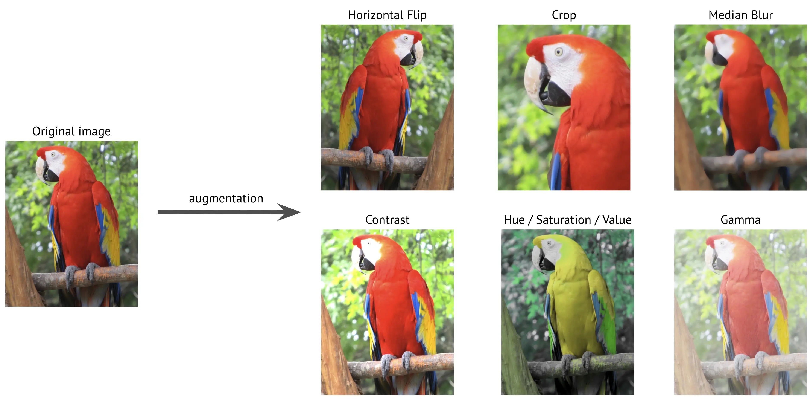

# What is Data Augmentation and Why Your Computer Vision Model Needs It

A model trained on 1,000 images of dogs photographed in daylight will struggle when it encounters dogs at night. A detector that only sees cars from behind won't recognize them from the side. And a tumor classifier trained on scans from one hospital's MRI machine may fail completely on images from another.

The problem isn't architecture or training — it's **data diversity**. Your model can only handle what it has seen.

**Data Augmentation** is a set of techniques that artificially increases the diversity of your training data by generating modified copies of existing samples. Instead of collecting more data — which is slow, expensive, and sometimes impossible — you show your model the same images in slightly different ways: flipped, rotated, brightened, cropped, blurred.


The augmented image is still a cat. The label is preserved. But your model now learns that "cat" isn't tied to one specific orientation, lighting, or framing.

## Why Augment Data?

Deep learning models improve with more diverse training data — this is an empirical fact observed across virtually every computer vision task. Models trained on larger, more varied datasets generalize better to new, unseen examples.

The ideal path to better performance is always **more high-quality, labeled data**, especially data that targets your model's weak spots (rare classes, edge cases, different environments). But this is often impractical:

1. **Cost and time:** Labeling at scale is expensive.
2. **Inherent scarcity:** Some phenomena are rare by nature — certain diseases will always have limited medical images, no matter how much money you spend.
3. **Expert bottleneck:** Radiological scans need radiologists. Satellite imagery needs geospatial analysts. The labeling pipeline is only as fast as the domain experts.

Beyond data quantity, **distribution shift** is a common failure mode. A model trained on images from one hospital, one country, or one camera will underperform when deployed in a different context. Augmentation helps by *widening* the training distribution, increasing the chance it overlaps with whatever the model will encounter in production.


Crucially, augmentation is applied **on-the-fly** during training. The transformations run on the CPU while the GPU handles forward and backward passes. This means you get more data diversity with near-zero additional cost compared to the slow, expensive process of collecting and labeling new samples.

## When Does Augmentation Help Most?

Augmentation tends to provide the **most relative value with smaller datasets**, where the risk of overfitting on limited examples is highest. For large datasets, the inherent diversity may already be sufficient — though augmentation typically still improves robustness.

Augmentation also acts as a form of **regularization**, similar to Dropout or weight decay. But unlike those uniform techniques, augmentation can be applied surgically — you could, in principle, design pipelines that apply specific transforms more heavily to underperforming classes or challenging samples.

### The Hard Part: No Silver Bullet

There's no automatic way to find the optimal augmentation strategy for every problem. The best pipeline depends on your specific **task**, **model architecture**, **dataset characteristics**, and even **training hyperparameters**.

While researchers have explored automated approaches (AutoAugment, RandAugment), these remain an active area of research and can be computationally expensive. In practice, selecting an effective pipeline relies on experience, intuition, and iterative experimentation.

> [!TIP]
> Finding the *absolute best* pipeline is hard. Finding a *good* one that improves your model is usually straightforward. See our guide on **[How to Pick Augmentations](../3-basic-usage/choosing-augmentations.md)** for practical recommendations.

### Watch Out: Over-Augmentation

Like any regularization, **overuse can be harmful**. Overly aggressive augmentations can:
- Slow down training convergence
- Create a training distribution that differs too much from real-world test data, hurting production performance

The goal is to expand the distribution, not distort it beyond what's realistic for your domain.

## Focusing on Image Augmentation

Data augmentation works across domains (text, audio, tabular), but it's especially impactful in **computer vision**. Images have high dimensionality and exhibit enormous real-world variability:

- **Viewpoint:** Objects look different from different angles
- **Illumination:** Daylight vs. night, indoor vs. outdoor, shadows
- **Scale:** Objects appear at different sizes depending on distance
- **Deformation:** Non-rigid objects bend and change shape
- **Occlusion:** Objects can be partially hidden
- **Background:** Objects appear against diverse backgrounds
- **Intra-class variation:** Even within "dog," there's massive visual diversity

Image augmentation techniques simulate these variations synthetically.

## Common Image Augmentation Techniques

### 1. Geometric Transformations

These alter the spatial structure of the image — position, orientation, scale, and shape.

- **Flipping**: [`HorizontalFlip`](https://explore.albumentations.ai/transform/HorizontalFlip), [`VerticalFlip`](https://explore.albumentations.ai/transform/VerticalFlip) — simple yet very effective when there's no inherent orientation preference
- **Rotation**: [`Rotate`](https://explore.albumentations.ai/transform/Rotate), [`RandomRotate90`](https://explore.albumentations.ai/transform/RandomRotate90) — invariance to object orientation
- **Scaling**: [`RandomScale`](https://explore.albumentations.ai/transform/RandomScale), [`Resize`](https://explore.albumentations.ai/transform/Resize) — robustness to objects appearing at different sizes
- **Translation**: [`Affine`](https://explore.albumentations.ai/transform/Affine) — objects should be found regardless of position
- **Shear and Perspective**: [`Affine`](https://explore.albumentations.ai/transform/Affine), [`Perspective`](https://explore.albumentations.ai/transform/Perspective) — simulates viewing from different angles
- **Elastic Deformations**: [`ElasticTransform`](https://explore.albumentations.ai/transform/ElasticTransform), [`GridDistortion`](https://explore.albumentations.ai/transform/GridDistortion) — local warping, especially useful for medical images

### 2. Color Space Transformations

These modify pixel values without changing spatial structure — simulating different lighting, cameras, and environments.

- **Brightness/Contrast**: [`RandomBrightnessContrast`](https://explore.albumentations.ai/transform/RandomBrightnessContrast) — varying lighting conditions
- **Gamma Correction**: [`RandomGamma`](https://explore.albumentations.ai/transform/RandomGamma) — non-linear intensity adjustment
- **Hue/Saturation/Value**: [`HueSaturationValue`](https://explore.albumentations.ai/transform/HueSaturationValue) — color variation across cameras and environments
- **Grayscale**: [`ToGray`](https://explore.albumentations.ai/transform/ToGray) — forces the model to rely on shape and texture rather than color
- **Channel Shuffle**: [`ChannelShuffle`](https://explore.albumentations.ai/transform/ChannelShuffle) — randomly reorders RGB channels

Here's an example showing several augmentations applied to a single image:



### 3. Noise and Blurring

These simulate imperfections in image capture or transmission:

- **Gaussian Noise**: [`GaussNoise`](https://explore.albumentations.ai/transform/GaussNoise) — random sensor noise
- **Blurring**: [`GaussianBlur`](https://explore.albumentations.ai/transform/GaussianBlur), [`MedianBlur`](https://explore.albumentations.ai/transform/MedianBlur), [`MotionBlur`](https://explore.albumentations.ai/transform/MotionBlur) — out-of-focus or motion during capture

### 4. Random Erasing / Occlusion

These force the model to learn from context rather than relying on any single feature:

- [`CoarseDropout`](https://explore.albumentations.ai/transform/CoarseDropout) — removes rectangular regions (generalization of [CutOut](https://arxiv.org/abs/1708.04552))
- [`GridDropout`](https://explore.albumentations.ai/transform/GridDropout) — removes grid-aligned patches
- [`MaskDropout`](https://explore.albumentations.ai/transform/MaskDropout) — removes regions guided by segmentation masks

### 5. Weather & Environmental Effects

These simulate real-world conditions your model may encounter in deployment:

- [`RandomRain`](https://explore.albumentations.ai/transform/RandomRain), [`RandomFog`](https://explore.albumentations.ai/transform/RandomFog), [`RandomSunFlare`](https://explore.albumentations.ai/transform/RandomSunFlare), [`RandomShadow`](https://explore.albumentations.ai/transform/RandomShadow)

### 6. Mixing Images

Advanced techniques that combine information from multiple images:

- **MixUp:** Weighted interpolation of image pairs and their labels
- **CutMix:** Cuts a patch from one image and pastes it onto another, mixing labels proportionally
- **Mosaic:** Combines four images into a 2×2 grid, exposing the model to objects at different scales
- **Copy-Paste:** Copies object instances (with segmentation masks) from one image to another

> [!NOTE]
> MixUp, CutMix, Mosaic, and Copy-Paste require specific label and batching logic. They are typically integrated into the data loading or training loop rather than applied as standalone single-image transforms.

## How Combining Augmentations Creates Massive Diversity

Even simple augmentations act **multiplicatively** when combined:

- [`HorizontalFlip`](https://explore.albumentations.ai/transform/HorizontalFlip) alone (with `p=1`) **doubles** your effective dataset — each image now has its original and flipped version.
- Add [`RandomRotate90`](https://explore.albumentations.ai/transform/RandomRotate90) (0°, 90°, 180°, 270°) and you multiply by **4**: now **8** geometric variations per image.
- Add continuous transforms like [`Rotate(limit=10)`](https://explore.albumentations.ai/transform/Rotate) and [`RandomBrightnessContrast`](https://explore.albumentations.ai/transform/RandomBrightnessContrast), and the number of distinct possible outputs becomes practically infinite.

> [!IMPORTANT]
> With a typical pipeline, **your model almost never sees the exact same input image twice** during training. It's constantly presented with unique variations, forcing it to learn robust, general features rather than memorizing specific pixel patterns.

## The Crucial Role of Target Synchronization

In many computer vision tasks, you're not just working with images — you have associated **targets** that describe the image content. When you apply a geometric augmentation (like a rotation or flip), you **must** apply the *exact same* transformation to the corresponding targets.

Here's how targets are handled for common tasks:

| Task | What gets augmented | Albumentations targets |
|---|---|---|
| **Classification** | Image only; the class label stays the same | `image` |
| **Object Detection** | Image + bounding box coordinates | `image`, `bboxes` |
| **Semantic Segmentation** | Image + pixel-level mask | `image`, `mask` |
| **Keypoint Detection** | Image + point coordinates | `image`, `keypoints` |
| **Instance Segmentation** | Image + masks + bounding boxes | `image`, `mask`, `bboxes` |

The following examples show how spatial transforms affect both the image and its associated targets simultaneously:

**Pixel-level augmentation (brightness)** affects only the image — the mask stays identical:


**Spatial augmentation (rotation)** affects both the image and the mask identically:


**For object detection**, spatial transforms must adjust bounding box coordinates too:


Handling this synchronization manually is complex and error-prone. Libraries like Albumentations handle it automatically — when you pass your image along with its masks, bounding boxes, or keypoints, the library ensures all targets are transformed consistently:

```python
result = transform(image=img, mask=mask, bboxes=bboxes, keypoints=keypoints)
```

> [!NOTE]
> Not all transforms support all target types. Pixel-level transforms like [`RandomBrightnessContrast`](https://explore.albumentations.ai/transform/RandomBrightnessContrast) only modify images, while spatial transforms like [`Rotate`](https://explore.albumentations.ai/transform/Rotate) modify both images and their associated targets. Check the [Supported Targets by Transform](../reference/supported-targets-by-transform.md) reference before building your pipeline.

## Conclusion

Data augmentation is an indispensable tool in modern computer vision. It helps bridge the gap caused by limited data, pushes models to learn robust and generalizable features, and leads to better real-world performance — all with near-zero additional cost compared to collecting new data.

The concept is simple: generate plausible variations of your training images while preserving labels. The challenge lies in choosing the right transforms for your specific task and domain, and ensuring that all targets (masks, boxes, keypoints) stay perfectly synchronized.

## Where to Go Next?

Now that you understand the concepts behind image augmentation:

-   **[Install Albumentations](./installation.md):** Set up the library in your environment.
-   **[Learn the Core Concepts](../2-core-concepts/index.md):** How Albumentations implements transforms, pipelines, and target handling.
-   **[How to Pick Augmentations](../3-basic-usage/choosing-augmentations.md):** A practical 7-step framework for selecting transforms.
-   **[See Basic Usage Examples](../3-basic-usage/index.md):** Task-specific guides for classification, detection, segmentation, and more.
-   **[Check Transform Compatibility](../reference/supported-targets-by-transform.md):** Which transforms work with your specific combination of targets.
-   **[Explore Transforms Visually](https://explore.albumentations.ai):** Experiment with different augmentations interactively.
