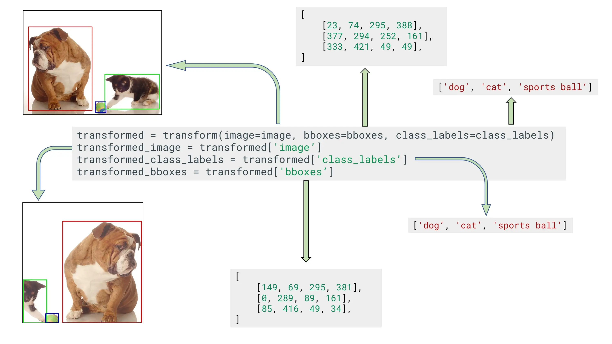

# Bounding Box Augmentation for Object Detection

This guide explains how to apply augmentations to images and their corresponding bounding boxes for object detection tasks using Albumentations. The key is ensuring transformations are applied consistently to both image pixels and box coordinates.

For background on *why* data augmentation is important and *which* specific augmentations might be suitable for object detection, please refer to:

*   **[What is Data Augmentation?](../1-introduction/what-are-image-augmentations.md)**
*   **[Choosing Augmentations](./choosing-augmentations.md)**

## Understanding Bounding Box Formats

Bounding boxes mark object locations. Albumentations needs to know the format of your bounding box coordinates. It supports four common formats:

*   **`pascal_voc`**: `[x_min, y_min, x_max, y_max]` in absolute pixel coordinates. `(x_min, y_min)` is the top-left corner, and `(x_max, y_max)` is the bottom-right corner.
*   **`albumentations`**: Similar to `pascal_voc`, but uses normalized coordinates: `[normalized_x_min, normalized_y_min, normalized_x_max, normalized_y_max]`. These are calculated as `x_pixel / image_width` and `y_pixel / image_height`.
*   **`coco`**: `[x_min, y_min, bbox_width, bbox_height]` in absolute pixel coordinates. `(x_min, y_min)` is the top-left corner.
*   **`yolo`**: `[normalized_x_center, normalized_y_center, normalized_bbox_width, normalized_bbox_height]`. These are normalized coordinates.

**Example:** For a 640x480 image (image_width=640, image_height=480) with a box from (98, 345) to (420, 462):


The formats represent this box as:

*   `pascal_voc`: `[x_min, y_min, x_max, y_max]` -> Direct pixel coordinates: `[98, 345, 420, 462]`
*   `albumentations`: `[x_min/image_width, y_min/image_height, x_max/image_width, y_max/image_height]` -> Normalized `pascal_voc`: `[98/640, 345/480, 420/640, 462/480]` ≈ `[0.153, 0.719, 0.656, 0.962]`
*   `coco`: `[x_min, y_min, bbox_width, bbox_height]` -> Top-left corner + box dimensions: `bbox_width=420-98=322`, `bbox_height=462-345=117`. Result: `[98, 345, 322, 117]`
*   `yolo`: `[x_center/image_width, y_center/image_height, bbox_width/image_width, bbox_height/image_height]` -> Normalized center + normalized box dimensions: `x_center=(98+420)/2=259`, `y_center=(345+462)/2=403.5`. Result: `[259/640, 403.5/480, 322/640, 117/480]` ≈ `[0.405, 0.861, 0.503, 0.244]`


You must specify the format you are providing so Albumentations can process it correctly.

## Augmenting Bounding Boxes: Step-by-Step

The process involves 4 main steps:

1.  Import libraries.
2.  Define an augmentation pipeline with bounding box parameters.
3.  Read image and bounding box data.
4.  Apply the pipeline to the image and boxes.

### Step 1: Import Libraries

```python
import albumentations as A
import cv2
import numpy as np
```

### Step 2: Define Augmentation Pipeline

Create an `A.Compose` pipeline, passing `A.BboxParams` to the `bbox_params` argument.

```python
# Example pipeline (matches original doc for consistency with images)
train_transform = A.Compose([
    A.RandomCrop(width=450, height=450, p=1.0), # Example random crop
    A.HorizontalFlip(p=0.5),
    A.RandomBrightnessContrast(p=0.2),
], bbox_params=A.BboxParams(format='coco', # Specify input format
                           label_fields=['class_labels'] # Specify label argument name(s)
                           ))
```

**Cropping Strategies for Object Detection:**

The example above uses [`A.RandomCrop`](https://explore.albumentations.ai/transform/RandomCrop). While simple, this transform might randomly crop a region that contains *none* of the original bounding boxes, which is often undesirable for training object detectors. Albumentations provides specialized cropping transforms that are safer for bounding boxes:

*   **[`A.AtLeastOneBboxRandomCrop`](https://explore.albumentations.ai/transform/AtLeastOneBboxRandomCrop):** This transform crops a random area but guarantees that **at least one** bounding box from the original image is present within the crop. It's useful when you want diverse crops but are willing to lose *some* boxes, perhaps focusing training on individual objects or when images contain many redundant boxes.

*   **[`A.BBoxSafeRandomCrop`](https://explore.albumentations.ai/transform/BBoxSafeRandomCrop):** This transform also crops a random area but guarantees that **all** bounding boxes are preserved within the crop (potentially by cropping a smaller area if needed). This is suitable when losing *any* bounding box is problematic (e.g., detecting all instances is critical, or you have rare objects).

*   **[`A.RandomSizedBBoxSafeCrop`](https://explore.albumentations.ai/transform/RandomSizedBBoxSafeCrop):** This is a very common and powerful transform. It crops a random portion of the image (with varying size and aspect ratio, similar to [`RandomResizedCrop`](https://explore.albumentations.ai/transform/RandomResizedCrop) in classification) while ensuring **all** bounding boxes remain within the cropped area. It then resizes this potentially non-square crop to your target `height` and `width`. This provides scale and aspect ratio augmentation while preserving all objects.

Consider replacing `A.RandomCrop` with one of these safer alternatives depending on your specific requirements for handling bounding boxes during cropping.

**Understanding `A.BboxParams`:**

*   **`format` (Required):** Specifies the format of the input bounding boxes (`'pascal_voc'`, `'albumentations'`, `'coco'`, or `'yolo'`).
*   **`label_fields` (Recommended):** List of keyword argument names that will hold the labels corresponding to the bounding boxes passed to the transform call (e.g., `['class_labels']`). Using this is the preferred way to handle labels, ensuring they stay synchronized with boxes that are kept or dropped.
*   **`min_area`:** Minimum pixel area. Boxes smaller than this after augmentation are dropped. Default: `0.0`.
*   **`min_visibility`:** Minimum fraction (0.0-1.0) of the original box area that must remain visible after augmentation. Boxes below this threshold are dropped. Default: `0.0`.
*   **`min_width`:** Minimum width of a bounding box (in pixels for absolute formats, normalized units for normalized formats). Boxes with width less than this value are removed. Default: `0.0`.
*   **`min_height`:** Minimum height of a bounding box (in pixels or normalized units). Boxes with height less than this value are removed. Default: `0.0`.
*   **`clip`:** If `True`, bounding box coordinates are clipped to stay within image boundaries (`[0, image_width]` for x, `[0, image_height]` for y) *before* applying transformations. Default: `False`.
*   **`filter_invalid_bboxes`:** If `True`, filters out invalid boxes (e.g., `x_max < x_min`) *before* applying augmentations. If `clip=True`, filtering happens after clipping. Default: `False`.
*   **`max_accept_ratio`:** Maximum allowed aspect ratio (`max(width/height, height/width)`). Boxes exceeding this ratio are filtered out. `None` disables this check. Default: `None`.

**Handling Imperfect Annotations:** It's common for real-world datasets to have bounding boxes that partially or fully extend outside the image boundaries due to labeling errors or previous processing. Setting `clip=True` will force these coordinates back within the image dimensions *before* augmentations are applied. Subsequently, setting `filter_invalid_bboxes=True` can help remove boxes that might have become invalid (e.g., zero width/height) *after* clipping. Using both `clip=True` and `filter_invalid_bboxes=True` together is a common strategy to clean up such annotations before augmentation.

**`min_area` / `min_visibility` Example:**

Consider cropping an image with two boxes:


Applying `A.CenterCrop` might result in smaller or partially visible boxes:

")

Using `min_area` can remove boxes that become too small:


Using `min_visibility` can remove boxes that are mostly cropped out:


**Handling Class Labels:**

Each bounding box needs a corresponding class label. Because bounding boxes are processed as NumPy arrays (which require homogeneous data types), labels **must** be passed separately from the coordinates.


This is done using the `label_fields` parameter in `A.BboxParams`. You define one or more names in `label_fields` (e.g., `['class_labels', 'difficult_flag']`). Then, when calling the transform, you pass lists corresponding to these names (e.g., `transform(..., class_labels=my_labels, difficult_flag=my_flags)`). Albumentations ensures these label lists are kept synchronized with the bounding boxes if any boxes are dropped during augmentation.

### Step 3: Read Image and Bounding Boxes

Load your image (e.g., into an RGB NumPy array) and prepare your bounding box data.

```python
# Load Image
image_path = "/path/to/your/image.jpg"
image = cv2.imread(image_path)
image = cv2.cvtColor(image, cv2.COLOR_BGR2RGB)

# Prepare Bounding Boxes (example using 'coco' format)
# Each inner list is [x_min, y_min, bbox_width, bbox_height]
bboxes = np.array([
    [23, 74, 295, 388],
    [377, 294, 252, 161],
    [333, 421, 49, 49],
])

# Prepare Labels (using the name specified in label_fields)
class_labels = ['dog', 'cat', 'sports ball']
# Example with multiple label fields if defined in BboxParams:
# class_categories = ['animal', 'animal', 'item']
```

Albumentations expects `bboxes` as a NumPy array `(num_boxes, 4)`. Each inner list/row must contain the 4 coordinate values according to the specified `format`.

### Step 4: Apply the Pipeline

Pass the image, bounding boxes (as `bboxes`), and the corresponding label lists using the keyword arguments defined in `label_fields`.

```python
# Using train_transform defined earlier which has label_fields=['class_labels']
augmented = train_transform(image=image, bboxes=bboxes, class_labels=class_labels)

transformed_image = augmented['image']
transformed_bboxes = augmented['bboxes']
# Access transformed labels using the key from label_fields
transformed_class_labels = augmented['class_labels']

# If multiple label fields were defined (e.g., label_fields=['class_labels', 'category_id'])
# and passed like: transform(..., class_labels=..., category_id=...)
# then access them: transformed_category_ids = augmented['category_id']
```



The output dictionary contains the augmented image and the corresponding augmented bounding boxes and labels, potentially filtered by `min_area` or `min_visibility`.

### Visualization

Visualizing the augmented image with its boxes is crucial for debugging. Always check the output of your *training* pipeline on sample images *before* starting a full training run.

**Important:** Visualize the output *before* applying `A.Normalize` and `A.ToTensorV2`, as these change the data type and value range, making direct display difficult.

```python
import matplotlib.pyplot as plt
import random
import numpy as np # Ensure numpy is imported
import cv2 # Ensure cv2 is imported

# Helper function to draw bounding boxes (adjust format handling as needed)
def draw_bboxes(image_np, bboxes, labels, class_name_map=None, color=(0, 255, 0), thickness=2):
    img_res = image_np.copy()
    font = cv2.FONT_HERSHEY_SIMPLEX
    font_scale = 0.5
    font_thickness = 1

    if not isinstance(bboxes, (list, np.ndarray)):
        print(f"Warning: bboxes is not a list or ndarray: {type(bboxes)}")
        return img_res
    if not isinstance(labels, (list, np.ndarray)):
        print(f"Warning: labels is not a list or ndarray: {type(labels)}")
        # Attempt to proceed if labels seem usable, otherwise return
        if len(bboxes) != len(labels):
            print("Warning: bbox and label length mismatch, cannot draw labels.")
            labels = ['?' for _ in bboxes] # Placeholder
        elif not all(isinstance(l, (str, int, float)) for l in labels):
             print("Warning: labels contain non-primitive types, cannot draw reliably.")
             labels = ['?' for _ in bboxes]

    for bbox, label in zip(bboxes, labels):
        # Assuming bbox format allows direct conversion to int x_min, y_min, x_max, y_max
        # This might need adjustment based on the ACTUAL format in your bboxes list
        # Example for pascal_voc or albumentations (after denormalizing)
        try:
             # Check if bbox has at least 4 elements
            if len(bbox) < 4:
                print(f"Warning: Skipping invalid bbox (fewer than 4 coords): {bbox}")
                continue
            x_min, y_min, x_max, y_max = map(int, bbox[:4])
        except (ValueError, TypeError) as e:
            print(f"Warning: Could not convert bbox coords to int: {bbox}, Error: {e}")
            continue # Skip this bbox

        cv2.rectangle(img_res, (x_min, y_min), (x_max, y_max), color, thickness)

        label_name = str(label) if class_name_map is None else class_name_map.get(label, str(label))
        # Simple text placement above the box
        (text_width, text_height), baseline = cv2.getTextSize(label_name, font, font_scale, font_thickness)
        text_y = y_min - baseline if y_min - baseline > text_height else y_min + text_height
        cv2.putText(img_res, label_name, (x_min, text_y), font, font_scale, color, font_thickness)

    return img_res

def visualize_bbox_augmentations(image, bboxes, labels, transform, samples=5):
    """Visualizes original image and augmented versions."""
    # Prepare visualization pipeline (strip Normalize, ToTensor)
    vis_transform = None
    if isinstance(transform, A.Compose):
        vis_transform_list = [
            t for t in transform
            if not isinstance(t, (A.Normalize, A.ToTensorV2))
        ]
        # Recreate Compose with original bbox_params if they exist
        bbox_params = getattr(transform, 'bbox_params', None)
        vis_transform = A.Compose(vis_transform_list, bbox_params=bbox_params)
    else:
        print("Cannot strip Normalize/ToTensor: transform is not an A.Compose instance.")
        vis_transform = transform # Use original transform

    if vis_transform is None or not hasattr(vis_transform, 'bbox_params'):
         print("Cannot visualize: Pipeline needs A.BboxParams for visualization.")
         return

    figure, ax = plt.subplots(1, samples + 1, figsize=(15, 5))

    # Draw original
    original_drawn = draw_bboxes(image, bboxes, labels)
    ax[0].imshow(original_drawn)
    ax[0].set_title("Original")
    ax[0].axis("off")

    # Draw augmented samples
    for i in range(samples):
        try:
            # Apply the visualization transform
            # Ensure labels are passed correctly based on label_fields
            label_args = {field: labels for field in vis_transform.bbox_params.label_fields}
            augmented = vis_transform(image=image, bboxes=bboxes, **label_args)

            aug_image = augmented['image']
            aug_bboxes = augmented['bboxes']
            # Extract labels correctly based on label_fields
            if vis_transform.bbox_params.label_fields:
                aug_labels = augmented[vis_transform.bbox_params.label_fields[0]]
            else:
                aug_labels = ['?' for _ in aug_bboxes] # Placeholder if no labels

            augmented_drawn = draw_bboxes(aug_image, aug_bboxes, aug_labels)
            ax[i+1].imshow(augmented_drawn)
            ax[i+1].set_title(f"Augmented {i+1}")
        except Exception as e:
            print(f"Error during augmentation sample {i+1}: {e}")
            ax[i+1].imshow(image) # Show original on error
            ax[i+1].set_title(f"Aug Error {i+1}")
        finally:
            ax[i+1].axis("off")

    plt.tight_layout()
    plt.show()

# --- Example Usage --- #
# Assuming 'image', 'bboxes', 'class_labels', and 'train_transform' are defined as in Step 3/4

# Load a sample image and annotations
# image = cv2.imread('your_image.jpg')
# image = cv2.cvtColor(image, cv2.COLOR_BGR2RGB)
# bboxes = [[...], [...]] # In 'coco' format for this example
# class_labels = ['label1', 'label2']

# Define the transform (must include bbox_params with correct format and label_fields)
# train_transform = A.Compose([
#     A.RandomCrop(width=450, height=450, p=1.0),
#     A.HorizontalFlip(p=0.5),
#     A.RandomBrightnessContrast(p=0.2),
#     # A.Normalize(...), # Include if used, will be stripped by visualize func
#     # A.ToTensorV2(),  # Include if used, will be stripped by visualize func
# ], bbox_params=A.BboxParams(format='coco', label_fields=['class_labels']))

# Visualize
# visualize_bbox_augmentations(image, bboxes, class_labels, train_transform, samples=4)

## Examples

*   [Using Albumentations to augment bounding boxes for object detection tasks](../../examples/example-bboxes/)
*   [How to use Albumentations for detection tasks if you need to keep all bounding boxes](../../examples/example-bboxes2/)
*   [Showcase. Cool augmentation examples on diverse set of images from various real-world tasks.](../../examples/showcase/)

## Where to Go Next?

After mastering bounding box augmentation, you might want to:

-   **[Review Core Concepts](../2-core-concepts/index.md):** Solidify your understanding of [Targets](../2-core-concepts/targets.md) and [Pipelines](../2-core-concepts/pipelines.md).
-   **[Refine Your Augmentation Choices](./choosing-augmentations.md):** Get specific advice on selecting effective transforms for object detection.
-   **[Optimize Performance](./performance-tuning.md):** Learn how to speed up your detection augmentation pipeline.
-   **Explore Related Tasks:**
    -   [Keypoint Augmentation](./keypoint-augmentations.md)
    -   [Semantic Segmentation](./semantic-segmentation.md) (useful for instance segmentation alongside boxes)
-   **[Dive into Advanced Guides](../4-advanced-guides/index.md):** Learn about custom transforms, serialization, or handling additional targets.
-   **[Visually Explore Transforms](https://explore.albumentations.ai):** Experiment with different spatial and pixel-level transforms.
