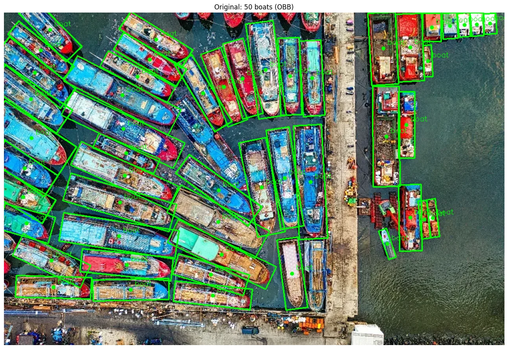
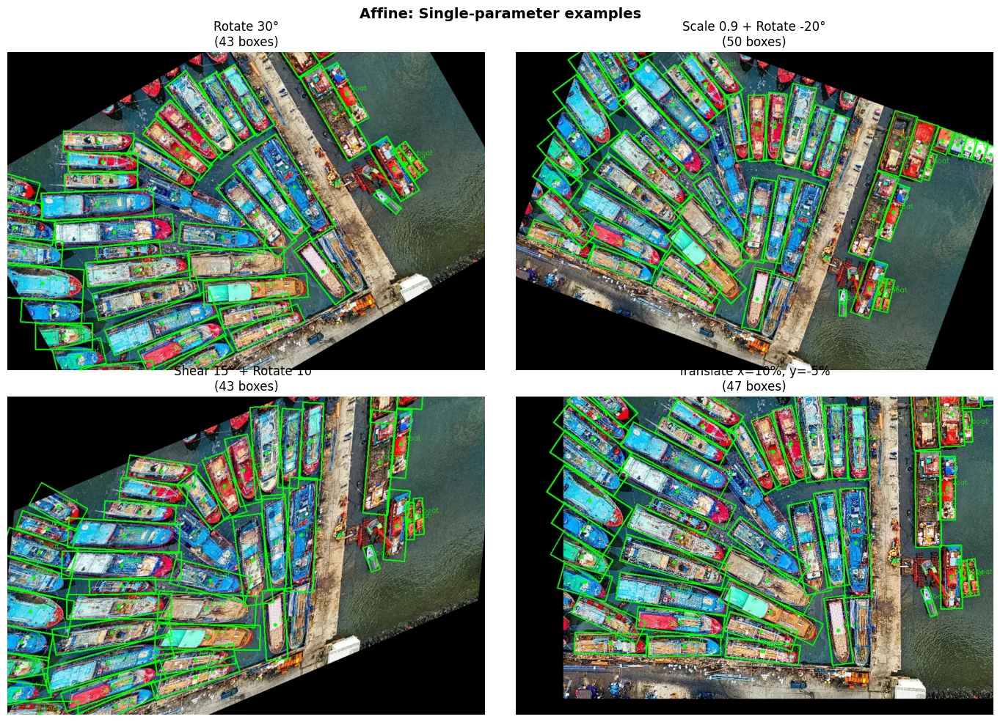
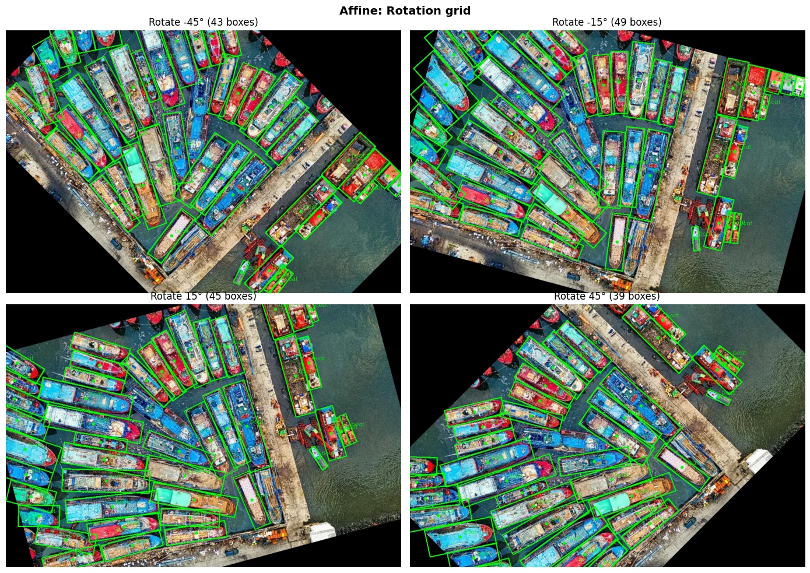
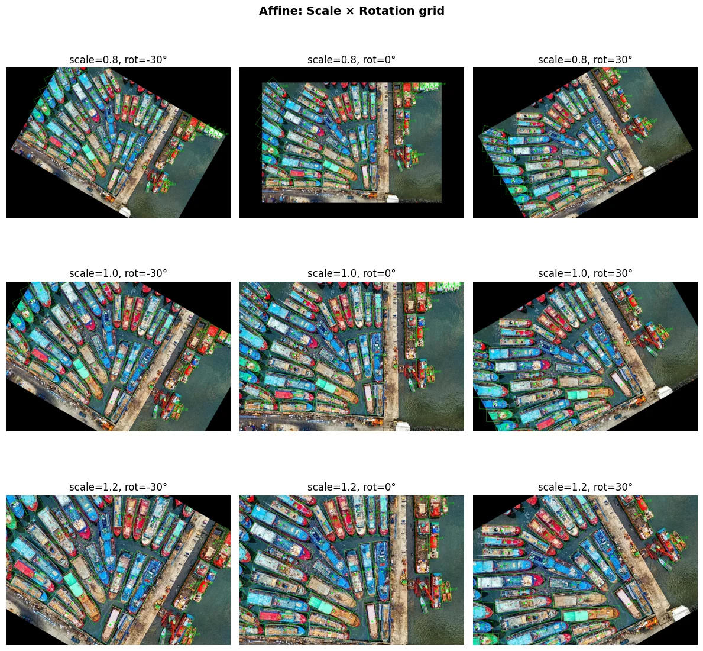
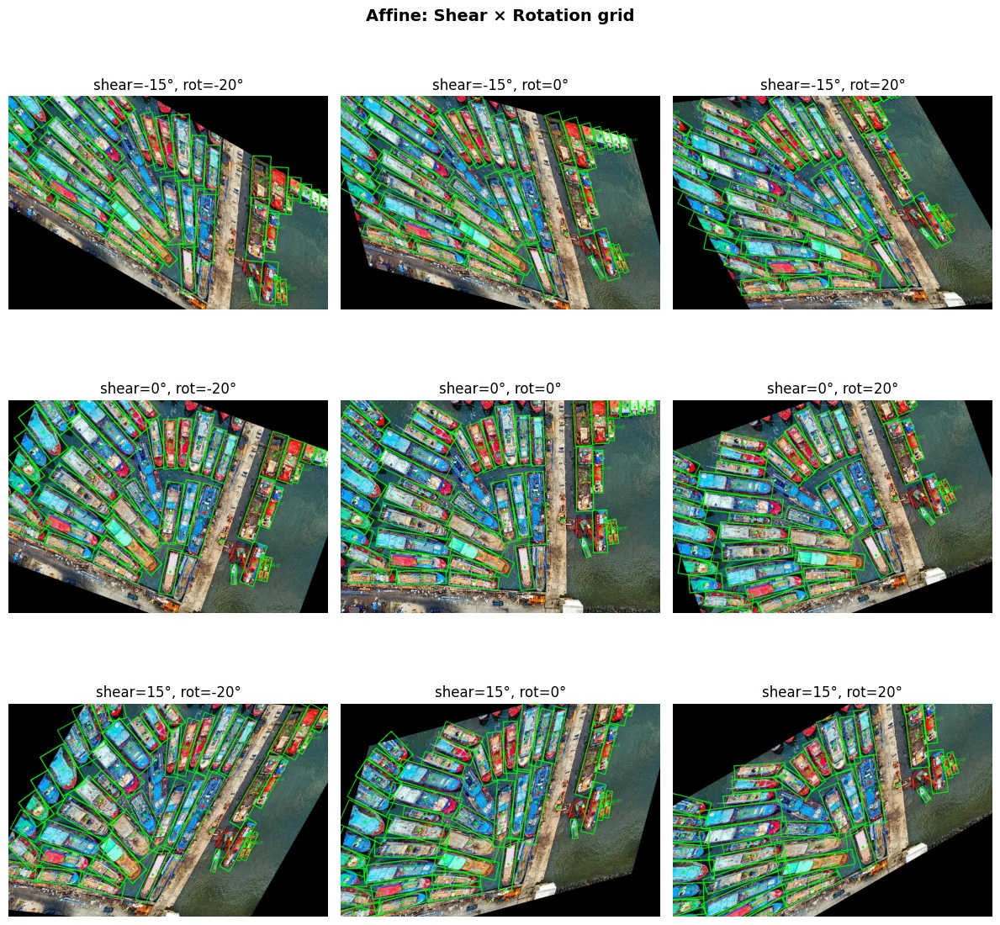
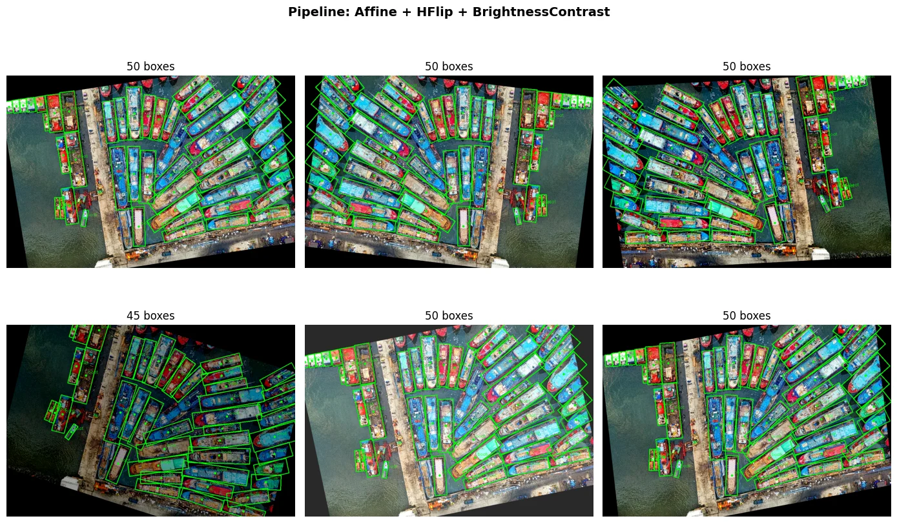

# Oriented Bounding Boxes (OBB)

Oriented bounding boxes (OBB) represent rotated objects with a 5th coordinate—the angle—in addition to the 4 coordinates used for axis-aligned boxes (HBB). OBB is useful for aerial imagery, boats, vehicles, and any scene where objects can be rotated.

## HBB vs OBB

*   **HBB (axis-aligned):** 4 coordinates—`[x_min, y_min, x_max, y_max]` or equivalent in other formats. The box edges are parallel to the image axes.
*   **OBB (oriented):** 5 coordinates—the same 4 as HBB plus `angle` as the 5th value. The box can be rotated.



## All 5 Formats for OBB

All coordinate formats supported for HBB also work for OBB. Append `angle` as the 5th coordinate:

| Format | HBB | OBB |
|--------|-----|-----|
| **coco** | `[x_min, y_min, w, h]` | `[x_min, y_min, w, h, angle]` |
| **pascal_voc** | `[x_min, y_min, x_max, y_max]` | `[x_min, y_min, x_max, y_max, angle]` |
| **albumentations** | `[x_min, y_min, x_max, y_max]` normalized | `[x_min, y_min, x_max, y_max, angle]` |
| **yolo** | `[cx, cy, w, h]` normalized | `[cx, cy, w, h, angle]` |
| **cxcywh** | `[cx, cy, w, h]` pixels | `[cx, cy, w, h, angle]` |

## Angle Semantics

The **angle** is the rotation of the **width edge** from horizontal, in **[-90, 90) degrees**.

*   **Width** = length of the edge more parallel to horizontal
*   **Height** = length of the other edge
*   **Angle** = rotation of the width edge from horizontal

The base rectangle has corners `[-w/2,-h/2], [w/2,-h/2], [w/2,h/2], [-w/2,h/2]`; at 0° the width edge is horizontal. Albumentations uses the same convention as OpenCV's `cv2.minAreaRect` and `cv2.boxPoints` for compatibility.

## BboxParams for OBB

Set `bbox_type='obb'` and choose your `coord_format`:

```python
import albumentations as A

# OBB in cxcywh format (center, width, height, angle in degrees)
bbox_params = A.BboxParams(
    coord_format='cxcywh',
    bbox_type='obb',
    label_fields=['labels'],
)

transform = A.Compose([
    A.Affine(scale=(0.9, 1.1), rotate=(-15, 15), shear=(-5, 5), p=0.9),
    A.HorizontalFlip(p=0.5),
], bbox_params=bbox_params)
```

## Transform Support

Most Dual transforms support OBB, including [`Affine`](https://explore.albumentations.ai/transform/Affine), [`Rotate`](https://explore.albumentations.ai/transform/Rotate), [`HorizontalFlip`](https://explore.albumentations.ai/transform/HorizontalFlip), and [`VerticalFlip`](https://explore.albumentations.ai/transform/VerticalFlip). Check the [Supported Targets by Transform](../reference/supported-targets-by-transform.md) reference for details. If a transform does not support OBB, the pipeline will raise an error at initialization.

## Affine + OBB Examples

[`Affine`](https://explore.albumentations.ai/transform/Affine) supports scale, translate, rotate, and shear—all of which correctly transform OBB angles.









")



## Clipping for OBB

*   **`clip_bboxes_on_input`:** Clips boxes to image bounds *once* before the pipeline. For OBB this is **lossy**—boxes with corners outside [0, 1] become axis-aligned (angle=0). Recommend `False` for OBB when using Affine or rotation.
*   **`clip_after_transform`:** Clips after each transform. For OBB, clips all 4 rotated corners and returns a wrapping axis-aligned box (angle=0). Default: `True`. Set to `False` if you want to allow temporary excursions outside bounds during the pipeline.

## Where to Go Next?

*   **[Bounding Box Augmentation](./bounding-boxes-augmentations.md):** Core HBB guide and format details
*   **[Supported Targets by Transform](../reference/supported-targets-by-transform.md):** Which transforms support OBB
*   **[Choosing Augmentations](./choosing-augmentations.md):** Selecting effective augmentations
