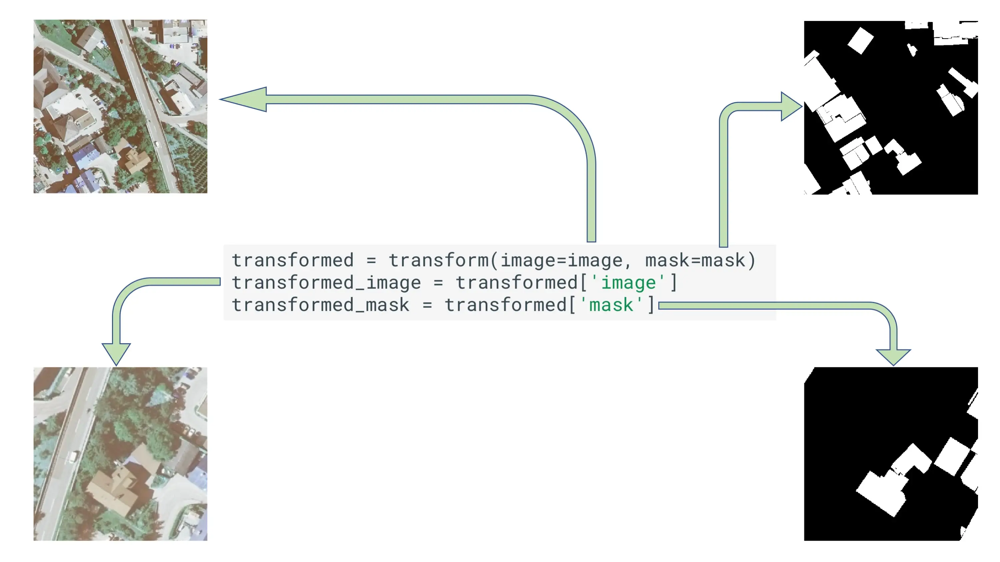

# Semantic Segmentation with Albumentations

Semantic segmentation involves classifying each pixel in an image. When applying augmentations for this task, the key challenge is ensuring that any geometric transformation applied to the image is **identically applied to its corresponding segmentation mask**. Color-based augmentations typically only affect the image.

This guide demonstrates the practical steps for setting up and applying synchronized augmentations for images and masks using Albumentations.

For background on *why* data augmentation is important and *which* specific augmentations might be suitable, please refer to:

*   **[What is Data Augmentation?](../1-introduction/what-are-image-augmentations.md)**
*   **[Choosing Augmentations](./choosing-augmentations.md)**

## Core Workflow

Applying synchronized augmentations for segmentation involves:

### 1. Setup: Import Libraries

Import Albumentations, an image reading library (like OpenCV), and potentially framework components.

```python
import albumentations as A
import cv2
import numpy as np
```

### 2. Define Augmentation Pipelines

Use `A.Compose` to define the sequence. Geometric transforms will automatically be applied to both the image and the mask when provided correctly.

**Example Training Pipeline:**

Includes resizing, random cropping, geometric transforms (applied to image and mask), and potentially image-only color transforms. `Normalize` applies only to the image, while `ToTensorV2` converts both.

```python
TARGET_SIZE = (256, 256) # Example input height, width

train_transform = A.Compose([
    # Resize shortest side of image and mask to TARGET_SIZE * 2, maintaining aspect ratio
    A.SmallestMaxSize(max_size=TARGET_SIZE[0] * 2, p=1.0),
    # Take a random crop
    A.RandomCrop(height=TARGET_SIZE[0], width=TARGET_SIZE[1], p=1.0),
    # Apply one of 8 random symmetries (flips/rotations)
    A.SquareSymmetry(p=1.0), # Replaces Horizontal/Vertical Flips
    # Optional: Further rotation if SquareSymmetry isn't sufficient or desired
    # A.Rotate(limit=30, p=0.3),
    # Optional: Image-only transforms (applied only to image)
    A.RandomBrightnessContrast(p=0.3),
    A.GaussNoise(std_range=(0.1, 0.2), p=0.2),
    # --- Framework-specific steps ---
    # Normalize image (mask is not normalized)
    A.Normalize(mean=(0.485, 0.456, 0.406), std=(0.229, 0.224, 0.225)),
    # Convert image and mask to PyTorch tensors
    A.ToTensorV2(),
])
```

**Example Validation Pipeline:**

Deterministic resizing, center cropping, and image normalization.

```python
val_transform = A.Compose([
    A.SmallestMaxSize(max_size=TARGET_SIZE[0] * 2, p=1.0),
    A.CenterCrop(height=TARGET_SIZE[0] * 2, width=TARGET_SIZE[1] * 2, p=1.0)),
    # No random cropping or geometric transforms
    # Normalize image
    A.Normalize(mean=(0.485, 0.456, 0.406), std=(0.229, 0.224, 0.225)),
    # Convert image to PyTorch tensor
    A.ToTensorV2(),
])
```

**Important Note on Mask Interpolation and Target Handling:**

When applying geometric transformations like resizing, rotation, or warping, the method used to calculate new pixel values (interpolation) is critical, especially for masks.

*   **Categorical Masks (Segmentation):** For typical segmentation masks where pixel values represent discrete class IDs (e.g., 0=background, 1=car, 2=person), using interpolation methods like bilinear or bicubic can create invalid pixel values. For instance, interpolating between a pixel with class ID 0 and another with ID 2 might result in a pixel with value 1, incorrectly introducing a class that wasn't originally present. To prevent this, **Nearest Neighbor interpolation (`cv2.INTER_NEAREST`)** is required. Albumentations defaults to `cv2.INTER_NEAREST` for targets passed via the `mask` argument.

*   **Continuous Targets (Depth, Heatmaps):** For tasks where the target is continuous (like depth maps or heatmaps), interpolating between values *is* often desirable. You can specify different interpolation methods for masks if needed (e.g., `A.Rotate(..., interpolation_mask=cv2.INTER_LINEAR)`)

*   **Image Restoration Use Case (Image as Mask):** An interesting pattern emerges for image restoration tasks (like denoising or deblurring). You can pass the *same* clean image as both the `image` and `mask` arguments to `Compose`. Geometric augmentations (like crops, flips, rotations) will be applied identically to both. Then, include image-only augmentations (like `A.GaussNoise`, `A.GaussianBlur`) in the pipeline. These will only affect the input passed as `image`, leaving the `mask` (the clean version) untouched by these specific transforms. The output dictionary will then contain a noisy/blurred `image` and a clean, geometrically-aligned `mask`, providing a perfect input/target pair for training a restoration model.

    ```python
    # Conceptual example for Denoising
    denoising_transform = A.Compose([
        A.RandomCrop(256, 256, p=1.0),
        A.HorizontalFlip(p=0.5),
        A.GaussNoise(std_range=(0.1, 0.2), p=1.0), # Applied only to 'image'
        A.Normalize(), # Applied only to 'image'
        A.ToTensorV2() # Applied only to 'image'
    ])

    # Usage in Dataset:
    # clean_image = cv2.imread(path)
    # clean_image = cv2.cvtColor(clean_image, cv2.COLOR_BGR2RGB)
    # augmented = denoising_transform(image=clean_image, mask=clean_image) # Pass clean image twice
    # noisy_input = augmented['image']
    # clean_target = augmented['mask'] # This remains clean but geometrically augmented
    ```

### 3. Load Image and Mask Data

Load the image (usually RGB) and its corresponding segmentation mask. Masks are typically single-channel grayscale images where each pixel value represents a class ID (e.g., 0 for background, 1 for class A, 2 for class B, etc.).

```python
image_path = "/path/to/your/image.jpg"
mask_path = "/path/to/corresponding/mask.png" # Often PNG format

# Read image (convert to RGB)
image = cv2.imread(image_path)
image = cv2.cvtColor(image, cv2.COLOR_BGR2RGB)

# Read mask (usually grayscale)
# Ensure mask is loaded correctly (e.g., some libraries might add extra channels)
mask = cv2.imread(mask_path, cv2.IMREAD_GRAYSCALE)
# Alternatively, if mask has channels: mask = cv2.imread(mask_path, cv2.IMREAD_UNCHANGED)

print(f"Loaded image shape: {image.shape}, dtype: {image.dtype}")
print(f"Loaded mask shape: {mask.shape}, dtype: {mask.dtype}")
# Expected mask output e.g.: Loaded mask shape: (512, 512), dtype: uint8
```


**An example showing an image and its mask before and after geometric augmentations (like crop and flip). Note how the transformations are applied consistently to both.**

### 4. Apply the Transform (Synchronized)

Pass both the image and the mask to the `Compose` object using the respective keyword arguments `image` and `mask`. Albumentations ensures geometric transforms are synchronized.

```python
# Apply the training transform to image and mask
augmented = train_transform(image=image, mask=mask)

# Extract the transformed image and mask
augmented_image = augmented['image']
augmented_mask = augmented['mask']

print(f"Augmented image shape: {augmented_image.shape}, dtype: {augmented_image.dtype}")
print(f"Augmented mask shape: {augmented_mask.shape}, dtype: {augmented_mask.dtype}")
# Expected output e.g.:
# Augmented image shape: torch.Size([3, 256, 256]), dtype: torch.float32
# Augmented mask shape: (256, 256), dtype: uint8 (or torch.int64 if converted later)
```

### 5. Integrate into Framework Data Loader

Apply the transform within your data loading pipeline, passing both image and mask.

**Conceptual PyTorch `Dataset`:**

```python
import torch
from torch.utils.data import Dataset, DataLoader

class SegmentationDataset(Dataset):
    def __init__(self, image_paths, mask_paths, transform=None):
        self.image_paths = image_paths
        self.mask_paths = mask_paths
        self.transform = transform # Assign the A.Compose object

    def __len__(self):
        return len(self.image_paths)

    def __getitem__(self, idx):
        image_path = self.image_paths[idx]
        mask_path = self.mask_paths[idx]

        # Read image and mask
        image = cv2.imread(image_path)
        image = cv2.cvtColor(image, cv2.COLOR_BGR2RGB)
        mask = cv2.imread(mask_path, cv2.IMREAD_GRAYSCALE)

        # Apply Albumentations transforms
        if self.transform:
            # Pass both image and mask
            augmented = self.transform(image=image, mask=mask)
            # Extract results
            image = augmented['image']
            mask = augmented['mask']

        return image, mask

# --- Usage Example ---
# Assuming train_img_paths, train_mask_paths, etc. are defined
# train_dataset = SegmentationDataset(train_img_paths, train_mask_paths, transform=train_transform)
# val_dataset = SegmentationDataset(val_img_paths, val_mask_paths, transform=val_transform)

# train_loader = DataLoader(train_dataset, batch_size=16, shuffle=True)
# val_loader = DataLoader(val_dataset, batch_size=16, shuffle=False)

# for batch_images, batch_masks in train_loader:
#     # Model training steps...
#     # batch_images shape: [B, 3, H, W], batch_masks shape: [B, H, W]
#     pass
```

### 6. Visualize Augmentations (Crucial Debugging Step)

Visualize the augmented image and mask pairs side-by-side *before* normalization and tensor conversion to confirm synchronization and realism.

```python
import matplotlib.pyplot as plt

# Simple function to overlay mask on image for visualization
def overlay_mask(image, mask, alpha=0.5, color=(0, 1, 0)): # Green overlay
    # Convert mask to 3 channels if needed, ensure boolean type
    mask_overlay = np.zeros_like(image, dtype=np.uint8)
    # Create a color overlay where mask is > 0
    mask_overlay[mask > 0] = (np.array(color) * 255).astype(np.uint8)

    # Blend image and overlay
    overlayed_image = cv2.addWeighted(image, 1, mask_overlay, alpha, 0)
    return overlayed_image


def visualize_segmentation(dataset, idx=0, samples=3):
    # Make a copy of the transform list to modify for visualization
    if isinstance(dataset.transform, A.Compose):
        vis_transform_list = [
            t for t in dataset.transform
            if not isinstance(t, (A.Normalize, A.ToTensorV2))
        ]
        vis_transform = A.Compose(vis_transform_list)
    else:
        print("Warning: Could not automatically strip Normalize/ToTensor for visualization.")
        vis_transform = dataset.transform

    figure, ax = plt.subplots(samples + 1, 2, figsize=(8, 4 * (samples + 1)))

    # --- Get the original image and mask --- #
    original_transform = dataset.transform
    dataset.transform = None # Temporarily disable for raw data access
    image, mask = dataset[idx]
    dataset.transform = original_transform # Restore

    # Display original
    ax[0, 0].imshow(image)
    ax[0, 0].set_title("Original Image")
    ax[0, 0].axis("off")
    ax[0, 1].imshow(mask, cmap='gray') # Show mask directly
    ax[0, 1].set_title("Original Mask")
    ax[0, 1].axis("off")
    # ax[0, 1].imshow(overlay_mask(image, mask)) # Or show overlay
    # ax[0, 1].set_title("Original Overlay")

    # --- Apply and display augmented versions --- #
    for i in range(samples):
        # Apply the visualization transform
        if vis_transform:
            augmented = vis_transform(image=image, mask=mask)
            aug_image = augmented['image']
            aug_mask = augmented['mask']
        else:
            aug_image, aug_mask = image, mask # Should not happen normally

        # Display augmented image and mask
        ax[i + 1, 0].imshow(aug_image)
        ax[i + 1, 0].set_title(f"Augmented Image {i+1}")
        ax[i + 1, 0].axis("off")

        ax[i + 1, 1].imshow(aug_mask, cmap='gray') # Show mask directly
        ax[i + 1, 1].set_title(f"Augmented Mask {i+1}")
        ax[i + 1, 1].axis("off")
        # ax[i+1, 1].imshow(overlay_mask(aug_image, aug_mask)) # Or show overlay
        # ax[i+1, 1].set_title(f"Augmented Overlay {i+1}")


    plt.tight_layout()
    plt.show()

# Assuming train_dataset is created with train_transform:
# visualize_segmentation(train_dataset, samples=3)

```

## Recommended Model Library: segmentation-models-pytorch

While Albumentations handles the data augmentation, you'll need a model architecture for semantic segmentation. A popular library for PyTorch users is **[segmentation-models-pytorch (SMP)](https://github.com/qubvel-org/segmentation_models.pytorch)** by [Pavel Iakubovskii](https://www.linkedin.com/in/pavel-iakubovskii/).

It provides implementations of many common segmentation architectures (like Unet, FPN, DeepLabV3+, PSPNet, etc.) with a wide range of pre-trained backbones available (including ResNets, EfficientNets, and Vision Transformers). Using SMP can be helpful for quickly setting up models with standard architectures and pre-trained weights.

```python
# Example of importing and using SMP (installation required: pip install segmentation-models-pytorch)
# import segmentation_models_pytorch as smp

# model = smp.Unet(
#     encoder_name="resnet34",        # choose encoder, e.g. mobilenet_v2 or efficientnet-b7
#     encoder_weights="imagenet",     # use 'imagenet' pre-trained weights for encoder initialization
#     in_channels=3,                  # model input channels (1 for grayscale images, 3 for RGB, etc.)
#     classes=N_CLASSES,              # model output channels (number of classes in your dataset)
# )
```

Integrating Albumentations pipelines with models from `segmentation-models-pytorch` is a common workflow for segmentation tasks.

## Next Steps

This guide provides the foundation for applying augmentations in semantic segmentation. Explore the **[Choosing Augmentations](./choosing-augmentations.md)** guide to discover more transforms (like elastic distortions, grid distortion, etc.) that are particularly relevant for segmentation tasks and learn how to tune parameters effectively.
