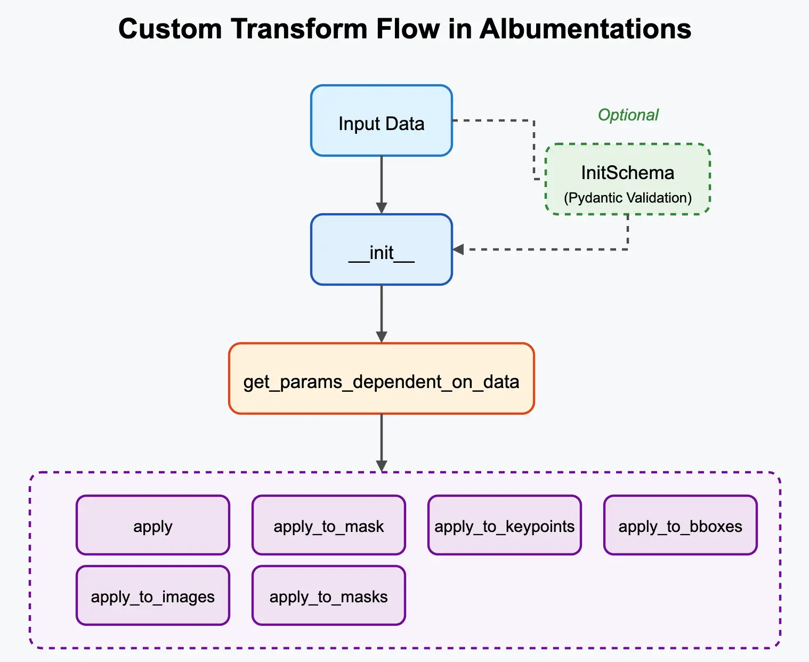

# Creating Custom Albumentations Transforms

While Albumentations provides a wide array of built-in transformations, you might need to create your own custom logic. This guide walks through the process step-by-step, referencing the typical flow of a custom transform.


*(Image Source: Diagram illustrating the custom transform flow)*

## Motivation

Why create a custom transform?

*   Implement novel augmentation techniques.
*   Create domain-specific transforms.
*   Wrap functions from external image processing libraries.
*   Encapsulate complex or conditional logic.

## Core Concept: Inheriting from Base Classes

To integrate with Albumentations, custom transforms inherit from base classes like `A.ImageOnlyTransform`, `A.DualTransform`, or `A.Transform3D`. These base classes provide the structure for handling different data targets (`image`, `mask`, `bboxes`, etc.) and probabilities.

## Step 1: Minimal Image-Only Transform

Let's start with the simplest case: a transform that only modifies the image pixels and involves some randomness. We'll inherit from `A.ImageOnlyTransform`.

**Goal:** Create a transform that multiplies the image pixel values by a random factor between 0.5 and 1.5.

**Code:**

```python
import albumentations as A
from albumentations.core.transforms_interface import ImageOnlyTransform
import numpy as np
import random
from typing import Any

class RandomMultiplier(ImageOnlyTransform):
    """Multiplies the pixel values of an image by a random factor."""

    def __init__(self, factor_range=(0.5, 1.5), p=0.5):
        # 1. Initialize the base class with probability 'p'
        super().__init__(p=p)
        # Store initialization parameters
        self.factor_range = factor_range

    # Use get_params_dependent_on_data for ALL parameter sampling
    # Correct signature includes `params` from get_params (though unused here)
    def get_params_dependent_on_data(self, params, data):
        # 2. Sample random parameter(s) once per call.
        # Even if not strictly dependent, we use this method.
        # The 'data' dict (e.g., data['image']) is available here if needed.
        factor = random.uniform(self.factor_range[0], self.factor_range[1])
        return {"factor": factor}

    def apply(self, img, factor, **params):
        # 3. Apply the transformation logic to the image
        # 'factor' comes from the dictionary returned by get_params_dependent_on_data()
        # We use np.clip to keep values in the valid range [0, 255]
        return np.clip(img * factor, 0, 255).astype(img.dtype)

# --- Usage ---
# Instantiate the custom transform
random_mult = RandomMultiplier(factor_range=(0.8, 1.2), p=1.0)

# Use it in a pipeline
pipeline = A.Compose([
    A.Resize(256, 256), # Example built-in transform
    random_mult,        # Your custom transform
])
```

**Explanation:**

1.  **`__init__(self, ...)`:** The constructor receives configuration parameters (`factor_range`). It calls `super().__init__(p=p)` to handle the standard probability logic.
2.  **`get_params_dependent_on_data(self, params, data)`:** This method is called once per transform invocation (if probability `p` is met). Its primary role is to sample any random values needed for the augmentation and perform any calculations (potentially based on the input `data` dictionary) that need to be shared across different `apply_to_...` methods (like `apply`, `apply_to_mask`, etc.). It receives the `params` dict from `get_params` (which is empty in this workflow) and the `data` dict. Returning values in a dictionary ensures they are computed only once and then passed consistently to the relevant apply methods via the `**params` argument.
3.  **`apply(self, img, factor, **params)`:** Performs the transformation using the image (`img`) and the sampled `factor` (received via `**params`). Returns the modified image.

This minimal example demonstrates the basic structure. `get_params_dependent_on_data()` is the method used for sampling augmentation parameters and centralizing calculations.

## Step 2: Data-Dependent Image-Only Transform

Now, let's create a transform where the parameters calculated depend on the input image itself. We'll still use `ImageOnlyTransform` as we only modify the image pixels.

**Goal:** Create a transform that normalizes the image using its per-channel mean and standard deviation.

**Code:**

```python
import albumentations as A
from albumentations.core.transforms_interface import ImageOnlyTransform
import numpy as np

class PerImageNormalize(ImageOnlyTransform):
    """Normalizes an image using its own mean and standard deviation."""

    def __init__(self, p=1.0):
        # Only probability needed for initialization
        super().__init__(p=p)

    # Correct signature includes `params` from get_params (though unused here)
    def get_params_dependent_on_data(self, params, data):
        # Calculate mean and std from the input image
        img = data['image'] # Access the image from the input data dict
        mean = np.mean(img, axis=(0, 1))
        std = np.std(img, axis=(0, 1))
        # Add a small epsilon to std to avoid division by zero
        std = np.where(std < 1e-6, 1e-6, std)
        return {"mean": mean, "std": std}

    def apply(self, img, mean, std, **params):
        # Apply normalization using the calculated mean and std
        # Ensure calculations are done in float to avoid data type issues
        img = img.astype(np.float32)
        normalized_img = (img - mean) / std
        return normalized_img

    # Note: Output dtype will be float32 after normalization
```

**Explanation:**

1.  **`__init__`:** Only requires the probability `p`.
2.  **`get_params_dependent_on_data(self, params, data)`:**
    *   It receives the `data` dictionary. We access the input image using `data['image']`.
    *   We calculate the mean and standard deviation across the height and width dimensions (axes 0 and 1) for each channel.
    *   A small epsilon is added to the standard deviation to prevent division by zero in case of a completely flat channel.
    *   The calculated `mean` and `std` are returned in the parameters dictionary.
3.  **`apply(self, img, mean, std, **params)`:**
    *   Receives the image and the calculated `mean` and `std` via `params`.
    *   Performs the standard normalization formula: `(pixel - mean) / std`.
    *   The image is cast to `float32` before the operation to ensure correct calculation and handle potential negative values after mean subtraction. The output will be `float32`.

This example shows how `get_params_dependent_on_data` allows you to compute augmentation parameters based on the specific input image being processed.

## Step 3: Handling Multiple Images Efficiently (within ImageOnlyTransform)

While `ImageOnlyTransform` focuses on modifying only image pixels, it can still receive multiple images via the `images` keyword argument (e.g., for video frames or batches needing consistent parameters). The *default* behavior might loop through each image slice and apply the single-image `apply` method using the same parameters for all slices.

For our `PerImageNormalize` example, this default behavior would be inefficient and incorrect (using the same mean/std for all images). We can override the `apply_to_images` method within our `ImageOnlyTransform` subclass to provide a correct and efficient vectorized implementation.

**Goal:** Efficiently normalize each image in a sequence/batch using its *own* mean and standard deviation, while still inheriting from `ImageOnlyTransform`.

**Code:**

```python
import albumentations as A
from albumentations.core.transforms_interface import ImageOnlyTransform # Keep ImageOnlyTransform
import numpy as np
from typing import Any # For type hinting

class PerImageNormalizeEfficient(ImageOnlyTransform): # Renamed for clarity
    """
    Normalizes an image or a sequence/batch of images using per-image
    mean and standard deviation. Overrides apply_to_images for efficiency.
    """
    def __init__(self, p=1.0):
        super().__init__(p=p)

    # get_params_dependent_on_data needs to handle both single image and multiple images
    def get_params_dependent_on_data(self, params, data):
        # Rename stats to params for clarity
        params_out = {}
        if 'image' in data:
            img = data['image']
            params_out['mean'] = np.mean(img, axis=(0, 1))
            params_out['std'] = np.std(img, axis=(0, 1))
        elif 'images' in data:
            imgs = data['images'] # Shape (N, H, W, C) or (N, H, W)
            # Calculate per-image mean/std. Axis is (1, 2) for H, W
            params_out['mean'] = np.mean(imgs, axis=(1, 2))
            params_out['std'] = np.std(imgs, axis=(1, 2))
            # Ensure means/stds have shape (N, C) or (N,) for broadcasting
            if imgs.ndim == 4 and params_out['mean'].ndim == 1: # Add channel dim if needed
                 params_out['mean'] = params_out['mean'][:, np.newaxis]
                 params_out['std'] = params_out['std'][:, np.newaxis]
        else:
             return {}

        # Add epsilon for stability
        params_out['std'] = np.where(params_out['std'] < 1e-6, 1e-6, params_out['std'])
        return params_out # Return the parameters dictionary

    # apply for single image (same as Step 2)
    def apply(self, img, mean, std, **params):
        # Ignore mode if necessary, or use for assertion/logging
        img = img.astype(np.float32)
        normalized_img = (img - mean) / std
        return normalized_img

    # Override apply_to_images for sequence/batch (vectorized)
    def apply_to_images(self, images, mean, std, **params):
        # Ignore mode if necessary, or use for assertion/logging
        # Ensure calculations are done in float
        images = images.astype(np.float32)

        # mean and std have shape (N, C) or (N,) allowing broadcasting
        # images shape is (N, H, W, C) or (N, H, W)
        # Reshape mean/std for broadcasting: (N, 1, 1, C) or (N, 1, 1)
        if images.ndim == 4: # N, H, W, C
            mean = mean[:, np.newaxis, np.newaxis, :]
            std = std[:, np.newaxis, np.newaxis, :]
        elif images.ndim == 3: # N, H, W
             mean = mean[:, np.newaxis, np.newaxis]
             std = std[:, np.newaxis, np.newaxis]

        normalized_images = (images - mean) / std
        return normalized_images

    # targets property is implicitly {"image": apply} from ImageOnlyTransform,
    # but the pipeline logic will correctly call apply_to_images when the 'images'
    # key is present in the input data.
```

**Explanation:**

1.  **Inheritance:** We still inherit from `A.ImageOnlyTransform`.
2.  **`get_params_dependent_on_data`:** This is updated to detect if `'image'` or `'images'` is present in the input `data` and calculate the mean/std accordingly (either a single value/vector or an array of values/vectors). It returns the calculated parameters in a dictionary.
3.  **`apply`:** Handles the single-image case as before. It receives the single `mean` and `std`.
4.  **`apply_to_images`:** This method is **overridden**. It receives the `images` stack/sequence and the *arrays* of `mean` and `std` calculated in `get_params_dependent_on_data`. It uses NumPy broadcasting to efficiently normalize each image with its corresponding statistics.

This `PerImageNormalizeEfficient` class now correctly handles both single images (via `apply`) and sequences/batches (via the overridden `apply_to_images`) while still being an `ImageOnlyTransform`, providing efficiency and correctness for the per-image normalization task.

## Step 4: Geometric Transform Affecting Multiple Targets (Manual Implementation)

This step shows how to implement a custom geometric transform inheriting from `A.DualTransform` and manually applying the transformation logic. Remember that `apply_to_bboxes` and `apply_to_keypoints` receive data in a standardized internal format.

**Goal:** Create a transform that randomly shifts the image and all associated targets, implementing the target logic manually.

**Code:**

```python
import albumentations as A
from albumentations.core.transforms_interface import DualTransform
import numpy as np
import cv2
import random
from typing import Any, Sequence, Dict # Use Dict for type hint clarity

class RandomShiftMultiTargetManual(DualTransform):
    """
    Randomly shifts the image and associated targets (mask, bboxes, keypoints)
    with manual implementation of target transformations, respecting internal formats.
    Processes arrays of bboxes and keypoints.
    """
    def __init__(self, x_limit=0.1, y_limit=0.1,
                 interpolation=cv2.INTER_LINEAR,
                 mask_interpolation=cv2.INTER_NEAREST,
                 border_mode=cv2.BORDER_CONSTANT,
                 fill=0,
                 fill_mask=0,
                 p=0.5):
        super().__init__(p=p)
        self.x_limit = x_limit
        self.y_limit = y_limit
        self.interpolation = interpolation
        self.mask_interpolation = mask_interpolation
        self.border_mode = border_mode
        self.fill = fill
        self.fill_mask = fill_mask

    def get_params_dependent_on_data(self, params: dict[str, Any], data: dict[str, Any]) -> dict[str, Any]:
        height, width = data['image'].shape[:2]

        # CORRECT: Use self.py_random for reproducibility
        dx = self.py_random.uniform(-self.x_limit, self.x_limit)
        dy = self.py_random.uniform(-self.y_limit, self.y_limit)

        # INCORRECT (would ignore Albumentations seed):
        # dx = random.uniform(-self.x_limit, self.x_limit)
        # dy = random.uniform(-self.y_limit, self.y_limit)

        # # Example using numpy generator if needed for array sampling:
        # noise_level = self.random_generator.uniform(0.01, 0.05)

        x_shift = int(width * dx)
        y_shift = int(height * dy)
        matrix = np.float32([[1, 0, x_shift], [0, 1, y_shift]])
        return {
            "matrix": matrix,
            "x_shift": x_shift,
            "y_shift": y_shift,
            "height": height,
            "width": width
            }

    def apply(self, img: np.ndarray, matrix: np.ndarray, height: int, width: int, **params) -> np.ndarray:
        return cv2.warpAffine(
            img, matrix, (width, height),
            flags=self.interpolation, borderMode=self.border_mode, borderValue=self.fill
        )

    def apply_to_mask(self, mask: np.ndarray, matrix: np.ndarray, height: int, width: int, **params) -> np.ndarray:
        return cv2.warpAffine(
            mask, matrix, (width, height),
            flags=self.mask_interpolation, borderMode=self.border_mode, borderValue=self.fill_mask
        )

    # Correct method name and signature for multiple bounding boxes
    def apply_to_bboxes(self, bboxes: np.ndarray, x_shift: int, y_shift: int, height: int, width: int, **params) -> np.ndarray:
        """
        Applies shift to an array of bounding boxes.
        Assumes bboxes array is in internal normalized format [:, [x_min, y_min, x_max, y_max, ...]].
        Returns bboxes array in the same format.
        """
        # Calculate normalized shifts
        norm_dx = x_shift / width
        norm_dy = y_shift / height

        # Apply shifts vectorized
        bboxes_shifted = bboxes.copy()
        bboxes_shifted[:, [0, 2]] = bboxes[:, [0, 2]] + norm_dx # Shift x_min, x_max
        bboxes_shifted[:, [1, 3]] = bboxes[:, [1, 3]] + norm_dy # Shift y_min, y_max

        return bboxes_shifted

    # Correct method name and signature for multiple keypoints
    def apply_to_keypoints(self, keypoints: np.ndarray, x_shift: int, y_shift: int, **params) -> np.ndarray:
        """
        Applies shift to an array of keypoints.
        Assumes keypoints array is in internal format [:, [x, y, angle, scale, ...]] where x, y are absolute pixels.
        Returns keypoints array in the same format.
        """
        keypoints_shifted = keypoints.copy()
        keypoints_shifted[:, 0] = keypoints[:, 0] + x_shift # Shift x
        keypoints_shifted[:, 1] = keypoints[:, 1] + y_shift # Shift y
        # Angle and scale remain unchanged by translation

        return keypoints_shifted

## Reproducibility and Random Number Generation

To ensure your custom transforms produce reproducible results when a seed is set for the overall pipeline using `A.Compose(..., seed=...)`, you **must** use the random number generators provided by the base transform classes: `self.py_random` and `self.random_generator`.

Using Python's global `random` module or NumPy's global `np.random` directly within your transform methods will bypass the seeding mechanism managed by Albumentations, leading to non-reproducible results even if a seed is provided to `Compose`. Fixing global seeds outside the pipeline also does not guarantee reproducibility within the pipeline's transformations.

The **only** way to ensure seeded reproducibility for random operations within your custom transform is to use the generators provided on `self`:

1.  **`self.py_random`:**
    *   An instance of Python's `random.Random`, seeded based on the `Compose` seed.
    *   Use for standard Python random functions (e.g., `self.py_random.uniform(a, b)`).

2.  **`self.random_generator`:**
    *   An instance of NumPy's `numpy.random.Generator`, seeded based on the `Compose` seed.
    *   Use for NumPy-based random sampling (e.g., `self.random_generator.uniform(a, b, size)`).

**Reference `RandomShiftMultiTargetManual.get_params_dependent_on_data`:** See the implementation in Step 4 for an example of correctly using `self.py_random.uniform`.

Always use `self.py_random` or `self.random_generator` within your `get_params_dependent_on_data` method for any random sampling.

## Input Parameter Validation with `InitSchema`

When creating custom transforms, especially ones with multiple configuration parameters, it's crucial to validate the inputs provided during initialization (`__init__`). Without validation, incorrect parameter values (e.g., wrong type, out-of-range numbers) might only cause errors much later during the training loop, potentially deep into an epoch, making debugging difficult. This violates the "fail fast" principle.

Manually writing comprehensive validation logic (e.g., using `if/else` checks and `raise ValueError`) within the `__init__` method for every parameter can be tedious, verbose, and error-prone. Developers might skip validating edge cases, leading to unexpected behavior later.

To address this, Albumentations integrates with the Pydantic library, providing a declarative and robust way to define input schemas and validation rules for your transform's `__init__` parameters. This ensures parameters are checked thoroughly upon instantiation.

1.  **Install Pydantic:** If you don't have it: `pip install pydantic`
2.  **Define `InitSchema`:** Inside your transform class, define an inner class named `InitSchema` that inherits from `pydantic.BaseModel`.
3.  **Declare Fields:** Define the fields in `InitSchema` corresponding to your `__init__` arguments, using Pydantic's type hints and `Field` for basic constraints (like `ge`, `le`).
4.  **(Optional) Add Custom Validators:** Use Pydantic decorators like `@field_validator` (for single fields) and `@model_validator` (for checks involving multiple fields) to implement more complex validation logic.

Albumentations will automatically find and use this `InitSchema` to validate the arguments when your transform is instantiated.

**Example: Mutually Exclusive Parameters**

Let's create a hypothetical `CustomBlur` transform that can apply either a Gaussian blur (requiring `sigma`) or a Box blur (requiring `kernel_size`), but not both.

```python
import albumentations as A
from albumentations.core.transforms_interface import ImageOnlyTransform
import numpy as np
import cv2
from typing import Any, Sequence, Dict, Optional # Optional needed

# Requires: pip install pydantic
from pydantic import BaseModel, Field, model_validator, ValidationError

class CustomBlur(ImageOnlyTransform):
    # Define Pydantic schema with custom model validator
    class InitSchema(BaseModel):
        sigma: float | None = Field(ge=0, description="Sigma for Gaussian blur.")
        kernel_size: int | None = Field(ge=3, description="Kernel size for Box blur (must be odd).")

        # Model validator to check mutual exclusivity and kernel_size oddness
        @model_validator(mode='after')
        def check_blur_params(self):
            sigma_set = self.sigma is not None
            kernel_set = self.kernel_size is not None

            if sigma_set and kernel_set:
                raise ValueError("Specify either 'sigma' or 'kernel_size', not both.")
            if not sigma_set and not kernel_set:
                raise ValueError("Must specify either 'sigma' (for Gaussian) or 'kernel_size' (for Box).")
            if kernel_set and self.kernel_size % 2 == 0:
                raise ValueError(f"kernel_size must be odd, got {self.kernel_size}")
            return self

    def __init__(self, sigma: float | None = None, kernel_size: int | None = None, p=0.5):
        super().__init__(p=p)
        # Store validated parameters (validation happens before __init__ fully runs)
        self.sigma = sigma
        self.kernel_size = kernel_size

    def apply(self, img: np.ndarray, **params) -> np.ndarray:
        if self.sigma is not None:
            # Ensure sigma is > 0 for cv2.GaussianBlur
            sigma_safe = max(self.sigma, 1e-6)
            return cv2.GaussianBlur(img, ksize=(0, 0), sigmaX=sigma_safe)
        elif self.kernel_size is not None:
            return cv2.blur(img, ksize=(self.kernel_size, self.kernel_size))
        else:
            # Should not be reached due to validation, but good practice
            return img

    # Since params aren't changing randomly per call, get_params_... is not needed

# --- Usage with Validation ---

try:
    # Valid: Gaussian
    transform_gauss = CustomBlur(sigma=1.5, p=1.0)
    print("Gaussian blur instantiation OK.")
    # Valid: Box blur
    transform_box = CustomBlur(kernel_size=5, p=1.0)
    print("Box blur instantiation OK.")
except ValidationError as e:
    print(f"Unexpected validation error: {e}")


try:
    # Fails: Both specified
    transform_both = CustomBlur(sigma=1.5, kernel_size=5)
except ValidationError as e:
    print(f"Instantiation failed (Both Params):\n{e}\n")

try:
    # Fails: Neither specified
    transform_neither = CustomBlur()
except ValidationError as e:
    print(f"Instantiation failed (Neither Param):\n{e}\n")

try:
    # Fails: Even kernel_size
    transform_even_kernel = CustomBlur(kernel_size=4)
except ValidationError as e:
    print(f"Instantiation failed (Even Kernel):\n{e}\n")

```
This example demonstrates how `@model_validator` enforces complex rules involving multiple `__init__` parameters, ensuring the transform is configured correctly.

## Passing Arbitrary Data via `targets_as_params`

Standard Albumentations targets like `image`, `mask`, `bboxes`, `keypoints` are automatically handled by the base transform classes (`ImageOnlyTransform`, `DualTransform`, etc.). However, sometimes you need to pass arbitrary data through the pipeline to your custom transform – data that isn't one of the standard types but is needed to determine the augmentation parameters.

Examples include:

*   Overlay images/masks to be blended onto the main image.
*   Metadata associated with the image (e.g., timestamps, sensor readings).
*   Paths to auxiliary files.
*   Pre-computed model weights or features.

Albumentations provides a mechanism for this using the `targets_as_params` property.

**How it Works:**

1.  **Override `targets_as_params`:** In your custom transform class, override the `targets_as_params` property. It should return a list of strings. Each string is a key that you expect to find in the input data dictionary passed to the `Compose` pipeline.

    ```python
    @property
    def targets_as_params(self) -> list[str]:
        return ["my_custom_metadata_key", "overlay_image_data"]
    ```

2.  **Pass Data to `Compose`:** When calling the pipeline, include your custom data using the keys defined in `targets_as_params`.

    ```python
    pipeline = A.Compose([
        MyCustomTransform(custom_metadata_key="my_custom_metadata_key", ...),
        ...
    ])

    # Prepare your custom data
    custom_metadata = {"info": "some_value", "timestamp": 12345}
    overlay_data = {"image": overlay_img, "mask": overlay_mask}

    # Pass it during the call
    result = pipeline(
        image=main_image,
        mask=main_mask,
        my_custom_metadata_key=custom_metadata, # Match the key
        overlay_image_data=overlay_data       # Match the key
    )
    ```

3.  **Access Data in `get_params_dependent_on_data`:** The data you passed (associated with the keys listed in `targets_as_params`) will be available inside the `data` dictionary argument of your `get_params_dependent_on_data` method.

    ```python
    def get_params_dependent_on_data(self, params: dict[str, Any], data: dict[str, Any]) -> dict[str, Any]:
        # Access standard params like shape
        height, width = params["shape"]

        # Access your custom data
        custom_info = data["my_custom_metadata_key"]["info"]
        overlay_img = data["overlay_image_data"]["image"]

        # --- Now use this data to calculate augmentation parameters --- #
        # Example: Decide blur strength based on custom_info
        if custom_info == "high_detail":
            blur_sigma = self.py_random.uniform(0.1, 0.5)
        else:
            blur_sigma = self.py_random.uniform(1.0, 2.0)

        # Example: Process the overlay image (resize, calculate offset, etc.)
        # (See full OverlayElements example below)
        processed_overlay_params = self.process_overlay(overlay_img, (height, width))

        # Return calculated parameters to be used in apply methods
        return {
            "blur_sigma": blur_sigma,
            "processed_overlay": processed_overlay_params
        }
    ```

4.  **Use Parameters in `apply...` Methods:** The dictionary returned by `get_params_dependent_on_data` is passed via `**params` to your `apply`, `apply_to_mask`, `apply_to_bboxes`, etc., methods.

    ```python
    def apply(self, img: np.ndarray, blur_sigma: float, processed_overlay: dict, **params) -> np.ndarray:
        img = apply_blur(img, blur_sigma)
        img = blend_overlay(img, processed_overlay["image"], processed_overlay["offset"])
        return img

    def apply_to_mask(self, mask: np.ndarray, processed_overlay: dict, **params) -> np.ndarray:
        mask = apply_overlay_mask(mask, processed_overlay["mask"], processed_overlay["mask_id"])
        return mask
    ```

**Complete Example: `AverageWithExternalImage` Transform**

The following `AverageWithExternalImage` transform demonstrates passing an external image via a custom key and averaging it with the main input image.

```python
import albumentations as A
from albumentations.core.transforms_interface import ImageOnlyTransform
import numpy as np
import cv2
from typing import Any, Dict

class AverageWithExternalImage(ImageOnlyTransform):
    """
    Averages the input image with an external image passed via `targets_as_params`.
    The external image is resized to match the input image dimensions.
    """

    def __init__(self, external_image_key: str = "external_image", p: float = 0.5):
        """
        Args:
            external_image_key (str): The key used to pass the external image data
                                     when calling the pipeline.
            p (float): Probability of applying the transform.
        """
        super().__init__(p=p)
        self.external_image_key = external_image_key

    @property
    def targets_as_params(self) -> list[str]:
        """Specifies that the external image data should be passed as a parameter."""
        return [self.external_image_key]

    def get_params_dependent_on_data(self, params: dict[str, Any], data: dict[str, Any]) -> dict[str, Any]:
        """
        Retrieves the external image and resizes it to match the target image shape.
        """
        if self.external_image_key not in data:
            # If the key is missing, return empty params to indicate skipping
            return {"resized_external_image": None}

        external_image = data[self.external_image_key]
        if not isinstance(external_image, np.ndarray):
             raise TypeError(f"Expected '{self.external_image_key}' to be a NumPy ndarray, got {type(external_image)}")

        target_height, target_width = params["shape"][:2]

        # Resize external image to match target image size
        resized_external_image = cv2.resize(
            external_image, (target_width, target_height), interpolation=cv2.INTER_LINEAR
        )

        return {"resized_external_image": resized_external_image}

    def apply(self, img: np.ndarray, resized_external_image: np.ndarray | None, **params: Any) -> np.ndarray:
        """
        Averages the input image with the resized external image.
        """
        if resized_external_image is None:
            # Skip if external image was not provided or resizing failed
            return img

        # Ensure both images have the same shape and type for averaging
        if img.shape != resized_external_image.shape:
             # This might happen if channel numbers differ, handle appropriately
             # For simplicity, we'll just return the original image here
             # In a real scenario, you might want to convert grayscale to color or vice-versa
             print(f"Warning: Shape mismatch between image ({img.shape}) and resized external ({resized_external_image.shape}). Skipping averaging.")
             return img

        # Perform averaging using float arithmetic for precision, then convert back
        avg_image = cv2.addWeighted(img, 0.5, resized_external_image, 0.5, 0.0)

        # Ensure the output dtype matches the input dtype
        return avg_image.astype(img.dtype)

    def get_transform_init_args_names(self) -> tuple[str, ...]:
        """Returns the names of the arguments used in __init__."""
        return ("external_image_key",)

# --- Example Usage ---
pipeline = A.Compose([
    AverageWithExternalImage(external_image_key="reference_photo", p=1.0),
    # Other transforms...
])

main_image = cv2.imread("path/to/main_image.jpg")
reference_photo = cv2.imread("path/to/reference_photo.jpg")

augmented_data = pipeline(image=main_image, reference_photo=reference_photo)
averaged_image = augmented_data["image"]

```

This powerful mechanism allows custom transforms to leverage arbitrary external data or metadata during the augmentation process, enabling highly flexible and complex augmentation scenarios.

## Step 4: Geometric Transform Affecting Multiple Targets (Manual Implementation)

This step shows how to implement a custom geometric transform inheriting from `A.DualTransform` and manually applying the transformation logic. Remember that `apply_to_bboxes` and `apply_to_keypoints` receive data in a standardized internal format.


## Using Custom Transforms in Pipelines

Once defined, your custom transform class is used just like any built-in Albumentations transform. Simply instantiate it and add it to your `A.Compose` list.

## Where to Go Next?

Now that you can create your own custom transforms:

-   **Integrate Your Transform:** Add your custom transform to pipelines within the [Basic Usage Guides](../3-basic-usage/index.md) relevant to your task.
-   **Explore Base Class APIs:** Consult the [API Reference](https://albumentations.ai/api-reference/) for details on `ImageOnlyTransform`, `DualTransform`, `Transform3D`, and other base classes you might inherit from.
-   **Handle Advanced Scenarios:** Learn how custom transforms interact with [Additional Targets](./additional-targets.md) or how they can be included in [Serialization](./serialization.md).
-   **Revisit Core Concepts:** Ensure your custom transform correctly handles [Targets](../2-core-concepts/targets.md) and fits within the [Pipeline](../2-core-concepts/pipelines.md) structure.
-   **Contribute (Optional):** If your transform is broadly useful, consider contributing it back to the Albumentations library (see the project's contribution guidelines).
